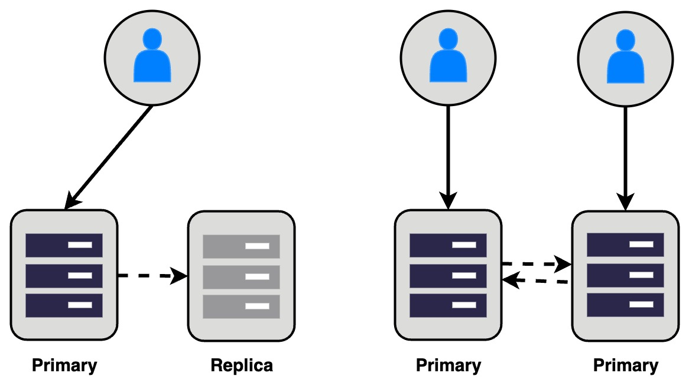
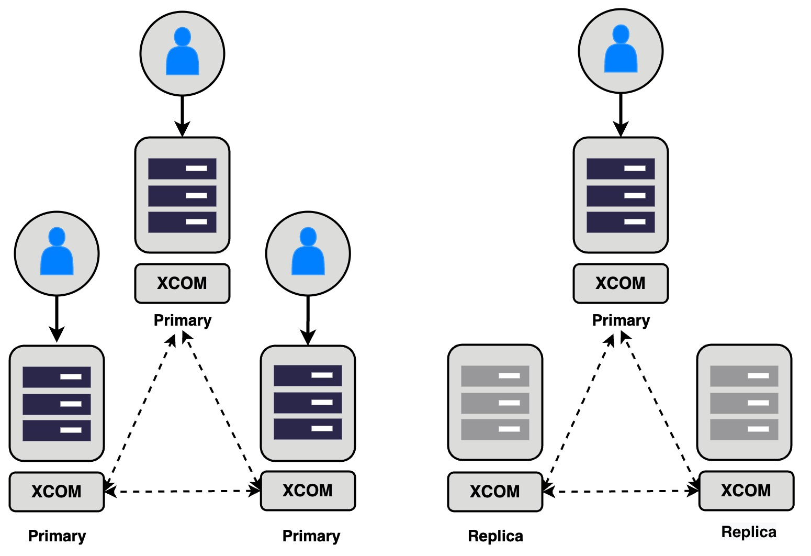
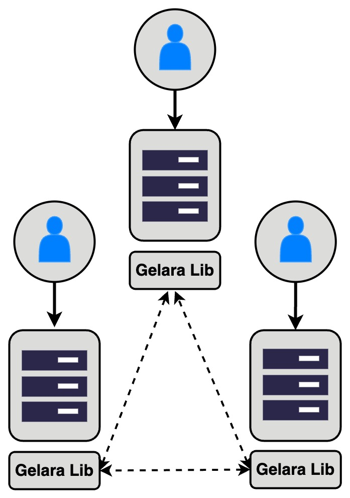
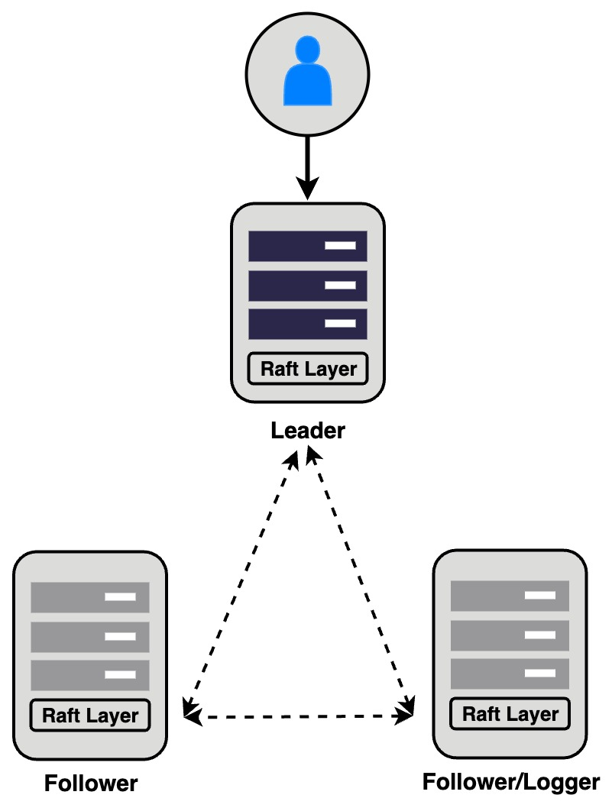

# A Comparison and Analysis of ApeCloud MySQL High Availability Solutions 

## Overview of Database High Availability

In today’s always-on digital world, any downtime can lead to lost revenue, decreased productivity, and unhappy customers. This is especially true for businesses that rely heavily on databases to store and manage data. Achieving high availability in a database system is crucial to ensure that a business’s databases are always accessible and operational. In this article, we will provide an overview of database high availability and the four capabilities required to achieve it.

### What is Database High Availability?

Database high availability is the ability of a database system to remain operational and accessible even in the event of failures or outages. This is achieved by implementing various techniques like failover, replication, clustering, and load balancing. The goal of high availability is to ensure that the database can continue to function and provide access to data even if one or more components fail.

### Four Capabilities for Achieving High Availability

To achieve high availability in a database system, the following four capabilities are required:

#### Compute Redundancy

The computing layer redundancy is responsible for ensuring that when one instance fails, another can quickly take its place and continue providing read and write services. This can be achieved through creating multiple database instances to form a cluster. There are two ways to deploy redundancy at the computing layer:

- **Active-Passive Mode**: Only one replica in the cluster provides read-write services, while the others can only offer read-only services.  Examples of this approach include MySQL primary-replica replication, SQL Server Failover Cluster Instance (FCI), and others. It's important to note that replicas can share a copy of the data (such as in SQL Server FCI), or they can store a separate copy of the data and synchronize it using a replication protocol (like in MySQL).
- **Active-Active Mode**: Multiple copies in the cluster provide read and write services simultaneously, such as Oracle RAC, MySQL Group Replication, and similar systems. Compared to the active-passive mode, this method has a faster switching speed and potentially higher resource utilization and load capacity. However, it requires addressing or bypassing write conflicts to ensure data consistency.

#### Data Redundancy/Replication

Data redundancy or replication ensures that multiple copies of the service have their own copy of the data, enhancing database durability, and preventing data loss resulting from data corruption. Different levels of data redundancy can be achieved using the following approaches:

- **Storage-Level Redundancy**: Multiple instances mount the same EBS, DRBD, establishing disk data mirroring between two servers, or rely on a clustered file system.
- **Database-Level Redundancy**: The replication module of the database system realizes data synchronization between replicas. The choice of synchronization method may affect the consistency, availability, and performance of the database system. Common synchronization methods include: 
  - Asynchronous replication, such as MySQL Asynchronous Replication. Data is persisted in the primary copy first, and the data is asynchronously transmitted to other copies. This method has low write latency, and the failure of any copy does not affect availability. However, there is no guarantee that data will not be lost.
  - Synchronous replication, such as MySQL primary-replica synchronous replication and Percona XtraDB Cluster. Only after the data is persisted in the replicas can the user be notified of the successful writing. If any copy fails, there will be zero data loss, but it will also cause a large write delay. When any replica fails, the database system may be unable to provide service.
  - Replication based on consensus protocols, such as MySQL Group Replication and ApeCloud MySQL Paxos Group. Based on the consensus protocol represented by Paxos, data is synchronized among multiple replicas (generally no less than 3) to ensure consistency. It steps on the sweet spot between synchronous and asynchronous replication: a fixed number (more than half) of replicas need to be in sync to tell the user that the write was successful, but it doesn't matter which replicas. Guaranteed no data loss (RPO = 0) while tolerating certain node/network failures.
  - **External/Application-Level Redundancy**: Uses Kafka to pass messages to synchronize data or self-developed data synchronization programs, such as DTS, to achieve high availability on top of the database.

The implementation of storage-level redundancy and external redundancy relies on non-database systems, which is not the focus of this article.

#### Failover Management

Failover management monitors the failure of the primary of the database and upgrades another replica to a primary to provide external services.

#### Service Endpoint Provisioning

Service endpoint provisioning ensures that the application system remains connected to the database even in the event of a failover, and can be achieved through elastic load balancing or adding a layer of Proxy.

## Comparison between ApeCloud MySQL and other Main Stream MySQL High Availability Solutions

### MySQL primary-replica/primary-primary replication

MySQL's official high-availability solution is now the most popular method for building a multi-copy database cluster and establishing a one-way (primary-replica) or two-way (primary-primary) replication channel. With primary-primary replication, two MySQL instances are mutually active acting as each others' backup, and synchronize data. However, MySQL does not automatically handle write conflicts in this scenario. To avoid affecting database consistency, application developers usually have to find ways to bypass the write conflicts of multiple nodes, such as having each node write to different tables.
 
MySQL primary-replica supports asynchronous and semi-synchronous replication of data. In semi-synchronous mode, when network problems or node downtime occur, affecting availability, it will be automatically downgraded to asynchronous replication. However, there is still a significant risk of data loss and RPO=0 cannot be guaranteed in asynchronous replication scenarios if the primary copy fails, and other copies may not have pulled all the data.
 
The principle of the semi-synchronous mode is that when the data is successfully persisted on the Primary and the specified number of Replicas during the commit process, the success message is returned to the client. Therefore, even if the Primary fails, all the data that has notified the client of successful commit must be found on a certain Replica. However, transaction commit in semi-synchronous mode involves multiple nodes and does not adopt a distributed coordination protocol such as a two-phase commit (2PC). If there is a failure in the commit process, there is still a risk of data inconsistency.
 
For example, suppose transaction T is being committed, and a failure occurs when the primary is in the Wait ACK phase. Assume that the replica has not received the binlog of T at this time, and when the replica is upgraded to primary, the modification of transaction T is not included. During the original Primary recovery process, the transaction T will be applied according to the persistent log. At this time, the data of the two copies is inconsistent.

**Advantages**:

1. The architecture is simple, widely validated, natively supported by MySQL, and has a good mass base.
2. Only two nodes are required at least, with fewer resource requirements. It can be extended with more nodes when needed.
3. Flexible configuration, supporting user trade-offs between consistency and performance/availability.

**Disadvantages**:

1. Only solve the problem of data transmission, and rely on third-party HA components to help fault detection and primary and replica switchover.
2. Cannot guarantee data consistency between primary and replica.
3. Asynchronous replication can lead to data loss.
4. No conflict detection for multi-primary writes.

### MySQL Group Replication

The Paxos protocol has shined in the database field in recent years. Many database systems have introduced various variants of Paxos to ensure the consistency of data synchronization in multiple copies. The benefits of introducing the Paxos protocol are:

1. On the premise of ensuring consistency, availability is maximized.
2. Decouple transaction commit logic and data synchronization logic.

MySQL Group Replication (MGR) is a replication function based on the Paxos protocol officially launched by MySQL, which is embedded in MySQL as a plug-in. MGR supports single-node and multi-node writing, supports Leader election for single-node writing, and supports conflict detection and resolution for multi-node writing (multi-node writing mode has many restrictions, such as not supporting Serializable isolation level).

However, there are certain problems in the design of MGR. The XCOM module (Paxos ) is embedded in MySQL as a plug-in. It is only responsible for deciding the commit order of transactions at the network level, not for persistence. The transaction commit is synchronized to other nodes through Paxos, and returns immediately after the log is persisted. That is to say, at the moment the transaction is committed, only the node (Primary) that accepts the request guarantees that the transaction is persistent. There are two problems with this design:

1. In extreme cases, if the three machines are down at the same time, and the primary node data is damaged. After the other nodes are restarted, the transaction that has just been successfully submitted disappears. That is to say, in the case of the loss of minority nodes, MGR may also experience data loss.
2. Even if the Primary node is not damaged, in order to ensure that data is not lost, it is necessary to manually designate the original leader node as the "seed" node when restarting.

It can be seen that the current design of MGR does not fully utilize the power of Paxos, essentially because the Paxos protocol layer has no control over MySQL logs. You may ask: Why does the Replica node of MGR not wait for the log to be persisted before sending an ACK to the Primary node? Because of the current plug-in design of MGR, it is impossible to control the replica log apply. A Replica node persists the log successfully, but if the transaction fails to commit for some reason, the Replica will still apply the failed transaction.

**Advantages**：

1. In theory, the Paxos protocol strictly guarantees the consistency of data on multiple copies.
2. Support multi-node update to improve resource utilization.
3. Compared with primary-replica clusters, it has failover management and automatic scaling capabilities.

**Disadvatages**:

1. In order to support multi-node writing, there are more restrictions. See:
2. Only the InnoDB engine is supported.
3. At least three nodes are required, and the cost is relatively high.
4. Many operation and maintenance operations require manual intervention, such as restarting to select seed nodes.
5. In extreme cases, minority data damage may result in data loss in the cluster.

### Percona XtraDB Cluster

Percona XtraDB Cluster (PXC) is an open-source high-availability deployment solution developed by Percona, which relies on the open-source Galera library for data synchronization in the cluster. It is named after its enhanced version of the InnoDB storage engine - XtraDB. 

p.s. MariaDB Galera Cluster, released by MariaDB, is also based on the Galera library and has similar capabilities to PXC.
 
Galera is a relatively complex distributed protocol. Below are some of the features of PXC based on Galera:

- Multiple primary synchronous replication is used, with instances in the cluster being equal and mutually primary-replica, and clients can connect to any instance.
- Transaction commit requires successful writing to all nodes. Optimistic strategies are used for transaction commit, where transactions are broadcast to all nodes after being locally submitted, and each node determines whether to roll back (locally first, then notifies other nodes to roll back) in the event of a conflict.
- When a node or network partition occurs, a majority of nodes that can still communicate with each other can automatically tolerate faults (exclude a minority of nodes that cannot write) and continue to provide writing. Therefore, it is recommended to deploy a single instance in the cluster.
 
**Advantages**:

1. Strong consistency of data across multiple nodes.
2. Supports multi-node updates, improving resource utilization.
3. Compared to primary-replica clusters, it has failover management and automatic scalability.

**Disadvantages**:

1. Limited support for multi-node writing. For details, please refer to [Percona XtraDB Cluster limitations - Percona XtraDB Cluster](https://docs.percona.com/percona-xtradb-cluster/8.0/limitation.html).
2. Only supports the InnoDB engine.
3. Requires at least three nodes, which is costly.
4. All nodes synchronize writing, and performance depends on the worst-performing node's resources, so reasonable resource planning and scheduling are required.

### ApeCloud MySQL Paxos Group 

ApeCloud MySQL Paxos Group (AC-MPG) synchronizes data between replicas based on Raft, a variant of the Paxos protocol. Unlike MGR, AC-MPG has only one Leader to accept read and write requests, and other Follower nodes only respond to read requests. This design does not need to consider conflict detection. In terms of design, the Raft protocol layer is not embedded in MySQL as a plug-in, but is deeply integrated into the MySQL kernel, replacing the original replication module. The data synchronization between replicas is driven by the Raft Layer, and how to replicate and apply does not require external intervention. In order to realize higher efficiency, AC-MPG transforms Binlog as Raft log, so that Raft Layer can directly operate MySQL log.

Therefore, AC-MPG does not have the same problems as MGR mentioned in the previous section, because:

1. The condition for successful AC-MPG transaction commit is that the majority nodes persist the transaction log. The reason why this can be specified is that the Raft Layer is responsible for log transmission and apply. Even if the logs are successfully persisted on some nodes but the final transaction is not committed, the Raft Layer will not apply these logs according to the protocol. This is a capability that MGR does not have. In any case, if the data of the minority nodes is damaged, it will not cause the loss of cluster data.
2. Restarted nodes can automatically join the cluster without manual intervention.

In addition to Leader and Follower, AC-MPG also supports other roles: (1) Low-cost Logger nodes that do not store data and have voting rights but not the right to be elected. When necessary, AC-MPG can be equivalent to the cost of MySQL primary and backup. (2) A Learner node that does not have voting rights and only synchronizes data.

In addition to supporting the InnoDB engine, AC-MPG also supports the LSM-Tree engine X-Engine with a higher compression rate to achieve lower costs.

**Advantages**:

1. Multi-copy data consistency, RPO=0.
2. Supports low-cost Logger nodes and flexible Learner nodes.
3. Support low-cost X-Engine.
4. With failover management and automatic scaling capabilities, no manual intervention is required.

**Disadvantage**:

1. Only single-node write is supported.

## Comparison
|                                    | Redundancy (Cost) | Failover Management| Consistency | RPO  | Write Performance | Multi-Write | Multi-Engine |
| :--   | :--               | :--                | :--         | :--  | :--               | :--         | :--          |
| MySQL Replication Asynchronization | Low  | N/A | Weak   | > 0 | Strong | N/A | Yes |
| MySQL Replication Synchronization  | Low  | N/A | Strong | 0   |        | Yes | Yes |
| MGR | High | Yes | Strong | ≈ 0 |     | Yes | N/A |
| PXC | High | Yes | Strong | 0   |     | Yes | N/A |
| ApeCloud MySQL Paxos Group | Configurable | Yes | Strong | 0   |        | N/A | Yes |\
