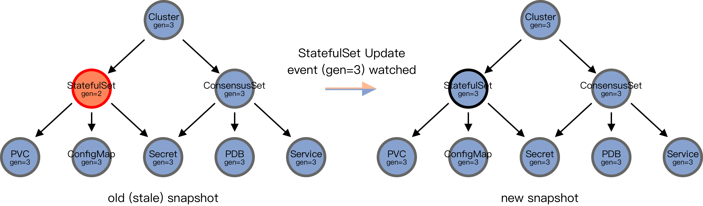

# Unveiling KubeBlocks Technology (Part 1): Why Do We Choose the DAG Model?

## Background

In the current implementation of Kubernetes, the Cluster Controller is responsible for most of the Reconcile logic, which is the core control logic used to maintain the consistency of the Kubernetes system. However, the Cluster Controller is too bulky and complex, and lacks clear abstraction levels and separation of concerns in its design. This makes it difficult to modify and add new logic, which can increase the difficulty of maintenance and modification during continuous iterations. In other words, modifying a small logical point may affect the entire system, causing unnecessary risks.

We analyzed the main logic of the current code. In this article, we provide a more structured plan for refactoring, including detailed explanations of several key issues in the plan.

## Current Model - `prepare-checkedCreate` pattern

In the Cluster Controller, the operation of the cluster object is mainly in the [`reconcileClusterWorkloads`](https://github.com/apecloud/kubeblocks/blob/main/controllers/apps/lifecycle_utils.go#L77) function, which uses the `prepare-checkedCreate` pattern: First, prepare all the required K8s objects according to `cluster.spec` (prepare phase); then try to create these objects. When the API Server returns an object already exists error (`metav1.StatusReasonAlreadyExists`), call the update function again to update these objects (checkedCreate phase).

This pattern has two problems:

- The first problem is that when a particular object has special business logic, it needs to be patched. For example, in KubeBlocks, once the configuration file is generated, it cannot be modified. Therefore, when updating the cluster, the ConfigMap of the configuration file needs to be filtered out in the prepare phase. Similarly, if the credential corresponds to the Secret needs to be created before other objects, the generation logic of the Secret needs to be placed before other objects. If the order is not noticed in subsequent iterations, it can cause unexpected problems.
- The second problem is that if a component is deleted during a cluster update, the corresponding object will become an orphan object drifting in the Kubernetes cluster.

In addition, this pattern has other potential problems caused by functional coupling that can lead to code conflicts. So refactoring starts here.

## The KubeBlocks Model

### Why do we use DAG?

[DAG（Directed acyclic graph)](https://en.wikipedia.org/wiki/Directed_acyclic_graph) is a data structure that has been extensively studied, and we can leverage a lot of existing knowledge and experience to make our construction process easier.

A `cluster` contains multiple K8s objects such as CD, CV, StatefulSet, Deployment, ConfigMap, Secret, Service, PVC, and KubeBlocks abstract CRDs, and these objects have dependencies (such as the credentials Secret needs to be created before other objects). Therefore, we can use DAG to express a `cluster`.

With such an abstract structure, we can transform many requirements into an operation on the DAG. For example, in the face of the requirement that _the configuration file ConfigMap cannot be updated_, we can define an operation that will traverse the DAG using the BFS (breadth-first search) algorithm and then delete or set the ConfigMap in it to immutable. In response to the requirement that _the credentials Secret must be created before other objects_, we can define another operation that adds all other objects to the dependency relationship of the Secret to ensure that the requirement is met.

We can abstract the "operation" mentioned above, which leads us to the second data structure: Transformer. The role of the Transformer is to "transform" a DAG into another DAG.

When we add new business logic later, we can write a new Transformer. In this way, we have established a continuous and iterative model, and the code coupling degree has also been reduced.

### The _Plan_

 After applying a series of Transformers, we obtain a final Directed Acyclic Graph (DAG). What should we do next? 

If each Node in this DAG has a K8s object and its corresponding operation (Create/Update/Delete), it would be very friendly, wouldn't it? If each edge represents the order in which they are executed, would it be better? If I just write a bunch of Transformers and apply them, and the final execution does not require my efforts, would it be close to perfection?

We abstract the last step of "execution", giving us the last data structure: _Plan_. The Plan is an execution plan that traverses the final DAG processed earlier and performs some actions. After the execution is completed, the cluster object reaches the declared state (i.e. the completion of this reconcile).

The above is the KubeBlocks' model, and you can check the [code frame](https://github.com/apecloud/kubeblocks/pull/1571) for [detailed information](https://github.com/apecloud/kubeblocks/pull/1571/files#diff-156cb301a9e77d9539ae0021bdc6beadcbdcfdf3e75b72240fa3b75d7cd7c7faR40).

Can the KubeBlocks model solve the problems in the `prepare-checkedCreate` pattern? The answer is yes.

For the first problem, an example analysis has been given earlier.

For the second problem, if the corresponding component is deleted during cluster update, the corresponding object will be deleted, so it can also be solved.

### How to obtain the old version of the `cluster` object?

You may have a question. Where is the old version of the cluster object when generating the final plan?

We can see the old version of the cluster object and other related objects as a cluster snapshot. There are two ways to obtain the cluster snapshot:

- By-ControllerRevision: You can refer to the implementation of [StatefulSet](https://github.com/kubernetes/kubernetes/tree/release-1.25/pkg/controller/statefulset) (see the [`revisionHistoryLimit`](https://kubernetes.io/docs/reference/kubernetes-api/workload-resources/stateful-set-v1/) documentation), record historical version clusters in the [ControllerRevision](https://kubernetes.io/docs/reference/kubernetes-api/workload-resources/controller-revision-v1/), and generate an old version cluster snapshot through ControllerRevision during subsequent Reconcile.
- By-Ownership: Objects belonging to the same cluster can be obtained through the OwnerReference relationship, and these objects can form an old version cluster snapshot.

#### Comparison

The By-ControllerRevision method needs to introduce similar `revisionHistoryLimit` logic and rely on ControllerRevision objects. According to the [official documentation](https://kubernetes.io/docs/reference/kubernetes-api/workload-resources/controller-revision-v1/), this has a certain risk:

> Note that, due to its use by both the DaemonSet and StatefulSet controllers for update and rollback, this object is beta. However, it may be subject to name and representation changes in future releases, and clients should not depend on its stability. It is primarily for internal use by controllers.

The By-Ownership method needs to obtain all related objects. There are two ways to obtain them. One is to read the local cache, which may cause some problems due to the lag; the other is to directly obtain the "latest" objects through the API Server, but actually, due to the network, there is still a possibility of obtaining stale objects.

This refactoring of the lifecycle chooses the By-Ownership method because Ownership has been established in the current implementation and thus the workload is smaller.

Then there is one remaining question: is there a problem reading stale objects in the old version snapshot? Next, we will analyze this problem.

## Stale Cache Problem Analysis

First of all, let's draw a conclusion: there is no problem constructing the old version cluster snapshot based on the cache.

### Problem Abstraction

There are two types of objects in the local cache: timely (latest) and stale (stale). The execution plan has three types of possible actions: `Create`, `Update`, and `Delete`.

Further, stale objects mean that the local cache is lagging behind the API Server versions, which means that a c/u/d (i.e. create/update/delete) arrangement can be used to express the increment of updates that have not been copied yet.

Formally, let's define the "+" operation as a binary operation on the set {c, u, d}, which aims to transform two consecutive operations into one operation. It can be seen that _c+u=c_, _u+c=u_, _c+d=d_, _d+c=c_, _u+d=d_, and _d+u=u_. Therefore, a string composed of the arrangement of elements in the set {c, u, d} can be expressed by one element. Thus, the difference between stale objects and the API Server is just a c/u/d operation, which we represent as `c-lag`, `u-lag`, and `d-lag`.

So far, we classify Plan Action into three types and cache into four cases.

### Problem Analysis

First, assuming that the latest snapshot does not change, that is, the cluster does not update.

#### Scenario 1. Latest Cluster Snapshot Is Not Updated

Next, we analyze whether there are problems after Plan Action combination execution with the four cache cases, as shown in the table below:
Cache\Plan Action

<table>
    <tr>
        <td colspan="2"> Cache\Plan Action </td>
        <td> Create </td>
        <td> Update </td>
        <td> Delete </td>
    </tr>
    <tr>
        <td colspan="2"> Latest </td>
        <td> ✅ </td>
        <td> ✅ </td>
        <td> ✅ </td>
    </tr>
    <tr>
        <td rowspan="4"> Stale </td>
    </tr>
    <tr>
        <td> c-lag </td>
        <td> -- </td>
        <td> ❌ </td>
        <td> ❌ </td>
    </tr>
    <tr>
        <td> u-lag </td>
        <td> -- </td>
        <td> ✅ </td>
        <td> ✅ </td>
    </tr>
    <tr>
        <td> d-lag </td>
        <td> ❌ </td>
        <td> -- </td>
        <td> -- </td>
    </tr>
</table>

When the local cache is the latest, the snapshot obtained from the cache is the old version snapshot, so the Plan Action based on this snapshot can achieve the expected purpose.

When `c-lag` occurs, it means that the object exists on the API Server but not in the cache. At this time, the Plan should only be _Update_ or _Delete_. However, because there is no cache, _Update_ actually becomes _Create_ to execute. When _Create_ is executed, an object that already exists error (`metav1.StatusReasonAlreadyExists`) will be reported, and the result is inconsistent with expectations. _Delete_ will not be generated, which means that the operation is lost, not as expected.
When `u-lag` occurs, it means that the object exists both in the API Server and in the cache, but the versions are different. At this time, the Plan should only consist of `Update` or `Delete` Actions, and the result should be consistent with expectations.

When `d-lag` occurs, it means that the object exists only in the cache and not in the API Server. At this time, the Plan should only consist of `Create` Actions, but because the object exists in the cache, `Create` becomes `Update` when executed. When `Update` is executed, an object not found error (`metav1.StatusReasonNotFound`) will be reported, and the result is inconsistent with expectations. When the object is not in the new snapshot, the Plan will incorrectly generate `Delete` Actions, which will also result in an object not found error.

At this point, constructing an old version snapshot based on the cache does indeed have problems. However, we still have a chance to remedy the situation. Let's focus on one stale object in the entire old snapshot version for now.

The image above assumes that a cluster within KubeBlocks has been updated to version 3 (gen=3), and its generated secondary resources and their dependencies are shown on the left side of the image. It can be observed that there is a stale object on the left-hand side, which is the StatefulSet (gen=2).

The Reconcile process of `controller-runtime` is an [EDA](https://en.wikipedia.org/wiki/Event-driven_architecture) model. When the update of this stale object reaches the cache, controller-runtime sends an event to the owner controller (that is, our cluster controller), and we have the opportunity to generate an execution Plan again. At this point, the object is in the latest (gen=3) state. According to the table above, the generated Plan execution is as expected. For other objects that are already in the latest state, updating them again will not have any other effects, as expected. Therefore, the problem is solved.

This process can be extended to multiple stale objects in the snapshot. Therefore, ultimately, by obtaining an old version snapshot from the local cache, we can ensure that the result meets expectations after several Reconciles.

#### Scenario 2. Latest Cluster Snapshot Is Update

If the latest cluster snapshot is updated, then it can be considered that all objects in the cache are stale, and the expected target becomes the updated snapshot. According to the previous analysis, even after several Reconciles, we can still ensure that the result meets expectations.

In summary, there is no problem with constructing an old version cluster snapshot through the cache, but we need to receive events for all objects in the snapshot (that is, when the controller is set up, it owns that GVK and sets the `SetControllerReference` parameters).

## Conclusion

This article discusses the problems with the current implementation of Kubernetes' Cluster Controller and introduces KubeBlocks, a new model that uses a Directed Acyclic Graph (DAG) to express a cluster. KubeBlocks uses Transformers to modify the DAG and a Plan to execute the final DAG. The article also addresses the issue of stale objects in the local cache and how KubeBlocks can handle this problem. The By-Ownership method is used to obtain the old version of the cluster object, and events are received for all objects in the snapshot to ensure that the result meets expectations after several Reconciles.
