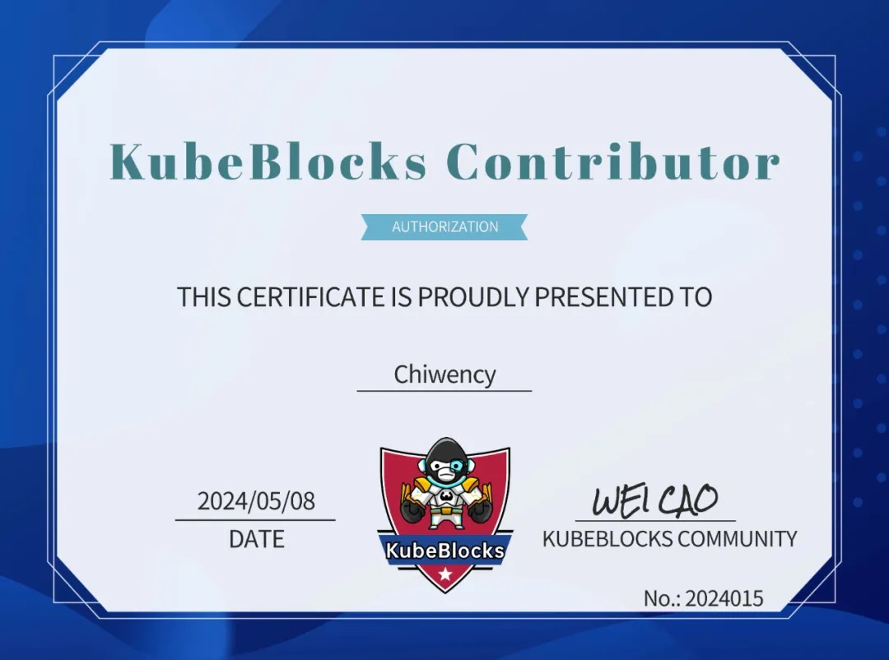
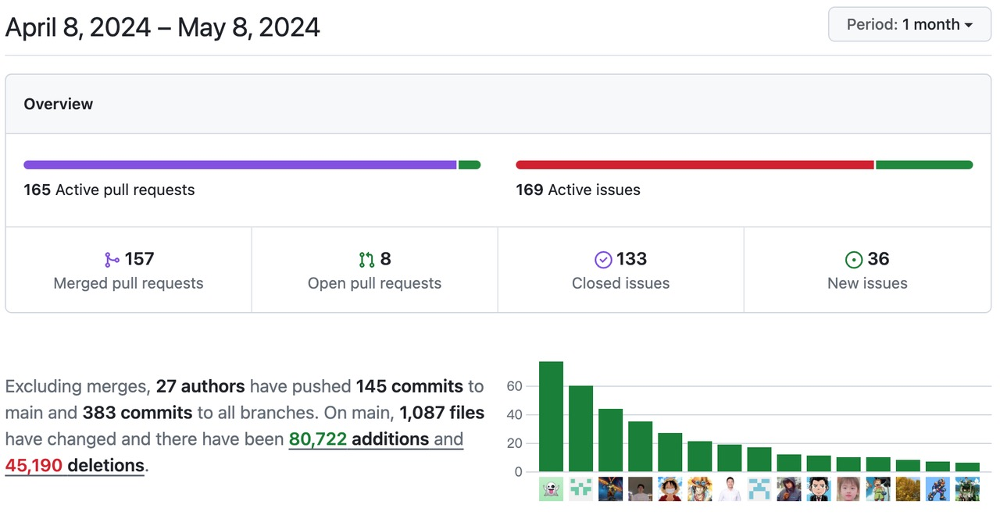

# Community Monthly Report for April 2024

## Overview

In April, KubeBlocks continued the development of v0.9.0. The new version is expected to be released in May, so stay tuned 🌟.

Over the past month, the community has participated in six offline events, merged 157 PRs, and resolved 133 issues, with contributions from 27 developers. What's more, KubeBlocks and WeScale have announced their participation in OSPP 2024 (Open Source Promotion Plan) and the projects are now open for student registration. For more details, refer to:

- [KubeBlocks Community Homepage](https://summer-ospp.ac.cn/org/orgdetail/833ca537-91a2-44a8-9965-5eee8f34aceb?lang=en)
- [WeScale Community Homepage](https://summer-ospp.ac.cn/org/orgdetail/5d8efb0a-7f0d-4705-b253-00bb162ef507?lang=en)

So far, KubeBlocks has grabbed 1.7k stars. Thanks for all the support.

## Highlights

- Supported saving backup CRs to a backup repo, allowing users to manually restore the cluster using the saved files (#7002).
- Supported ServiceRef to reference new API objects, decoupling it from ConnCredential (#7006).
- RSM supported in-place updates of Pods by adding the ability to retrieve Kubernetes versions, updating the Pod template revision generation algorithm, and supporting the IgnorePodVerticalScaling switch (#7000).
- Supported cluster RuntimeClassName configuration (#7001).
- Supported specific instance scale-down, useful for scenarios such as node failures, data corruption, or instance unavailability (#6958).
- Supported overridable component services in the cluster API (#6934).

## Bug Fixes

- Fixed the issue where the cluster was always in the "Deleting" state after upgrading from v0.8.2 to v0.9 (#6985).
- Fixed the issue where the cluster was always in the "Updating" state after vscale (#6971).
- Fixed the issue where stop/hscale OpsRequests were always running in v0.9 (#6972).

## New Contributors

👏 Let's welcome

💙 @Chiwency 💙!

Nice to have you here in the KubeBlocks family. Chiwency managed to merge a PR last month.

## Activities

KubeBlocks & WeScale have participated in OSPP 2024. Join us in exploring solutions to challenging problems. And guess what? There are generous rewards, gifts, and certificates waiting for you!
Click the links below to view the details and contact your mentor.
- Basic: [KubeBlocks supports etcd Add-on](https://summer-ospp.ac.cn/org/prodetail/248330234?lang=en&list=pro)
- Advanced: [KubeBlocks supports Redis PITR (Point-in-Time Recovery) and recovery of specific keys](https://summer-ospp.ac.cn/org/prodetail/248330238?lang=en&list=pro)
- Advanced: [Implementing Consistency Optimization with Table-Level Read-After-Write Strategy Based on Wescale](https://summer-ospp.ac.cn/org/prodetail/245d80005?lang=en&list=pro)

## Good First Issues

We call for more developers to participate in the collaborative development of KubeBlocks. Starting with [good first issues](https://github.com/apecloud/kubeblocks/contribute), we hope to build the next-generation database management platform with each and every one of you！Claim now 👇

- [#7229 [Improvement] Specify backup/restore PORT by name](https://github.com/apecloud/kubeblocks/issues/7229)
- [#7031 [Improvement] doc API `opsrequest.spec.restoreSpec.restoreTimeStr`](https://github.com/apecloud/kubeblocks/issues/7031)

Related links:
- [Good first issue](https://github.com/apecloud/kubeblocks/contribute)
- [Contributing to KubeBlocks](https://github.com/apecloud/kubeblocks/blob/main/docs/CONTRIBUTING.md)
- [Developing KubeBlocks](https://github.com/apecloud/kubeblocks/blob/main/docs/00%20-%20index.md)

Feel free to join the GitHub Discussion or the [KubeBlocks Slack group](https://join.slack.com/t/kubeblocks/shared_invite/zt-29tx52d8n-vli24S6gtD5ODJlNUqLqbQ)!

