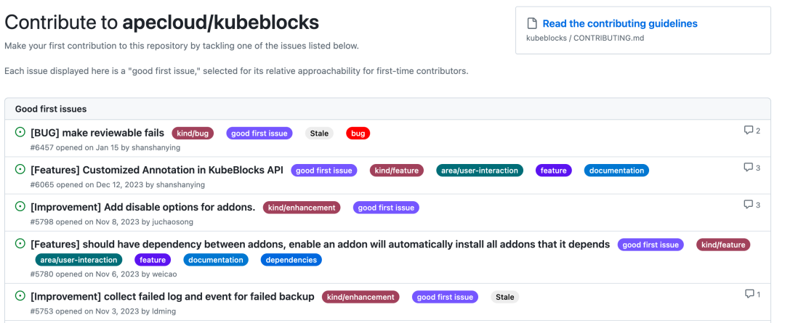
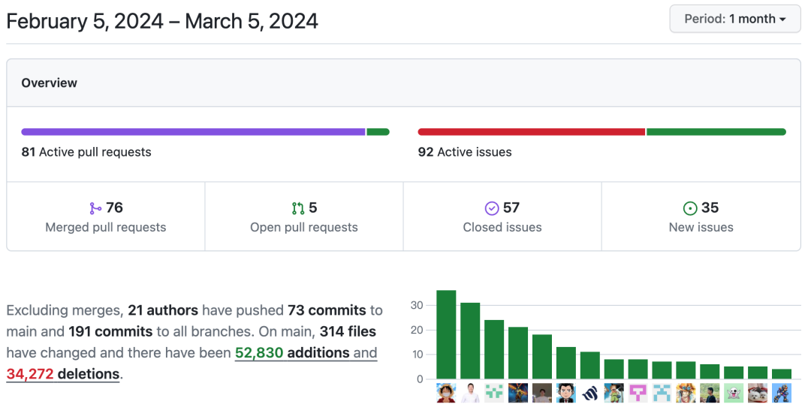

# Community Monthly Report for February 2024

## Overview

In February, KubeBlocks continued the development of v0.8.2 and v0.9.0 and mainly focused on sharding API, which will be released in v0.8.2.

In the past month, the community has merged 76 PRs and resolved 57 issues. A total of 21 community members participated in these contributions, including 1 new contributor.

## Highlights

- Supported ShardingSpec API to define database clusters with sharding topology (to be released in v0.8.2).
- Supported creating and deleting official Redis Clusters based on KubeBlocks Sharding API (to be released in v0.8.2).
- Supported Camellia Redis Proxy for one-click deployment, configuration management, horizontal scaling, restarts, and other operations (to be released in v0.8.2).
- Supported declaring host network capabilities (#6705).
- Supported specifying namespaces that operators should manage (#6641).
- MongoDB supported connections from outside of K8s using host network (#6689).
- Lorry supported action commands(#6474).
- Compatible with CronJob v1beta1 to resolve backup failures when using K8s v1.20 (#6687).
- 【External Contribution】Added version validation for Addon spec. Addon CRD supported provider and version fields, and the controller could add provider information to labels for quick querying (#6603).

## Bug Fixes

- Fixed the issue of exposing SVC with an empty componentName (#6712).
- Adjusted the OceanBase switchover feature to accommodate Oracle tenant mode (#6710).
- Resolved backup and restore failures when using the host network (#6715).
- Fixed the issue of parameter reconfiguration failures(#6664 #6665).
- Fixed the issue of inoperative dynamic parameters. In Patroni PostgreSQL, if dynamic parameters and static parameters were modified simultaneously, the dynamic parameters did not take effect (#6648).
- Removed duplicate ports generated when exposing SVC (#6631).
- Fixed bugs related to ServiceAccount. If RestoreCR specifies a ServiceAccount, the backup and restore pods will use the specified SA (#6605).

## New Contributors

👏 A big welcome to

💙 @Shuimo03 💙

for joining the KubeBlocks community! Shuimo03 has successfully merged a PR last month (#6603).

We call for more developers to participate in the collaborative development of KubeBlocks. Starting with [good first issues](https://github.com/apecloud/kubeblocks/contribute), we hope to build the next-generation database management platform with each and every one of you！

Related links:
- Good first issue: https://github.com/apecloud/kubeblocks/contribute
- Contribution guide: https://github.com/apecloud/kubeblocks/blob/main/docs/CONTRIBUTING.md
- Developing guide: https://github.com/apecloud/kubeblocks/blob/main/docs/00%20-%20index.md

Feel free to join the GitHub Discussion or the [KubeBlocks Slack group](https://join.slack.com/t/kubeblocks/shared_invite/zt-29tx52d8n-vli24S6gtD5ODJlNUqLqbQ)!

