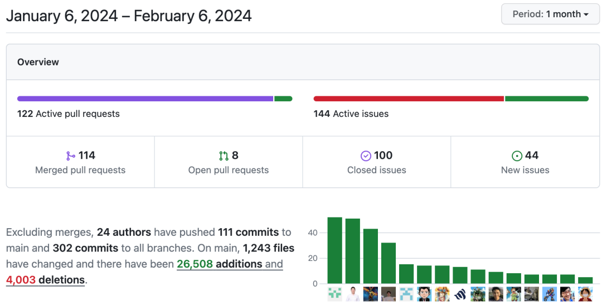

# Community Monthly Report for January 2024

## Overview

- **Release of KubeBlocks v0.8.0**
  
  KubeBlocks [v0.8.0](./announcing-kubeblocks-v0.8.0.md) was officially released this month, with the current latest stable version being v0.8.1.

- **Highlights of KubeBlocks v0.8.0**
  
  KubeBlocks v0.8.0 introduced the Component API, which simplified the integration of database engines. Addons have also been separated from the KubeBlocks repository and now exist independently, making it more convenient to use.

- **Community Contributions**
  
  In the past month, the community has merged 114 PRs and resolved 100 issues. A total of 24 community members participated in these contributions, including 5 new contributors.

## Highlights

- KubeBlocks has supported more addons, such as TiDB, Xinference, openGauss, InfluxDB, OceanBase (primary/standby), and Flink. Check the [official documentation](https://kubeblocks.io/docs/release-0.8/user_docs/overview/supported-addons) for the supported capabilities of each engine.
- KubeBlocks Client SDK is now available (check the [repo](https://github.com/apecloud/kubeblocks-client)) and currently supports Java, Python, and Rust.
- Switchover is now supported for MySQL Replication clusters, and it allows `kbcli promote` commands.

## New Contributors

In January, KubeBlocks has seen 5 new contributors who merged 5 pull requests. 

They are 💙 @earayu @driverby @kissycn @LiuG-lynx @lispking 💙. 

Thank you for your contributions for helping to build KubeBlocks as the next-generation database management platform.

Developers who want to contribute to KubeBlocks can start by tackling "good first issues" and leave a comment to claim them. Once our maintainers assign the issues, you can just start right away!

Additionally, since addons are now separated and the Client SDK is released, you can also take an active part in these fields. 

Related links:
- Good first issue: https://github.com/apecloud/kubeblocks/contribute
- Contribution guide: https://github.com/apecloud/kubeblocks/tree/main/docs
- KubeBlocks addon repo: https://github.com/apecloud/kubeblocks-addons
- KubeBlocks Client SDK repo: https://github.com/apecloud/kubeblocks-client

Feel free to join the GitHub Discussion or the [KubeBlocks Slack group](https://join.slack.com/t/kubeblocks/shared_invite/zt-29tx52d8n-vli24S6gtD5ODJlNUqLqbQ)!

## Community Activities

On January 10th, the community announced the recruitment for the second round of developer training camp. To ensure the effectiveness of the camp, a total of 50 developers were recruited.

By the way, the traditional Chinese Spring Festival is around the corner 🎉. May you have a prosperous New Year!