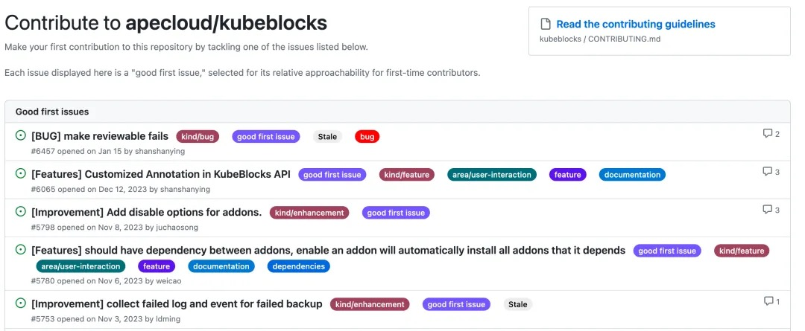
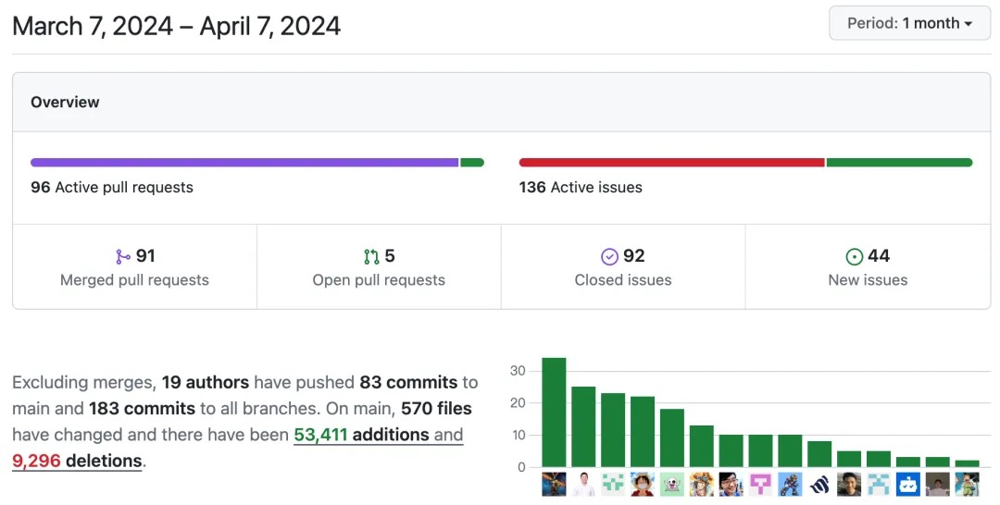

# Community Monthly Report for March 2024

## Overview

In March, KubeBlocks officially released v0.8.2. This update notably included the support for Redis Cluster, camellia-redis-proxy, and compatibility with Pulsar v3.0.2. Furthermore, the development team has been actively working on the upcoming v0.9.0.

Over the past month, the community has merged 91 PRs and resolved 92 issues. A total of 19 community members participated in these contributions, including 6 new contributors.

So far, a total of 1607 GitHub users have starred KubeBlocks. We do appreciate your support and look forward to more interactions🌟.

## Highlights

- Supported Redis Cluster.
- Supported Sharding topology for Cluster APIs, so that users could define shard numbers and component specs with ShardingSpec.
- Supported camellia-redis-proxy. It is currently running on K8s v1.14, and allows configuring external Redis instances, including those outside the K8s cluster.
- Supported high-availability access from an external K8s cluster for MongoDB Replicaset addresses.
- Supported Pulsar v3.0.2.
- Supported exposing nodeport addresses for each Pulsar broker.
- Supported IPv4/IPv6 dual stack for StarRocks. Both private and public addresses could use IPv4 and IPv6. However, IPv6 support in the StarRocks kernel was still required.
- Lorry supported customizing the roleProbe command for probing. The command could be declared through YAML scripts.

## Bug Fixes

- Resolved the issue of SVC recovery failure (#6768).
- Fixed the issue where updating KubeBlocks would restart PG (#6771).
- Resolved the problem of ConfigMap not found during cluster deletion and code optimization (#6793).
- Fixed the issue of ineffective custom endpoints when creating OSS backup repositories (#6819).
- Resolved the issue of etcd role probe failure during the upgrade process (#6839).
- Fixed the issue of invalid reconcile worker nodes (#6805).

## New Contributors

👏 Shout out to

💙 @Aayush Sharma, rustover, luoyuLianga, dingshun-cmss, Yunyinzi, bliubiu 💙

for joining the KubeBlocks community! They successfully merged PRs last month.

We call for more developers to participate in the collaborative development of KubeBlocks. Starting with [good first issues](https://github.com/apecloud/kubeblocks/contribute), we hope to build the next-generation database management platform with each and every one of you！

Related links:
- Good first issue: https://github.com/apecloud/kubeblocks/contribute
- Contribution guide: https://github.com/apecloud/kubeblocks/blob/main/docs/CONTRIBUTING.md
- Developing guide: https://github.com/apecloud/kubeblocks/blob/main/docs/00%20-%20index.md

Feel free to join the GitHub Discussion or the [KubeBlocks Slack group](https://join.slack.com/t/kubeblocks/shared_invite/zt-29tx52d8n-vli24S6gtD5ODJlNUqLqbQ)!

