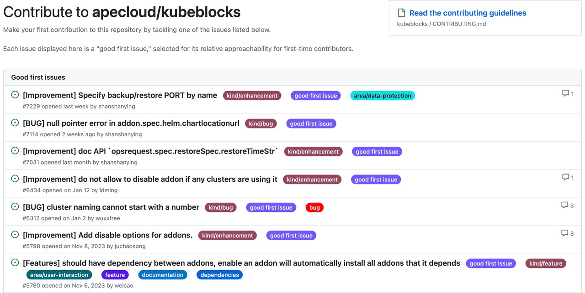
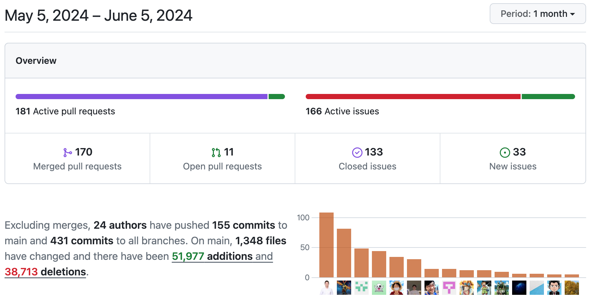

# Community Monthly Report for May 2024

## Overview

In May, KubeBlocks released v0.8.3 and continued the development of v0.9.0. The major updates are supporting cross-cluster referencing of configuration objects and NodeCountCluster. The community also fixed related defects.

Over the past month, the community merged 170 PRs, and resolved 133 issues, with contributions from 24 developers.

## Highlights

- [#7153](https://github.com/apecloud/kubeblocks/pull/7153) Supported to reference config across clusters.
- [#7258](https://github.com/apecloud/kubeblocks/pull/7258) Supported NodeCountScaler.

## Bug Fixes

- [#7475](https://github.com/apecloud/kubeblocks/pull/7475) Fixed the crash issue after executing a switchover for MongoDB.
- [#7447](https://github.com/apecloud/kubeblocks/pull/7447) Adapted rolecheck to accommodate cluster initialization for some database engines.
- [#7365](https://github.com/apecloud/kubeblocks/pull/7365) Supported PVC to create idempotent.
- [#7352](https://github.com/apecloud/kubeblocks/pull/7352) Added labels to distinguish KubeBlocks from dataprotection.
- [#7323](https://github.com/apecloud/kubeblocks/pull/7323) Fixed the issue that the configmap 'xxx-rsm-env' was not found.
- [#7299](https://github.com/apecloud/kubeblocks/pull/7299) Added lorry ports to the host network.
- [#7256](https://github.com/apecloud/kubeblocks/pull/7256) Removed the validation for the cluster component spec in webhook.
- [#7266](https://github.com/apecloud/kubeblocks/pull/7267) Fixed the issue that there were duplicate volume mounts in the config-manager container.

## New Contributors

👏 Let's welcome

💙 @[d976045024](https://github.com/d976045024), [duiniwukenaihe](https://github.com/duiniwukenaihe), [starnop](https://github.com/starnop) 💙!

Nice to have you here in the KubeBlocks community. All of them merged their first PR to KubeBlocks last month. Thanks for the contributions!

## Good First Issues

We call for more developers to participate in the collaborative development of KubeBlocks. Starting with [good first issues](https://github.com/apecloud/kubeblocks/contribute), we hope to build the next-generation database management platform with each and every one of you! Claim now 👇

- [#7229 [Improvement] Specify backup/restore PORT by name](https://github.com/apecloud/kubeblocks/issues/7229)
- [#7031 [Improvement] doc API `opsrequest.spec.restoreSpec.restoreTimeStr`](https://github.com/apecloud/kubeblocks/issues/7031)

Related links:
- [Good first issue](https://github.com/apecloud/kubeblocks/contribute)
- [Contributing to KubeBlocks](https://github.com/apecloud/kubeblocks/blob/main/docs/CONTRIBUTING.md)
- [Developing KubeBlocks](https://github.com/apecloud/kubeblocks/blob/main/docs/00%20-%20index.md)

Feel free to join the GitHub Discussion or the [KubeBlocks Slack group](https://join.slack.com/t/kubeblocks/shared_invite/zt-29tx52d8n-vli24S6gtD5ODJlNUqLqbQ)!

