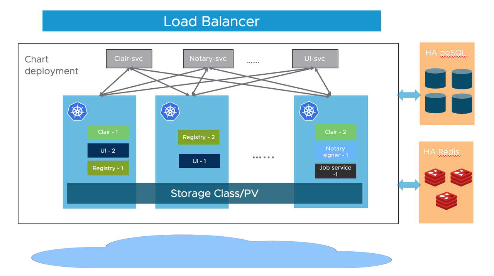
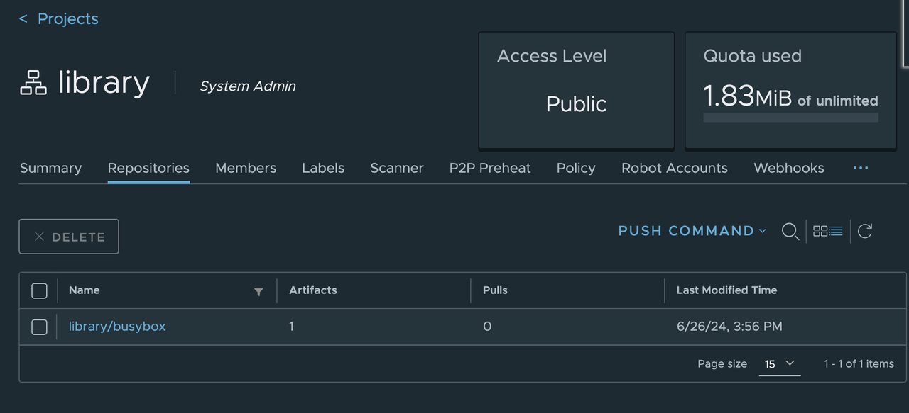
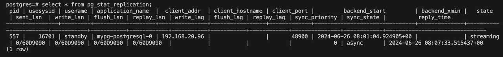
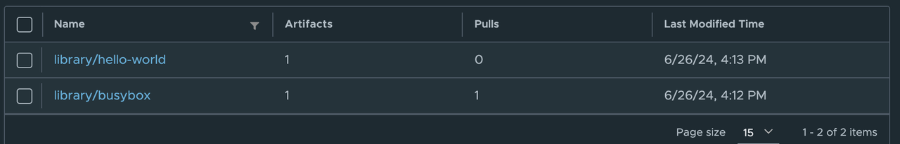

When it comes to building a self-hosted Docker image repository, Harbor is often a highly recommended choice. However, **Harbor does not come with a built-in HA (high availability) integration**, which makes its services relatively unreliable. **To create a HA Harbor cluster, developers typically need to set up their own HA Redis and PostgreSQL clusters**, which can be quite cumbersome.



Figure 1. [Architecture of Harbor](https://goharbor.io/docs/2.1.0/install-config/harbor-ha-helm/#architecture)

Fortunately, you can now use KubeBlocks to set up a high-availability Harbor cluster with just a few steps.

## Why KubeBlocks

KubeBlocks is an open-source control plane software that runs and manages databases, message queues and other data infrastructure on K8s, and it could manage various types of engines, including RDBMSs (MySQL, PostgreSQL), Caches (Redis), NoSQLs (MongoDB), MQs (Kafka, Pulsar), etc.

In this blog, we will explain how to use KubeBlocks to build a HA Harbor cluster in just 5 minutes.

## Environment preparation

Before you start, make sure your environment meets the requirements of [KubeBlocks](https://kubeblocks.io/docs/preview/user_docs/installation/install-with-kbcli/install-kubeblocks-with-kbcli#environment-preparation) and [Harbor](https://goharbor.io/docs/2.11.0/install-config/installation-prereqs/).

## Install kbcli and KubeBlocks

1. Install kbcli.

   ```bash
   curl -fsSL https://kubeblocks.io/installer/install_cli.sh | bash
   ```

2. Install KubeBlocks.

   ```bash
   kbcli kubeblocks install
   ```

3. Check whether KubeBlocks is installed successfully.

   ```bash
   kbcli kubeblocks status
   ```

4. Enable the `postgresql` and `redis` addons. By default, the two addons are enabled. You can check the status of the addons by running the following command. If they're not enabled, follow [the guidelines here](https://kubeblocks.io/docs/preview/user_docs/overview/supported-addons#use-addons) to enable them.

   ```bash
   kbcli addon list
   ```

## Create PostgreSQL and Redis clusters

1. To keep things isolated, create a separate namespace called `demo`.

   ```bash
   kubectl create namespace demo
   ```

2. Create a PostgreSQL cluster. Here we use the replication mode, which creates a Replication Cluster to support automatic failover. For more details, refer to [Create PostgreSQL cluster](https://kubeblocks.io/docs/preview/user_docs/kubeblocks-for-postgresql/cluster-management/create-and-connect-a-postgresql-cluster).

   ```bash
   kbcli cluster create postgresql mypg --mode replication --namespace demo
   ```

3. Create a Redis cluster. Here we create a Redis Replication Cluster and specify the version as `redis-7.0.6`, and KubeBlocks will create a primary-secondary redis cluster with sentinel.  For more details, refer to [Create Redis cluster](https://kubeblocks.io/docs/preview/user_docs/kubeblocks-for-redis/cluster-management/create-and-connect-a-redis-cluster).

   ```bash
   kbcli cluster create redis myredis --mode replication --version redis-7.0.6 --namespace demo
   ```

4. View the status of clusters. Wait until the status of both clusters becomes `Running`.

   ```bash
   kbcli cluster list --namespace demo
   ```

## Connect to clusters

You can also connect to the cluster following [the detailed guidelines here](https://kubeblocks.io/docs/preview/api_docs/connect_database/overview-of-database-connection) based on different scenarios. For convenience, we will use the test environment for demonstration.

### Connect to PostgreSQL cluster

1. Connect to the PostgreSQL cluster.

   ```bash
   kbcli cluster connect mypg --namespace demo
   ```

2. In PostgreSQL CLI, create a new user.

   ```bash
   create user test with password 'password';
   ```

3. Create a new database registry for Harbor.

   ```bash
   CREATE DATABASE registry OWNER test;
   ```

Users and databases created here will be used later when installing Harbor.

### Connect to Redis cluster

1. Connect to the Redis cluster.

   ```bash
   kbcli cluster connect myredis --namespace demo
   ```

2. Create a user.

   ```bash
   ACL SETUSER test on >password ~* +@all
   ```

## Install Harbor

1. Download the Harbor Helm chart.

   ```bash
   helm repo add harbor https://helm.goharbor.io

   helm fetch harbor/harbor --untar
   ```

2. Get information about services in cluster. The ClusterIP of `mypg-postgresql` and `myredis-redis-redis` is the address that Harbor connects to.

   ```bash
   kubectl get service -n demo
   >
   NAME                                    TYPE           CLUSTER-IP       EXTERNAL-IP    PORT(S)                                                  AGE
   mypg-postgresql                         ClusterIP      172.16.155.121   <none>         5432/TCP,6432/TCP                                        74m
   myredis-redis-redis                     ClusterIP      172.16.190.126   <none>         6379/TCP                                                 66m

3. Configure the PostgreSQL database in `values.yaml`. Use the external database KubeBlocks provides and fill in the necessary database information. For other configurations (e.g. `expose.type`), refer to [the official documentation](https://goharbor.io/docs/2.11.0/install-config/configure-yml-file/).

   ```bash
   database:
     type: external
     ...
     external:
       host: "172.16.155.121" # clusterIP of postgresql
       port: "5432"
       username: "test"       # your username
       password: "password".  # your password
       coreDatabase: "registry" # your database name
       existingSecret: ""
       sslmode: "disable"
   ```

4. Configure the Redis database in `values.yaml`.

   ```bash
   redis:
     type: external
     ...
     external:
       addr: "172.16.190.126:6379" # clusterIp of redis: port
       sentinelMasterSet: ""
       coreDatabaseIndex: "0"
       jobserviceDatabaseIndex: "1"
       registryDatabaseIndex: "2"
       trivyAdapterIndex: "5"
       username: "test"        # your username
       password: "password"    # your password
       existingSecret: ""
    ```

5. Install Harbor.

   ```bash
   helm install myharbor. -n demo
   ```

6. Check the status of pods. Make sure all services are running.

   ```bash
   kubectl get pods -n demo
   > 
   NAME                                   READY   STATUS    RESTARTS   AGE
   myharbor-core-66d95c9f45-vpcnn         1/1     Running   0          44m
   myharbor-jobservice-85b5676456-kl5r9   1/1     Running   0          44m
   myharbor-nginx-55dd86f5d8-s78gn        1/1     Running   0          44m
   myharbor-portal-869c6656c5-5dtsc       1/1     Running   0          44m
   myharbor-registry-c66cd79b-77k5j       2/2     Running   0          44m
   myharbor-trivy-0                       1/1     Running   0          44m
   mypg-postgresql-0                      4/4     Running   0          65m
   mypg-postgresql-1                      4/4     Running   0          82s
   myredis-redis-0                        3/3     Running   0          57m
   myredis-redis-1                        3/3     Running   0          57m
   myredis-redis-sentinel-0               1/1     Running   0          58m
   myredis-redis-sentinel-1               1/1     Running   0          58m
   myredis-redis-sentinel-2               1/1     Running   0          58m
   ```

Now you can access Harbor UI as usual.

## High availability

To illustrate the high availability of the Harbor cluster built with KubeBlocks, we will simulate a failure of the primary pod of the PostgreSQL cluster.

1. View the initial status of the PostgreSQL cluster and pods. Currently, `mypg-postgresql-0` is the primary pod and `mypg-postgresql-1` is the secondary pod.

   ```bash
   kubectl -n demo get pod -L kubeblocks.io/role
   >
   NAME                                   READY   STATUS    RESTARTS   AGE     ROLE
   ...
   mypg-postgresql-0                      4/4     Running   0          66m     primary
   mypg-postgresql-1                      4/4     Running   0          66m     secondary
   ...
   ```

2. Push a test image `busybox` to the Harbor registry.

   ```bash
   docker docker tag busybox harbor.domain.com/library/busybox
   docker push harbor.domain.com/library/busybox     
   ```

3. You can see that the image is successfully pushed to the Harbor registry.

   

4. Now, simulate a failure of the primary pod of the PostgreSQL cluster.

   ```bash
   # Enter the primary pod
   kubectl exec -it mypg-postgresql-0 -n demo -- bash

   # Delete the data directory of PostgreSQL to simulate an exception
   root@mycluster-postgresql-0:/home/postgres# rm -fr /home/postgres/pgdata/pgroot/data
   ```

5. View logs to observe how the roles of pods switch when an exception occurs.

   ```bash
   # View the primary pod logs
   kubectl logs mypg-postgresql-0 -n demo
   ```

   In the logs, the leader lock is released from the primary pod and an HA switch occurs. A new replica has been created using backup data. The service recovers within a few seconds.

   ```bash
   2024-06-26 08:00:51,759 INFO: no action. I am (mypg-postgresql-0), the leader with the lock
   2024-06-26 08:01:01,726 INFO: Lock owner: mypg-postgresql-0; I am mypg-postgresql-0
   2024-06-26 08:01:01,802 INFO: Leader key released
   2024-06-26 08:01:01,824 INFO: released leader key voluntarily as data dir empty and currently leader
   2024-06-26 08:01:01,825 INFO: Lock owner: mypg-postgresql-1; I am mypg-postgresql-0
   ...
   2024-06-26 08:01:04,475 INFO: replica has been created using basebackup_fast_xlog
   2024-06-26 08:01:04,475 INFO: bootstrapped from leader 'mypg-postgresql-1'
   2024-06-26 08:01:04,476 INFO: closed patroni connection to the postgresql cluster
   ```

   ```bash
   # View secondary pod logs
   kubectl logs mypg-postgresql-1 -n demo
   ```

   The original secondary pod `mypg-postgresql-1` has obtained the leader lock and become the primary pod.

   ```bash
   2024-06-26 08:02:13,638 INFO: no action. I am (mypg-postgresql-1), the leader with the lock
   ```

6. View the status of the PostgreSQL cluster and pods. After the failover, `mypg-posgresql-0` becomes the secondary pod and `mypg-postgresql-1` becomes the primary pod.

   ```bash
   kubectl -n demo get pod -L kubeblocks.io/role
   >
   NAME                                   READY   STATUS    RESTARTS   AGE   ROLE
   ...
   mypg-postgresql-0                      4/4     Running   0          89m   secondary
   mypg-postgresql-1                      4/4     Running   0          26m   primary
   ...
   ```

7. Connect to the PostgreSQL cluster to view the replication information in the primary pod.

   ```bash
   postgres=# select * from pg_stat_replication;
   ```

   

   The result shows that `mypg-postgresql-0` has been assigned as the secondary's pod.

8. Validate the service of the Harbor cluster. Here we pull the `busybox` image we pushed earlier. The image is successfully pulled from the Harbor registry. We also push a new image `hello-world`. The image is also successfully pushed to the Harbor registry. After the failover, both the read and write functionalities of the Harbor cluster have been restored, demonstrating the effectiveness of the high availability feature provided by Kubeblocks.

   

## Scale the cluster

KubeBlocks offers the capability of both vertical and horizontal scaling. You can effortlessly scale the cluster by executing the following command.

- Vertical scaling

   ```bash
   kbcli cluster vscale mypg \
   --components="postgresql" \
   --memory="4Gi" --cpu="2" \
   --namespace demo
   ```

- Horizontal scaling

   ```bash
   kbcli cluster hscale mypg 
   --replicas 3 \
   --namespace demo \ 
   --components postgresql
   ```

## Conclusion

By integrating KubeBlocks, you can set up a high-availability Harbor cluster in only 5 minutes, ensuring your Harbor cluster provides continuous and reliable services. KubeBlocks simplifies the entire setup process, allowing you to focus on more important tasks without worrying about the configuration and management of the underlying infrastructure.

## Reference

- [KubeBlocks](https://github.com/apecloud/kubeblocks)
- [KubeBlocks.io](https://kubeblocks.io/)
- [KubeBlocks Addons](https://github.com/apecloud/kubeblocks-addons)
- [Harbor](https://github.com/goharbor/harbor/wiki/Architecture-Overview-of-Harbor)