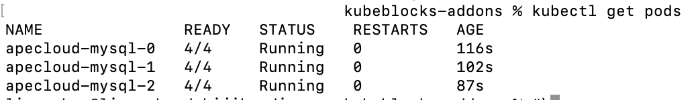
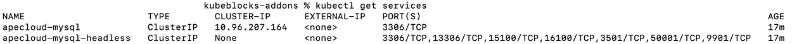
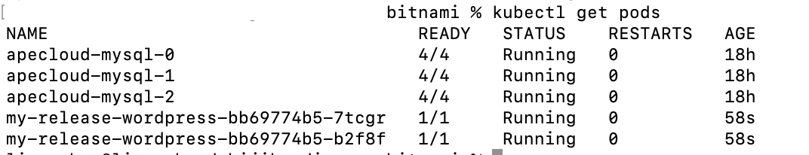
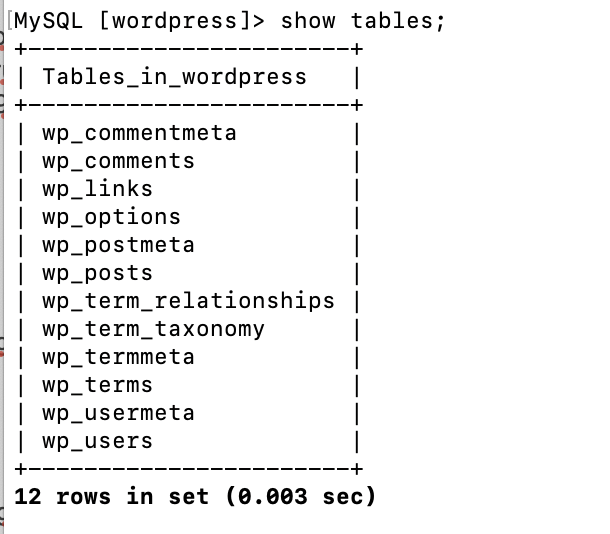
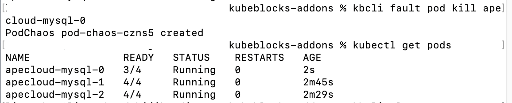
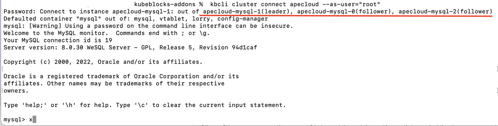

## Introduction

### WordPress

WordPress is the world's most popular content management system (CMS). Since its release in 2003, it has become the go-to tool for building websites. Its extensive ecosystem of plugins and themes allows users to easily expand functionality and enhance the appearance of their sites. The vibrant WordPress community also provides abundant resources and support, further reducing the difficulty of development and maintenance.

As a result, WordPress has become the choice of millions of users worldwide, holding a dominant position in the field of website building.

### What is KubeBlocks?

KubeBlocks is an open-source Kubernetes operator that manages a variety of databases and stateful middleware. It supports over 30 database systems, including MySQL, PostgreSQL, Redis, MongoDB, Kafka, ClickHouse, and Elasticsearch. The core concept behind KubeBlocks is its use of a common set of abstract APIs (CRDs) to describe the shared attributes across these diverse database engines. This allows database vendors and developers to leverage addons to account for the differences between engines.

### Why use KubeBlocks?

When deploying WordPress using the Bitnami image, the built-in MariaDB database provides an out-of-the-box solution. However, this approach has several drawbacks:

- **High availability limitations**: The MariaDB instance in the Bitnami image is typically deployed on a single node. If an issue occurs to this node, it may lead to website service interruptions. Additionally, the built-in MariaDB lacks an automatic failover mechanism.
- **Resource competition**: Hosting both the MariaDB database and the WordPress service within the same Pod can result in resource contention, complicating resource allocation.
- **Poor scalability**: While MariaDB supports scaling, horizontally scaling the database (improving performance and capacity by adding instances) is complex and requires additional management and configuration tools.
- **Monitoring and management**: The built-in MariaDB lacks comprehensive monitoring and management features, making it difficult to detect and resolve performance problems or failures promptly.

However, KubeBlocks can effectively address these shortcomings:

- **High availability**: KubeBlocks can provide high-availability solutions for WordPress and the database independently, enhancing overall system reliability.
- **Resource isolation**: KubeBlocks runs WordPress and the database in separate Pods, providing better resource isolation and avoiding contention.
- **Strong scalability**: KubeBlocks supports scaling the WordPress and database replicas independently, allowing dynamic resource adjustments as needed.
- **Easy management**: KubeBlocks allows creating the required database cluster for WordPress with a single command. It also provides built-in backup and monitoring features for the database, improving management efficiency.

## Deployment

### Install KubeBlocks

KubeBlocks includes a dedicated command-line tool called kbcli. If you haven't installed KubeBlocks yet, you can set up both kbcli and KubeBlocks with just a few simple commands.
Before installation, make sure that your environment meets [the requirements of KubeBlocks](https://kubeblocks.io/docs/preview/user_docs/installation/install-with-kbcli/install-kubeblocks-with-kbcli#environment-preparation).

1. Install kbcli.

   ```bash
   curl -fsSL https://kubeblocks.io/installer/install_cli.sh | bash
   ```

2. Install KubeBlocks.

   ```bash
   kbcli kubeblocks install
   ```

3. Check whether KubeBlocks is installed successfully.

   ```bash
   kbcli kubeblocks status
   ```

You can refer to the official documentation for detailed operations.

- [Install kbcli](https://kubeblocks.io/docs/preview/user_docs/installation/install-with-kbcli/install-kbcli)
- [Install KubeBlocks](https://kubeblocks.io/docs/preview/user_docs/installation/install-with-kbcli/install-kubeblocks-with-kbcli)

### Create a HA Cluster

Before deploying WordPress, you need to create a database cluster to manage the backend data for WordPress. You can create this cluster using either [kbcli](https://kubeblocks.io/docs/preview/user_docs/kubeblocks-for-apecloud-mysql/cluster-management/create-and-connect-an-apecloud-mysql-cluster) or [kubectl](https://kubeblocks.io/docs/preview/api_docs/kubeblocks-for-apecloud-mysql/cluster-management/create-and-connect-an-apecloud-mysql-cluster).

1. Create a HA cluster.

   Here, we use the `apecloud-mysql` addon provided by KubeBlocks to create a MySQL cluster for WordPress. Using kbcli, you can quickly create a high-availability and production-ready MySQL database cluster with multiple replicas.

   The example below sets the replicas to 3, which enables the RaftGroup mode and creates a MySQL cluster with three replicas.

   ```bash
   # Enable addon (enabled by default)
   kbcli addon install apecloud-mysql 

   # Create a cluster and you can set parameters, such as creating a cluster with three replicas by --set replicas=3
   kbcli cluster create apecloud-mysql --cluster-definition=apecloud-mysql --set replicas=3
   ```

   Check the cluster status and wait until all pods are running.

   ```bash
   kubectl get pods
   ```

   

2. Get access address

   You can access the MySQL cluster directly through Pods or services. In this example, we'll demonstrate accessing the cluster via services.

   Run the following command to get the service address, which takes the form `apecloud-mysql.default (namespace) .svc.cluster.local (default suffix)`.

   ```bash
   kubectl get services
   ```

   

### Install WordPress

1. Configure the database cluster.

   You can create users in the database for role management in WordPress. Here, we create a user named myadmin to serve as the primary user when installing WordPress.

   1. Run the command below to connect to the MySQL database as the root user.

      ```bash
      kbcli cluster connect apecloud-mysql
      ```

   2. In the database, execute the following SQL to create a user and grant permissions. Set database permissions as needed.

      ```bash
      CREATE USER 'myadmin'@'%' IDENTIFIED BY 'password';
      GRANT ALL PRIVILEGES ON *.* TO 'myadmin'@'%';
      FLUSH PRIVILEGES;
      create database wordpress;
      ```

   3. Run the following command to create `mysql-secret` and set the key `mariadb-password=password`. During the installation, WordPress will use this password key value as the database password. Note that the key name for the password must be mariadb-password. The username will not be read from this secret.

      ```bash
      kubectl create secret generic mysql-secret --from-literal=mariadb-password=password
      ```

:::caution

You can create a secret to be referenced later during the WordPress installation to avoid transmitting the password in plaintext.

:::

2. Install WordPress.

   1. Install WordPress and configure the parameters.

      ```bash
      helm install my-release oci://registry-1.docker.io/bitnamicharts/wordpress \
      --set mariadb.enabled=false \
      --set externalDatabase.host=apecloud-mysql.default.svc.cluster.local \ 
      --set externalDatabase.database=wordpress \ 
      --set externalDatabase.port=3306 \
      --set externalDatabase.user="myadmin"
      --set externalDatabase.existingSecret="mysql-secret" \
      --set replicaCount=2
      ```

      Parameter description:

      - `mariadb.enabled`: Set this to `false` to disable the installation of MariaDB and use an external database service instead.
      - `host`: Use the MySQL service address obtained earlier to access MySQL service, e.g. `apecloud-mysql.default.svc.cluster.local`.
      - `user`, `database`, `port`: Set these parameters according to your actual needs.
      - `existingSecret`: This is the recommended method for securely transmitting passwords. You can reference the previously created secret here to transmit passwords to avoid transmitting them in plaintext. Note that the secret must include the connection password. After `existingSecret` is set, the password field will be ignored.
      - `password`: This is an optional parameter since `existingSecret` is recommended in this article to avoid plaintext transmission. Additionally, when `existingSecret` is set, the password field will be ignored.
      - `replicaCount`: This represents the number of WordPress instance pods to start.

   2. Check the Pod status and make sure all Pods are ready and running.

      ```bash
      kubectl get pods
      ```

      

   3. Enter the WordPress container. You can view the database remotely and view the database information of WordPress.

      ```bash
      kubectl exec -it wordpress-584444f68b-sxcss  -- bash
      mysql -h  apecloud-mysql.default.svc.cluster.local  -u Wordpress
      ```

      

Now, WordPress and the database cluster are deployed successfully.

### High availability demo

This blog will delete one Pod to simulate failover.

```bash
kubectl delete pod apecloud-mysql-0
```

After deleting the Pod `apecloud-mysql-0`, you can see that it has 3 out of 4 containers ready, with the MySQL container being unavailable.



However, this does not affect the overall database connectivity.

Additionally, you can observe that `apecloud-mysql-1` become the leader Pod, demonstrating the powerful failover capabilities of KuebBlocks.



### Scale a cluster

In cases of performance issues or similar problems, scaling up a database may be necessary. KubeBlocks provides a convenient scaling command using `kbcli vscale`, making it easy to increase compute resources.

```bash
kbcli cluster vscale mycluster --components=apecloud-mysql --cpu=500m --memory=500Mi
```

For more database parameter settings, please refer to [the official documentation](https://github.com/bitnami/containers/tree/main/bitnami/WordPress#connect-WordPress-container-to-an-existing-database).
