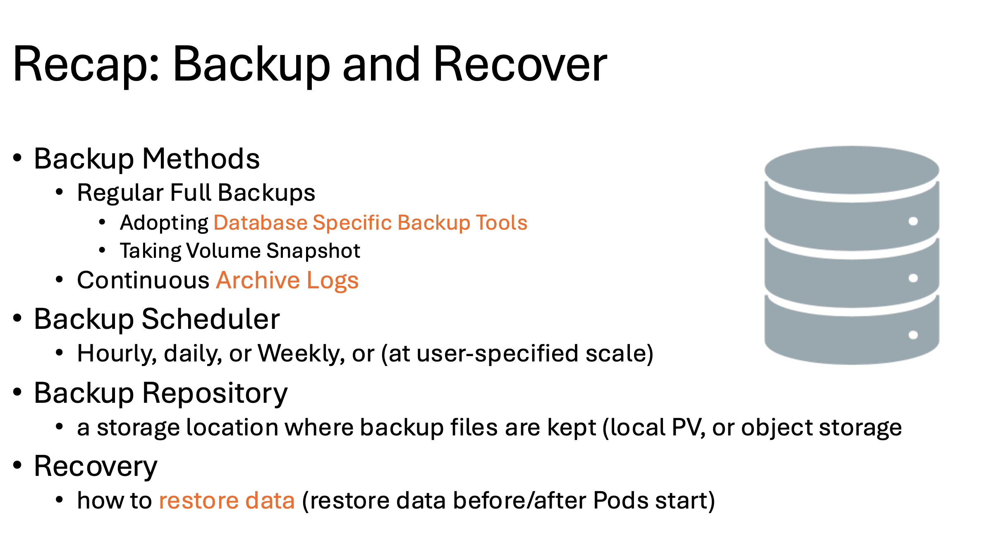
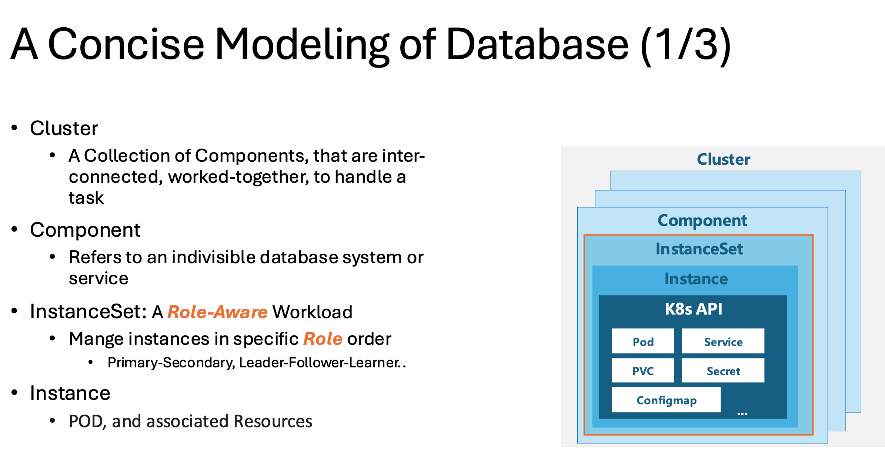
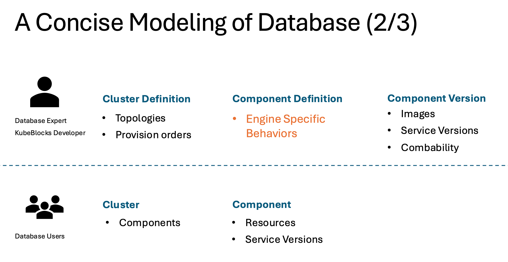
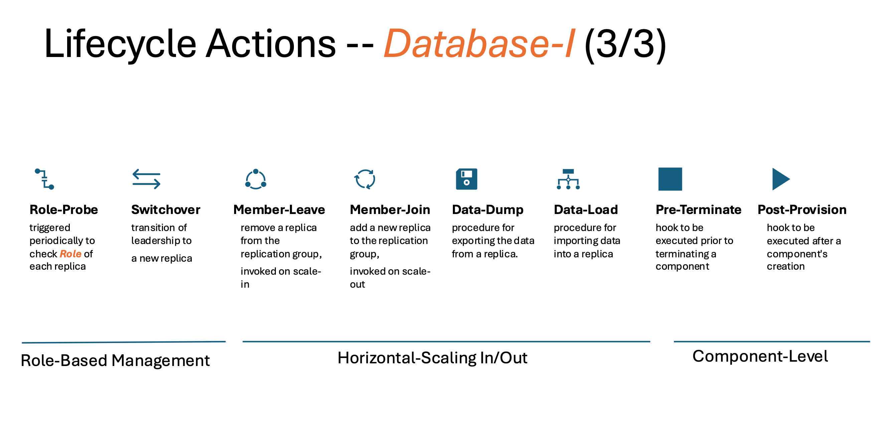
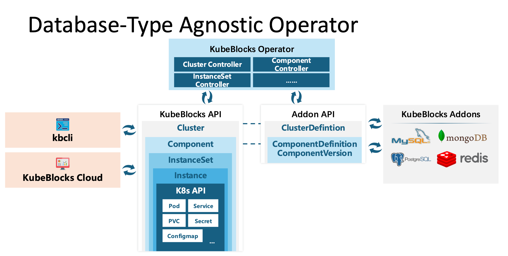
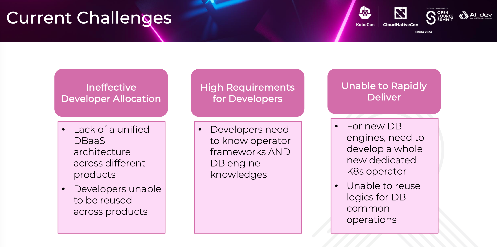
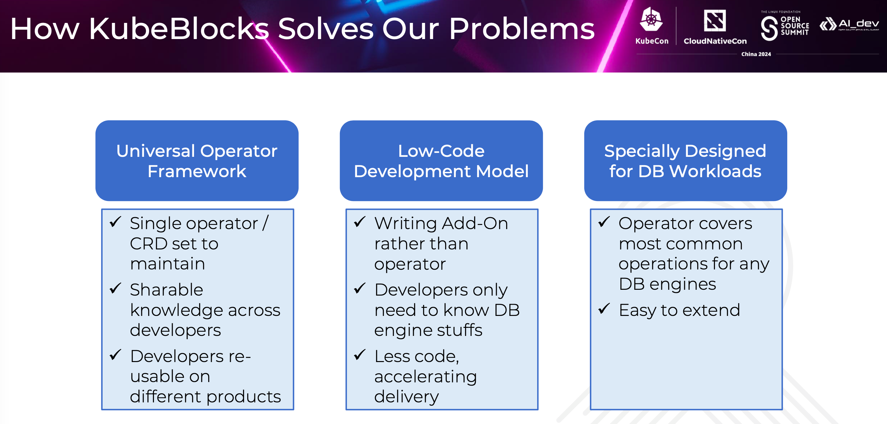
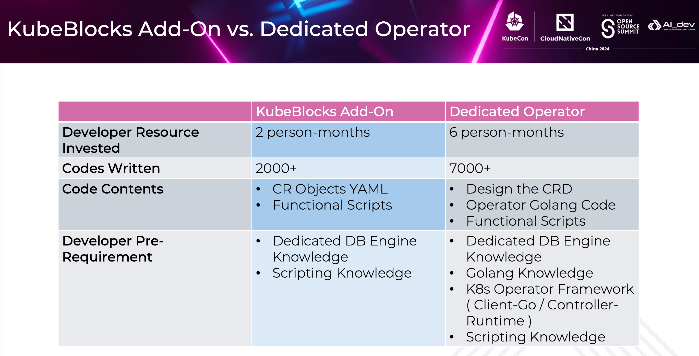
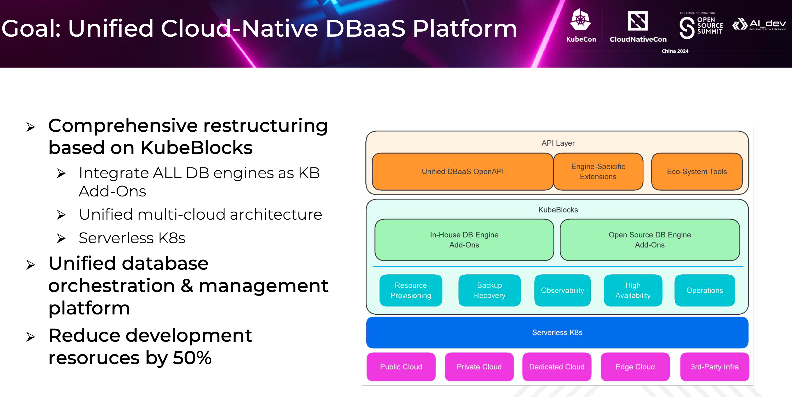

# How to Manage Database Clusters Without a Dedicated Operator?

As cloud computing and database technologies evolve, finding an efficient and cost-effective way to manage database clusters has become crucial. I hope this presentation provides you with valuable insights and practical solutions.

Before we dive into the details, let me introduce myself and my co-speaker. I am Shanshan from KubeBlocks, and ApeCloud is the startup company behind KubeBlocks. Before joining ApeCloud, I worked at Alibaba Cloud Database Group for years as a database developer for SQL optimization and SQL execution, focusing more on databases rather than cloud-native tech. My co-speaker Shun Ding is a system architect from China Mobile Cloud, and he is also a KubeBlocks contributor. He made this first commit earlier this year, and months later he integrated their in-house database to KubeBlocks as an addon.

Today, I will introduce KubeBlocks and the design concept of it, and Shun will share why they chose KubeBlocks, how KubeBlocks has helped reduce their work and what their next step with KubeBlocks are. We won't dive into detailed APIs or specific database technology in this talk.

## Why and how KubeBlocks is designed

### How to manage various databases on K8s?

The motivation we started the KubeBlocks project was quite simple: how to manage databases more effectively.
Our team is a group of people with strong database background and K8s background, including database developers, database administors, and SREs. We deal with hundreds of cloud database issues daily, from database crashes, slow queries, high availability to data migration, resource scheduling, etc.

The interesting part about our team is that we work on different database types, for instance, MySQL, PostgreSQL, Redis, MongoDB, which are widely used open source databases. When we exchange our ideas on how to manage a specific database, we find these databases actually share many things in common. If we can improve the management of one database, can others benefit from it? Besides, databases are in an era of rapid growth, with new data products emerging continuously. These new databaes, to some extent, still inherit those common characteristics.

So the challenge we face is: is it possible to design a unified platform, to manage not only one, but a batch of widely-used databases, or even more, to manage those emerging databases as well? What's more, if there is such a platform, we hope the platform can be deployed on either cloud or on-premises infrastructures.

Then, Kubernetes stands out as the natural choice because Kubernetes has become the de facto standard of container orchestration, and it can bring the platform wherever this is Kubernetes, such as public cloud, private cloud, edge cloud etc. So the challenge is how to manage various databases on Kubernetes.

The answer to "On Kubernetes" is straight forward, i.e. to develop an operator. But what about "various databases"?

Let's take a look at what "Manage" is first. When we talk about "Mange Database", it usually refers to:
provisioning, scaling (either horizontally or vertically), backup and restore, configuration (especially for parameters and for performance tuning), minor version upgrading, volume expansion, and monitoring.

To develop a dedicated operator covering all these features, one needs a team of database experts and cloud-native experts, several months of investment, and most importantly, a large user base. The more the users, the better the operator. But this can be quite challenging, and not every database team can afford such an endeavor. And the maturity level of operators may vary.

Compared to the thriving Kubernetes, the database field seems relatively niche to me. Can we find a way to rapidly transform database experts' knowledge into productivity, which means translating it into code? So that more and more databases will run on Kubernetes easily.

Here we take backup and restore as an example. Backup and restore are crucial to disaster recovery. Let's recap the classical backup and restore procedure.

1. Backup methods: This procedure usually has one or more backup methods, for example regular full backups and continuous archive logs. To take regular full backups, one may adopt some widely-used database-specific backup tools, or simply take a volume snapshot.
2. Backup scheduler: Then it has a backup scheduler to trigger the backup periodically, say, hourly, or daily or weekly or at user-specified time.
3. Backup repo: After that, it must configure a backup repository, to store each backup for some retention time, including backup files and some meta data. The backup repository can be a local PV, or an object storage, such as S3, or OSS, or MinIO in a test environment.
4. Restore: When restoring a database cluster from a backup, you have to set the procedure to restore data, and decide to restore data before or after the pod is running.

Throughout the whole procedure, we find out that the work of a database expert is quite focused and limited, primarily including:

- How to use database-specific backup tools;
- How to set the archive log;
- And how to configure the restore command if any.

And other tasks listed here can be left to cloud-native experts. The cloud-native expert only has to develop the framework to support this process, and this framework can be reused by different database experts, or the same database for different versions.

### The architecture of KubeBlocks

With these ideas in mind, here comes KubeBlocks. KubeBlocks is an open source and cloud neutral project. It was open-sourced last June and has 2k stars to date. KubeBlocks is a database-type agnostic operator, designed to be extensible, flexible, and pluggable.

Its extensiblility comes from its unified APIs. KubeBlocks provides an addon mechanism for integrating database engines, which also is the key to how Chind Mobile Cloud can integrate their in-house and open source databases into KubeBlocks within 2 months. We have about 30 addons so far, most of them are contributed by the community for their own needs.

It is flexible, which means it has a very flexible cluster topology. Users can customize their own cluster topology and each component comes from the addon market.

It is pluggable with its modular design. Modules such as backup and restore, montoring, and configuration are pluggable. One can choose which module to use tailored to their specific requirements.

If you are interested in KubeBlocks, you can visit our GitHub repo, and you will get more technical details and more documentations, and a full list of database addons we have.

All these features befenit from our precise and concise modeling of database, which is pivotal from the perspecitive of databases. We complete the modeling by taking the following three steps.

Step 1. Build a hierarchical model.

We first model each standalone database system or service as a component, such as a MySQL component to provide MySQL services, and an orchestor for MySQL high availability and replication management. This modeling is quite intuitive.

And a database cluster is, by nature, a collection of components that working together to handle certain database tasks. For example, a cluster with a MySQL component and an orchestor component makes a high-available MySQL Replication cluster. Further more, you can customize this cluster with any preferred proxy component such as HAProxy and ProxySQL.

These two layers - individual database components and the overall cluster - provide a straightforward, easy-to-follow structure. But what is so special about databases? It is not only stateful, the more important part is: it has roles.

We provide a workload, especially designed for databases, called InstanceSet, to provide role-aware management.

KubeBlocks InstanceSet is an improved StatefulSet that manages databases in a specific role order to enhance availability, rather than in the ascending or descending numeric order used by StatefulSet. InstanceSet supports heterogeneous replicas with varied resources and configurations, and can take individual database instances offline for proactive maintenance, for instance, when a replica is erroneous or a node should be upgraded.

There will be another talk the day after tomorrow from KubeBlocks and KuaiShou, and my colleague Xueqiang will introduce more details of instanceset.

Step 2. Separate the cluster template API and the cluster API.

We notice that it is still too complex for a database user, who simply wants to create a cluster.
Apart from the four layer modeling, we further divide each layer into two parts: one for database experts, and the other part for database users.

Database experts handle the cluster definition for topology, component definition to describe engine-specific behaviors, and component version to describe engine images and ensure compatibilities.
Database users only need to know the cluster and components they need, and for each component, they only need to care about resource configurations, such as CPU, memory, volume size, and replicas.

Step 3. Introduce the Database Interface.

With more and more databases integrated into KubeBlocks, we find the setup scripts are far from enough to describe engine specific behaviors.

Here we propose a set of database interfaces to manage replicas or component lifecycle, called Lifecycle Actions in KubeBlocks. Without these actions, one can never manage a database well. The details of each action vary from database to database. I category these actions into three groups:

- Role probe and switchover for role management;
- memberJoin and memberLeave, dataDump and dataLoad for horizontal scaling in and out;
- Post-provision and pre-termintion operations for component level management.

The most widespread action, so far, is roleProbe. It is triggered periodically to check the role of each replica and reports the results to pod, through events or API calls. So the database service will be routed to the right replica as expected.

With more addons joining our communtity, we will continuously refine these actions, and there are still actions uncoverd, for example reconfiguring and account provisioning.

To summarize, KubeBlocks is a database-type agnostic operator. It provides a unified API, and database experts can integrate their specific engines through our Addon mechanisms, focusing on database specific knowledge. While database users or administrators can interact with different databases using the same API. It significantly reduces the complexity and learning curve associated with database management.

KubeBlocks 1.0 will be released soon in two months, and welcome to join our communtity.

## How China Mobile Cloud uses KubeBlocks

Good afternoon, everyone. This is Shun from China Mobile Cloud. I'm a senior system architect. Today I'm happy to share with you how we use KubeBlocks to manage our cloud databases in a way without writing dedicated operators.

### Challenges faced by the DBaaS system of China Mobile Cloud

Before we jump in, let me share with you an overview about China Mobile Cloud DBaaS system, which manges all of our cloud databases. The DBaaS system in China Mobile Cloud covers a comprehensive product line, including transactional databases, analytical and search databases, NoSQL databases, and more. Not only do we provide the DB services for some most populuar open source databases and 3rd party databases, we are also developing our in-house DB engines and provide services on top of them. Currently we are serving for more than 35k customers across 9 major industries, such as government, telecom, finance, health care, education, etc.

And more than 130k database cluster instances are running on our 15 Level-1 regions and 31 Level-2 regions.  Besides database provisioning, we also build a solid eco-system to help our customers manage their databases more efficiently.  We've build so many helpful management tools and systems like data migration, DB management console, and some tools with AIOps capabilities. China Mobile Cloud DBaaS platform runs in a cloud-native way, which means most of our DB instances are running inside the K8s clusters.

As you can see, managing such a massive scale of DB instances is a challenging task. Although we've built a DBaaS system that can manage different types of DB instances well, we are currently facing challenges in maintaining such a DBaaS system. Our DBaaS system is roughly divided into the API layer and the operator layer, and the operator layer is the core part.

Our first challenge is that we have developed different operators for different DB engines. The differences between these operators are so significant that developers may struggle to switch from developing an operator for engine A to one for engine B, resulting in less flexible allocation of development resources.

Furthermore, it places high demands on developers, requiring them to understand both the principles of the database engine and the entire operator framework. While some frameworks are available, they still set a high bar for developers, making it challenging to quickly add productive team members.
What's more, we are developing our in-house DB engines and we want to create a DBaaS system for them quickly.

However, due to the challenges mentioned earlier, rapidly developing a DBaaS system for new engines isn't feasible for us. To achieve this, we need to build a highly skilled development team with expertise in our database engines and operator frameworks. Next, these developers have to create a new operator from scratch because the database engine is our in-house development, with no existing operators available. Building from the ground up leads to a lot of redundant work, and even if some logic is similar to other database engine operators, it cannot be effectively reused.

So, we set out to find a solution. How can we make operators have similar interfaces? How can we lower the requirements for DBaaS system developers? How can we quickly integrate new database engines?

### Why KubeBlocks?

That's when we discovered the KubeBlocks project, which addresses our challenges effectively. KubeBlocks is a universal operator framework specifically designed for database workloads, allowing developers to write different addons for various database engines to integrate them into the KubeBlocks system. The project stands out to us for several reasons:

Firstly, KubeBlocks is a universal operator framework, meaning a single operator can support all types of database engines. Developers only need to maintain one operator and a single set of CRDs, making it easier to share knowledge across the team at the operator level. This also allows for flexible assignment of developers to different engine teams.

Furthermore, the framework employs a low-code development model, where different database engines are integrated by creating addons, rather than developing dedicated operators from scratch.

The add-ons are simply Helm charts containing CR objects from the KubeBlocks framework. When developing addons, we only need to write the YAML files for the required CR objects and a few functional scripts. We'll dive deeper into these details later. The CR objects in the addons are defined declaratively, allowing developers to describe the desired state of a running database cluster, just like any other Kubernetes object, while the KubeBlocks framework handles reconciliation. This low-code development model lowers the barrier for building a DBaaS system for a new database engine — developers only need to understand how the engine works to get started.

Also, less code means fewer potential bugs and faster integration of new database engines, perfectly aligning with our requirements.

What's more, the KubeBlocks is a generic framework specially designed for database workloads. It effectively covers all the basic management operations for databases on Kubernetes. For example, it covers lifecycle management, backup & restore, configuration management, high availability, etc.

Additionally, KubeBlocks also includes extensible mechanisms, allowing specific database engine management operations to seamlessly integrate into the overall framework.

### Build the H-DB addon based on KubeBlocks

After the thorough research, we decided to give KubeBlocks a try. At that time, we needed to integrate an in-house database engine into our DBaaS system, which we referred to as H-DB. This presented an ideal opportunity to test KubeBlocks for DBaaS system integration.

Let me first give you a brief introduction to our H-DB.  It is a fully in-house developed, cloud-native distributed database engine, separating the computation and storage layer.  Usually, writing a DB operator for such a complex DB system is challenging, not mention to do it in a quick way. However, thanks to the KubeBlocks project, we can achieve that in a low-code way. Here's how we build the whole KubeBlocks addon:

- The first step is to design the cluster topology, and build up an addon scaffold. Typically, the initial addon just contains a rough ClusterDefinition scaffold and a very basic ClusterVersion specifying the images for all the component containers. Back to our case, there're two components in our H-DB cluster: the compute nodes and data nodes. So we defined a cluster definition object with these two components, configured the images for each component in the ClusterVersion, and just set a dummy start command in the ClusterDefinitions temporarily. Then we wrote a simple Cluster CR object for testing to ensure all the addons can be installed without problems and that Pods could be started successfully.
- The next step is to refine the ClusterDefinition, setting the right configuration parameters in the ConfigMap, also writing scripts to bootstrap the cluster. We tweak our configuration and scripts to make the cluster up and running. This is a crucial step, because it means the first workable add-on is done.
- The next part is to support the backup and recovery capability. We needed to write the functional scripts on backup and recovery, and integrate into the ActionSet CR objects in KubeBlocks. We could create a backup OpsRequest and a restore OpsRequest to test the functionality.
- Then, we wrote ConfigConstraint on the addon to control which parameters could be modified, whether they could be dynamically reloaded or not, and the reload command. This allowed the addon to modify some configuration parameters in the database engine.
- After that, we made further tweaks to this add-on. The next step is to enable high availability and role detection, add observability sidecars to our database clusters to collect metrics and logs from instances, and finally, add more cluster versions to map to different kernel versions.

Now, a complete KubeBlocks addons for our H-DB is done. By using KubeBlocks, we build the first DBaaS system for H-DB in just two months,  with just ONE person. And this can be even faster, because the later steps for building the addons can be parallelized. This is our first successful KubeBlocks integration case in China Mobile Cloud.

Here is a summarized comparison between developing KubeBlocks add-ons vs. developing a dedicated operator. We compare the KubeBlocks addon development process with the process of writing dedicated operators for a similar DB engine.

In terms of developer resources, the KubeBlocks addon requires only 2 person-months, whereas a similar product with an operator takes about 6 person-months.

The H-DB case is a great starting point, demonstrating how we can address the current issues faced by the DBaaS system using KubeBlocks.

### About feature cooperation

Our next step is to further integrate more engines through KubeBlocks for further evaluation and to upgrade to a new version of KubeBlocks, evaluating new features we are interested in.

In China Mobile Cloud, our ideal goal is to build a unified cloud-native DBaaS platform. On this platform, we aim to achieve unified multi-cloud architecture, unified interfaces at the API and operator layers, supporting database clusters with different architectures, and the database instances can be deployed on serverless Kubernetes clusters on demand. This will form a unified database orchestration and general management platform that supports different infrastructures such as public cloud, private cloud, dedicated cloud, edge cloud, etc.

As KubeBlocks continues to develop and improve, once it reaches sufficient maturity, we will consider restructuring our existing DBaaS engines based on the KubeBlocks framework. Although it may involve initial restructuring work, in the long run, we expect to save about 50% of the development resources on different DB engines.
