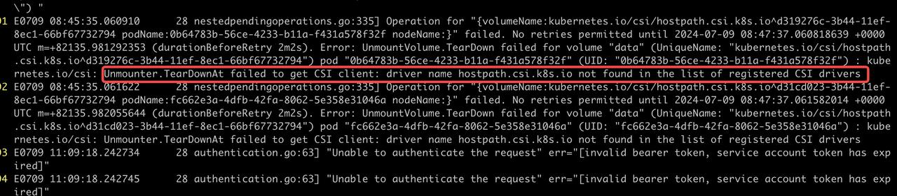
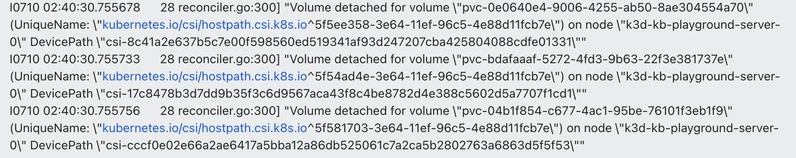
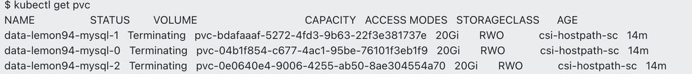
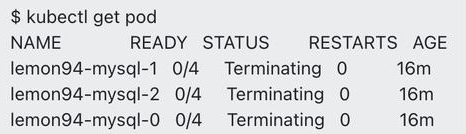
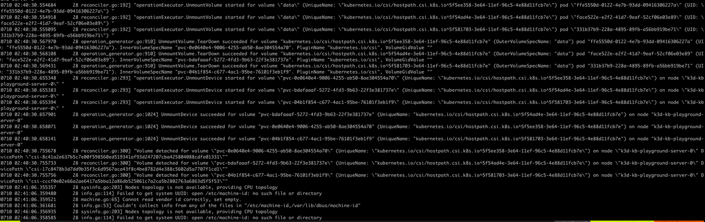
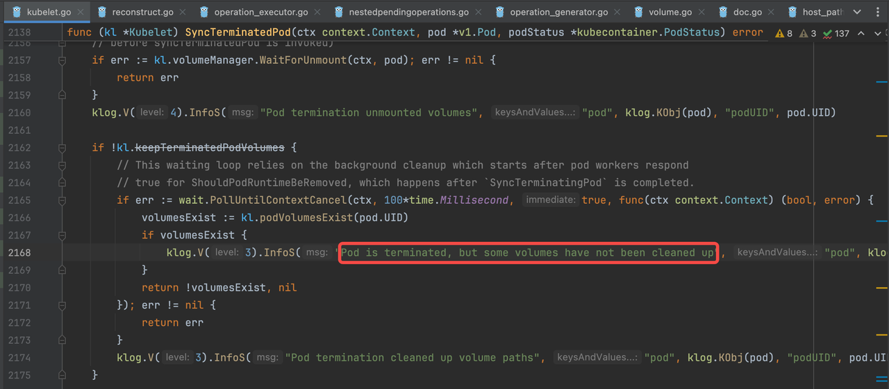
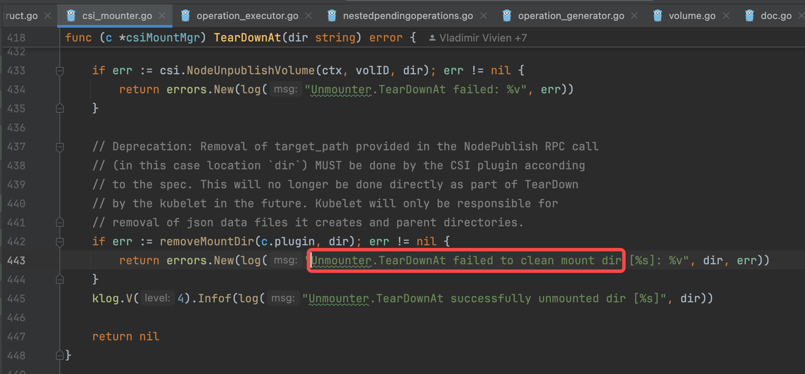
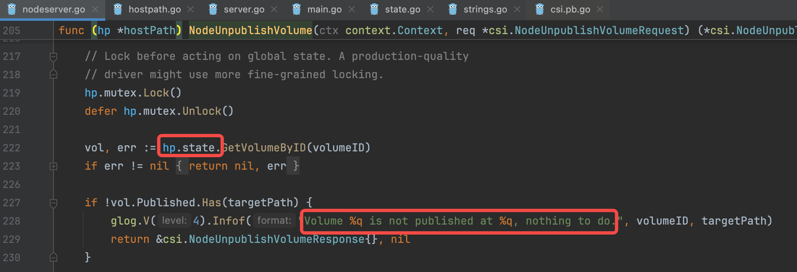
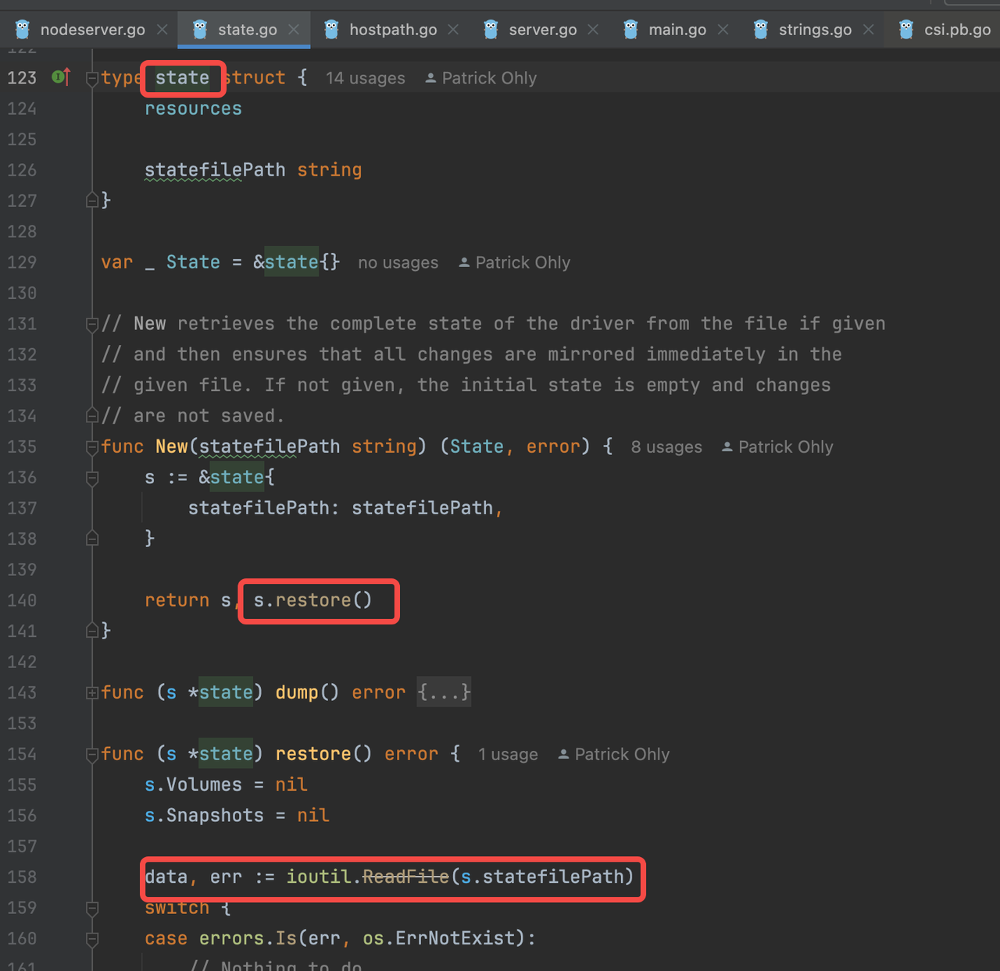

# How to Fix Pods Stuck in Terminating Status in Kubernetes?

Running into a Pod stuck in "Terminating" is one of those occasional, but nearly unavoidable, issues that every Kubernetes user experiences.

Recently, while assisting a community user test the upgrade from KubeBlocks v0.8 to v0.9, we hit a situation where a Cluster just wouldn’t delete. After a day of back-and-forth troubleshooting, we figured out the causes of a few strange problems, but one issue persisted — a Pod stuck in Terminating. Coincidentally, I was also discussing Pod lifecycle management with the KubeBlocks SIG members, so I decided it was a good chance to delve deeper and figure out what was really going on.

## Problem Reproduction

After some recollection and attempts, the steps to reproduce the issue are as follows:

1. Run `kbcli playground init` in KubeBlocks v0.8.
2. Run `kbcli cluster create xxxx`.
3. Upgrade kbcli to v0.9.
4. Run `kbcli kubeblocks upgrade` in KubeBlocks v0.9 and the `helm upgrade job` times out and fails.
5. Run `helm uninstall kubeblocks`.
6. Run `Delete cluster xxxx`.
7. Run `helm install kubeblocks`.
8. The `Cluster xxxx` remained in the Deleting status.

## Troubleshooting

### Pinpoint the Issue

Based on past experience, when a Cluster fails to delete, it’s usually because some subordinate resources can’t be removed. Our community user also observed that both the Pod and the PVC were stuck in the Terminating status. Since the PVC cannot be deleted until the Pod it’s attached to is gone (due to the finalizer protection), the focus naturally shifted to why the Pod couldn't be deleted.

First, let’s examine the YAML file of the Pod object. According to the official K8s documentation on the Pod termination process, we filtered out the fields related to Pod termination:
The relevant fields are still quite a bit to sift through, but we need to analyze each field systematically. Fortunately, this analysis goes quickly:

1. `deletionTimestamp` is set.
2. `finalizer` is empty.
3. It has exceeded `terminationGracePeriodSeconds (set to 30 seconds)`.
4. All containers have been `terminated`.
5. Two containers exited with non-zero codes: 137 and 143.
According to the K8s documentation, at this point, the kubelet should update the pod phase to Failed, but it still shows as `Running`.

It seems the kubelet’s current behavior doesn’t align with the documentation, so let’s dig into the kubelet logs to see what happened.

### Kubelet Logs

Once again, we’re faced with a lengthy log file, but luckily, the error message appears near the end:


It seems that while the kubelet was attempting to unmount the data volume, it encountered an error because it couldn’t find the corresponding Hostpath CSI Driver. After some checking, we confirmed that the Hostpath CSI Driver had indeed been removed during one of the earlier steps. So, we quickly reinstalled it.

```bash
kbcli addon enable csi-hostpath-driver
```

Unfortunately, while the unmounting process no longer threw errors, the Pod and PVC were still stuck in the Terminating status:







The kubelet logs didn’t provide any further clues.



### Kubelet Verbose Logs

As with any well-maintained open-source project, a robust logging mechanism is essential.

After consulting the documentation, we confirmed that both the kubelet startup command and configuration file allow for setting the log level. By default, this value is set to 0, but it can be increased to a maximum of 7.

So, we tried bumping up the log level to 6 to get more detailed logs.

Unfortunately, despite trying various attempts, we couldn’t change the log level in K3d, and even GPT-4o was stumped.

We then spent some additional time reproducing the issue in minikube, where we successfully set the log level to 6:

```bash
minikube start --extra-config=kubelet.v=6
```

And then we obtained the logs:

```bash
minikube logs -f
```

### Simplify the Reproduction Process

The initial reproduction steps were quite time-consuming. Based on the earlier analysis, the issue wasn’t directly related to KubeBlocks, so we could simplify the process as follows:

1. Create a Pod and PVC.
2. Disable the Hostpath CSI Driver.
3. Delete the Pod and PVC to trigger the issue.

Then we created the following Pod and PVC objects:

```yaml
apiVersion: v1
kind: PersistentVolumeClaim
metadata:
  name: data-xxxxxx
spec:
  accessModes:
  - ReadWriteOnce
  resources:
    requests:
      storage: 2Gi
---
apiVersion: v1
kind: Pod
metadata:
  name: hello-xxxxxx
spec:
  containers:
  - name: nginx
    image: nginx:latest
    volumeMounts:
    - name: volume-xxxxxx
      mountPath: /data
  volumes:
  - name: volume-xxxxxx
    persistentVolumeClaim:
      claimName: data-xxxxxx
```

We switched the CSI Driver to use the built-in Hostpath of minikube :

```bash
minikube addon enable csi-hostpath-driver
```

With simplified steps, it became much easier and more efficient to reproduce the issue and analyze the verbose kubelet logs.

### More Information Uncovered

The logs were extensive, so it required a lot of patience to go through them. After some time, two suspicions emerged.

#### Suspicion 1: Every 100ms, there’s a message reporting "Pod is terminated, but some volumes have not been cleaned up."

```bash
Jul 15 03:49:33 minikube kubelet[1432]: I0715 03:49:33.850919    1432 kubelet.go:2168] "Pod is terminated, but some volumes have not been cleaned up" pod="default/hello-xxxxxx" podUID="9a42f711-028a-4ca2-802a-0e4db734592d"
```

#### Suspicion 2: We noticed exponentially frequent messages reporting "failed to remove dir ...: device or resource busy."

```bash
Jul 15 03:49:34 minikube kubelet[1432]: E0715 03:49:34.053463    1432 nestedpendingoperations.go:348] Operation for "{volumeName:kubernetes.io/csi/hostpath.csi.k8s.io^e9216f9a-425b-11ef-9abf-4e607aa5fc75 podName:9a42f711-028a-4ca2-802a-0e4db734592d nodeName:}" failed. No retries permitted until 2024-07-15 03:51:36.0534518 +0000 UTC m=+881.487053596 (durationBeforeRetry 2m2s). Error: UnmountVolume.TearDown failed for volume "volume-xxxxxx" (UniqueName: "kubernetes.io/csi/hostpath.csi.k8s.io^e9216f9a-425b-11ef-9abf-4e607aa5fc75") pod "9a42f711-028a-4ca2-802a-0e4db734592d" (UID: "9a42f711-028a-4ca2-802a-0e4db734592d") : kubernetes.io/csi: Unmounter.TearDownAt failed to clean mount dir [/var/lib/kubelet/pods/9a42f711-028a-4ca2-802a-0e4db734592d/volumes/kubernetes.io~csi/pvc-ea3178bf-fc12-432c-a01b-8389b04c508e/mount]: kubernetes.io/csi: failed to remove dir [/var/lib/kubelet/pods/9a42f711-028a-4ca2-802a-0e4db734592d/volumes/kubernetes.io~csi/pvc-ea3178bf-fc12-432c-a01b-8389b04c508e/mount]: remove /var/lib/kubelet/pods/9a42f711-028a-4ca2-802a-0e4db734592d/volumes/kubernetes.io~csi/pvc-ea3178bf-fc12-432c-a01b-8389b04c508e/mount: device or resource busy
```

Suspicion 1 suggests that the kubelet is periodically checking whether the Pod’s associated resources have been released, but finds that some volumes have not been cleaned up.

Suspicion 2 indicates that the kubelet is trying to delete the directory corresponding to the PVC, but the directory is still in use.

Both point to volume resources not being released.

So, we logged into minikube to check why the directory hadn’t been released:

```bash
root@minikube:/var/lib/kubelet/pods# lsof +D /var/lib/kubelet/pods/9a42f711-028a-4ca2-802a-0e4db734592d/volumes/kubernetes.io~csi/pvc-ea3178bf-fc12-432c-a01b-8389b04c508e/mount
root@minikube:/var/lib/kubelet/pods# mount | grep /var/lib/kubelet/pods/9a42f711-028a-4ca2-802a-0e4db734592d/volumes/kubernetes.io~csi/pvc-ea3178bf-fc12-432c-a01b-8389b04c508e/mount
/dev/vda1 on /var/lib/kubelet/pods/9a42f711-028a-4ca2-802a-0e4db734592d/volumes/kubernetes.io~csi/pvc-ea3178bf-fc12-432c-a01b-8389b04c508e/mount type ext4 (rw,relatime)
```

Also `lsof` returned nothing, indicating no process was using this directory. `mount` returned results, indicating the directory was still mounted.

This narrowed the issue down further: the directory corresponding to the PVC hadn’t been unmounted or the unmount failed.

### Jump to the Conclusion

At this point, we can conclude that during the process of deleting the Pod and PVC, the CSI Driver was restarted, preventing the directory corresponding to the PVC from being correctly unmounted and stalling the Pod termination.

The solution is to manually unmount the directory.

### Is There More?

But wait, isn’t the CSI Driver essentially the control plane for storage resources? The restart of the control plane shouldn’t hinder the release of storage resources — Kubernetes can’t be this fragile.

This indicates a deeper issue: Why did the restart of the CSI Driver prevent the PVC directory from unmounting?

### Time to Dig Deeper

This is undoubtedly a bug in either the kubelet or the CSI Driver. The next step is to locate the bug. Since the logs weren’t revealing much more, it was time to dive into the code.

| Component Name | Version |
| :------------- | :------ |
| K8s            | 1.29.3  |
| Hostpath CSI Driver | 1.11.0 |

Based on the earlier suspicions, we used the error messages to trace the corresponding code locations.

Code Location 1:



Here, it’s clear that during the Pod termination process, the kubelet checks every 100ms whether the volume has been cleaned up. Until the method returns `true`, this loop continues, meaning the kubelet remains stuck at this point. As a result, the Pod deletion process cannot proceed, and the Pod remains in the Terminating status.

This behavior matches what we observed and also the logs in Suspicion 1.

Code Location 2:



Here, we see that the kubelet indeed attempts to delete the directory corresponding to the PVC. Looking further up the code, we find that if the deletion fails, the kubelet employs an exponential retry mechanism.

However, a new discovery emerges: `removeMountDir` can only execute if `csi.NodeUnpublishVolume` returns successfully, indicating that the unmount operation has succeeded.

So, the culprit is narrowed down to the Hostpath CSI Driver.

### The Culprit Revealed

Next, we examined the Hostpath logs, which report "Volume ... is not published at ...".

```bash
I0715 03:49:34.052729       1 server.go:101] GRPC call: /csi.v1.Node/NodeUnpublishVolume
I0715 03:49:34.052749       1 server.go:105] GRPC request: {"target_path":"/var/lib/kubelet/pods/9a42f711-028a-4ca2-802a-0e4db734592d/volumes/kubernetes.io~csi/pvc-ea3178bf-fc12-432c-a01b-8389b04c508e/mount","volume_id":"e9216f9a-425b-11ef-9abf-4e607aa5fc75"}
I0715 03:49:34.053026       1 nodeserver.go:228] Volume "e9216f9a-425b-11ef-9abf-4e607aa5fc75" is not published at "/var/lib/kubelet/pods/9a42f711-028a-4ca2-802a-0e4db734592d/volumes/kubernetes.io~csi/pvc-ea3178bf-fc12-432c-a01b-8389b04c508e/mount", nothing to do.
```

It turns out the directory wasn’t published — did the metadata get lost after the restart? Could it be that the metadata was stored in memory? That seems unreliable.

However, we must consider that the CSI Driver is Hostpath, which, according to the official documentation, is only intended for testing. Could it really be this unreliable?

To confirm, we conducted further code investigation.




It appears the state metadata is indeed stored in a file. Upon opening the file, we found the entry: `"Published": null`.

```bash
minikube ssh
cat /var/lib/csi-hostpath-data/state.json

{"Volumes":[{"VolName":"pvc-be2792ca-6937-4296-a234-381bd7c94f1d","VolID":"f595ce89-4283-11ef-ba81-6a2e54b029dc","VolSize":2147483648,"VolPath":"/csi-data-dir/f595ce89-4283-11ef-ba81-6a2e54b029dc","VolAccessType":0,"ParentVolID":"","ParentSnapID":"","Ephemeral":false,"NodeID":"","Kind":"","ReadOnlyAttach":false,"Attached":false,"Staged":null,"Published":null}],"Snapshots":null}
```

### Fix the Issue

The mystery is solved: The Hostpath CSI Driver has a bug in persisting metadata.
Time to submit an issue and a PR to the official repo. But before submitting, I checked the existing issues list and [the same issue had already been reported](https://github.com/kubernetes-csi/csi-driver-host-path/issues/457).

Great news! someone already reported it, and it’s been fixed. All we need to do is to upgrade the driver, as outlined in [this PR](https://github.com/apecloud/helm-charts/pull/21).

## Summary

The actual troubleshooting process was much more complex and involved a significant effort. To make the explanation easier to follow, some analysis steps and branches were omitted from the narrative.

For instance, devising an efficient reproduction process took considerable time, as did getting the kubelet logs in order. We also spent a lot of time reading through the kubelet and volume management-related code.

Some key takeaways:

1. During Pod termination, Kubernetes waits indefinitely for all volume resources to be released.
2. The kubelet handles Pods by assigning each Pod a goroutine responsible for managing its entire lifecycle, from Creating, Running, Terminating, and Terminated.
3. The kubelet’s module for handling volume-related tasks is called the volume manager, which assigns a goroutine to each volume to handle attaching, mounting, unmounting, and detaching.
4. The Hostpath CSI Driver is definitely not suitable for production environments.