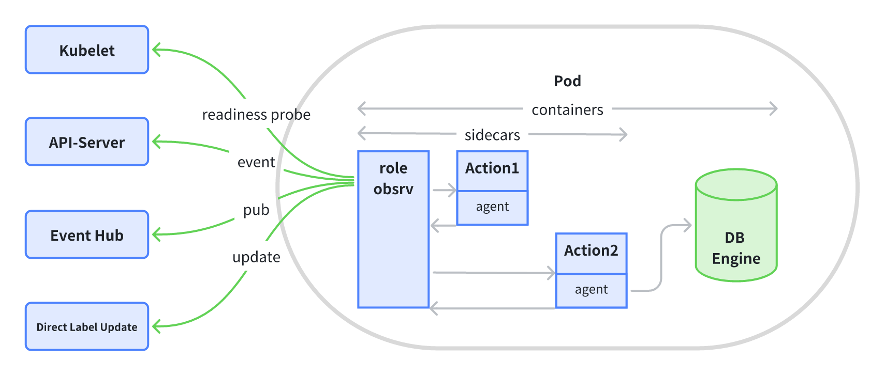

# InstanceSet

In KubeBlocks, an instance is the fundamental unit, composed of a Pod and other auxiliary objects. To make it simple, you can think of it as just a Pod, but we'll refer to it as an "instance" throughout the text.

**InstanceSet is a general workload API responsible for managing a group of instances. All workloads in KubeBlocks are ultimately managed through InstanceSet**.

Compared to K8s native workload APIs like StatefulSet and Deployment, **InstanceSet incorporates additional features and design considerations specifically related to databases, such as roles and high availability**. **This makes it much more capable of supporting complex stateful workloads like databases**.

## How to use InstanceSet?

InstanceSet generates a fixed name for each instance it manages and creates a Headless Service, giving each instance a stable network identifier. With this identifier, instances within the same InstanceSet can find each other, and other systems within the same Kubernetes cluster can also find each instance under this InstanceSet.

InstanceSet uses VolumeClaimTemplates to generate storage volumes with fixed identifiers for each instance. Other instances or systems can locate an instance through its fixed identifier and access the data stored in its volume.

When it comes to updates, **InstanceSet supports RollingUpdate for all instances in a deterministic order**, and you can configure various behaviors for the rolling updates. Similarly, during horizontal scaling, InstanceSet adds or removes instances in a deterministic order.

Building on these basic features, to meet the demands of supporting high availability in databases, InstanceSet further supports more features like **in-place update**, **instance template**, **taking specified instance offline**, **role-based services**, and **role-based update strategies**.

Let's delve into these features in more detail below.

## How to generate an instance name?

InstanceSet renders instance objects by using an instance template, with the number of instances controlled by the `Replicas` field.

```yaml
apiVersion: workloads.kubeblocks.io/v1alpha1
kind: InstanceSet
metadata:
  name: mydb
spec:
  replicas: 3
  template:
    spec:
      terminationGracePeriodSeconds: 10
      containers:
      - name: mydb
        image: registry.kubeblocks.io/mydb:15.1
        ports:
        - containerPort: 5123
          name: db
        volumeMounts:
        - name: data
          mountPath: /var/mydb/
  volumeClaimTemplates:
  - metadata:
      name: data
    spec:
      accessModes: [ "ReadWriteOnce" ]
      storageClassName: "my-storage-class"
      resources:
        requests:
          storage: 10Gi
```

In the example above, an InstanceSet named `mydb` is declared, consisting of three instances (`replicas=3`). Each instance is rendered from an instance template made up of `template` and `volumeClaimTemplates`. The `template` is used to render the Pod within the instance, while `volumeClaimTemplates` are used to render the PVC within the instance.

The pattern for generating instance names is `$(instanceSet.name)-$(instanceID)`. By default, `instanceID` is an ordinal value. In this example, `instanceSet.name` is `mydb`, and the ordinal starts from 0, incrementing with each instance. The resulting instance names are: `mydb-0`, `mydb-1`, and `mydb-2`. When using the multi-instance template feature, the `instanceID` generation rule expands to `$(template.name)-$(ordinal)`. For more details, refer to the [instance template documentation](https://kubeblocks.io/docs/preview/api_docs/instance-template/introduction).

To provide a fixed network identifier, each InstanceSet generates a Headless Service object. The name pattern for this Service is `$(instanceSet.name)-headless`. In this example, the final Headless Service name is `mydb-headless`. Through this pattern, three instances under this InstanceSet gain three fixed network identities: `mydb-0.mydb-headless.default.local`, `mydb-1.mydb-headless.default.local`, and `mydb-2.mydb-headless.default.local`.

Since the InstanceSet name becomes part of the fixed network identifier, it must conform to [the DNS Label standard](https://kubernetes.io/docs/concepts/overview/working-with-objects/names/#dns-label-names).

## How to get instances under an instanceSet?

When InstanceSet generates secondary resources, it adds two labels to them: `workloads.kubeblocks.io/managed-by=InstanceSet` and `workloads.kubeblocks.io/instance=<instanceSet.name>`. These labels can be used to get all secondary resources under a specific InstanceSet, including Pods and PVCs.

In the example above, the labels to get the corresponding Pods would be:

- `workloads.kubeblocks.io/managed-by=InstanceSet`
- `workloads.kubeblocks.io/instance=mydb`

If you want to customize the labels used to get Pods under an InstanceSet, you can do so by setting the `spec.selector` field. For example:

```yaml
apiVersion: workloads.kubeblocks.io/v1alpha1
kind: InstanceSet
metadata:
  name: mydb
spec:
  selector:
    matchLabels:
      db: mydb
```

Labels set via `spec.selector`'s `MatchLabels` will be automatically added to the Pods generated by the InstanceSet.

## Create/Delete an instance

By default, InstanceSet creates instances in an ascending order. When creating a new instance, the Pod of the previous instance must reach the `Ready` status before the next one is generated.

Deleting an instance follows the opposite order. Before deleting an instance, the Pod within it must be in the `Ready` status. The main consideration here is that if a Pod is not `Ready`, there might be problems with the data in its attached PVC. InstanceSet ensures that no further actions are taken until data issues are resolved.

InstanceSet also uses the creation logic for both the initial setup and horizontal scaling up. Conversely, the deletion logic is applied during horizontal scaling down.

InstanceSet also supports configuring instance creation and deletion strategies via the `spec.podManagementPolicy`. Currently, two strategies are supported: `Ordered` (the default) and `Parallel`. The `Parallel` strategy allows for the simultaneous creation or deletion of instances.

### Scale down specified instances

In some scenarios, you may need to delete specific instances during a scale-down operation.

For example, if a Node needs to be offloaded due to a physical machine failure, all instances (Pods) on that Node should be deleted. This can be achieved through the specified instance scale-down feature.

Using the earlier example of the `mydb` InstanceSet, you could scale down by deleting the instance with ordinal `1` while keeping the instances with ordinals `0` and `2`:

```yaml
apiVersion: workloads.kubeblocks.io/v1alpha1
kind: InstanceSet
metadata:
  name: mydb
spec:
  replicas: 2
  offlineInstances: ["mydb-1"]
# ...
```

For more detailed instructions, refer to [the offloading specified instance feature](https://kubeblocks.io/docs/preview/api_docs/maintenance/scale/horizontal-scale).

## Update an instance

When fields in the instance template updates, all instances under the InstanceSet will also be updated.

By default, InstanceSet updates each instance sequentially in descending order. Before updating an instance, the previous instance must have already been updated and reached the `Ready` status.

If the instances are granted with roles (which will be discussed in the following sections), InstanceSet updates them according to their role priorities, starting from the lowest to the highest. If the role priorities are the same, the instances are updated further in descending ordinal order.

InstanceSet supports more update behaviors by configuring `spec.updateStrategy`. For example, you can control the total number of instances to be updated using `spec.updateStrategy.rollingUpdate.partition` and manage the maximum number of unavailable instances during the update process with `spec.updateStrategy.rollingUpdate.maxUnavailable`. For more details, refer to the [`spec.updateStrategy` API documentation](https://kubeblocks.io/docs/preview/developer_docs/api-reference/cluster#apps.kubeblocks.io/v1alpha1.UpdateStrategy).

### In-place update

Applications often have high availability requirements for databases. Typically, when a Pod is updated, the action taken is to recreate it, which takes some time and can result in temporary unavailability of the database service.

To minimize the impact of updates on database service availability, InstanceSet supports **in-place updates**. When certain fields in the instance template are updated, InstanceSet **updates the Pod or scales the PVC in place**, ensuring minimal disruption to the instance.

In principle, the in-place update capability leverages the in-place update feature of Kubernetes native Pod API. The specific fields supported are as follows:

- `spec.template.metadata.annotations`
- `spec.template.metadata.labels`
- `spec.template.spec.activeDeadlineSeconds`
- `spec.template.spec.initContainers[*].image`
- `spec.template.spec.containers[*].image`
- `spec.template.spec.tolerations` (Only adds Toleration)
- `spec.instances[*].annotations`
- `spec.instances[*].labels`
- `spec.instances[*].image`

Starting from Kubernetes v1.27, the `PodInPlaceVerticalScaling` feature gate can be enabled to further support in-place updates for CPU and memory. InstanceSet automatically detects the Kubernetes version and feature gate status and provides additional support for the following fields:

For Kubernetes 1.27 and later, with `PodInPlaceVerticalScaling` enabled, the following fields support in-place updates:

- `spec.template.spec.containers[*].resources.requests["cpu"]`
- `spec.template.spec.containers[*].resources.requests["memory"]`
- `spec.template.spec.containers[*].resources.limits["cpu"]`
- `spec.template.spec.containers[*].resources.limits["memory"]`
- `spec.instances[*].resources.requests["cpu"]`
- `spec.instances[*].resources.requests["memory"]`
- `spec.instances[*].resources.limits["cpu"]`
- `spec.instances[*].resources.limits["memory"]`

For PVCs, InstanceSet also leverages the PVC API's capabilities and only supports volume expansion.

For more details, refer to [the in-place update feature](https://kubeblocks.io/docs/preview/api_docs/maintenance/in-place-update/overview).

## Instance templates

By default, **InstanceSet generates all instances from a single template**.

In some scenarios, you may need instances with different configurations within the same InstanceSet, such as varying resource allocations or environment variables. InstanceSet **supports defining additional instance templates** on top of the default template to accommodate these needs.

Using the previously mentioned `mydb` InstanceSet as an example, if you want to configure it with one large primary instance and two smaller secondary instances, you can configure this cluster as follows:

```yaml
apiVersion: workloads.kubeblocks.io/v1alpha1
kind: InstanceSet
metadata:
  name: mydb
spec:
  replicas: 3
  template:
    spec:
      terminationGracePeriodSeconds: 10
      containers:
      - name: mydb
        image: registry.kubeblocks.io/mydb:15.1
        ports:
        - containerPort: 5123
          name: db
        volumeMounts:
        - name: data
          mountPath: /var/mydb/
  volumeClaimTemplates:
  - metadata:
      name: data
    spec:
      accessModes: [ "ReadWriteOnce" ]
      storageClassName: "my-storage-class"
      resources:
        requests:
          storage: 10Gi
  instances:
  - name: primary
    replicas: 1
    resources:
      limits:
        cpu: 8
        memory: 16Gi
  - name: secondary
    replicas: 2
      resources:
        limits:
          cpu: 4
          memory: 8Gi
```

For more detailed instructions, refer to [the instance template feature](https://kubeblocks.io/docs/preview/api_docs/instance-template/introduction).

## Roles

Most database systems support multi-instance deployments, where each instance assumes a different role, typically determined by their internal data replication relationships. For example, in PostgreSQL, there are Primary and Secondary roles, while in etcd, there are roles like leader, follower, and learner.

In a database system, instances with different roles often have distinct characteristics. For example, in terms of service capabilities, the primary node usually supports read and write capabilities, while other nodes provide read-only capabilities. During operations, following best practices for managing database, the secondary instances are typically upgraded one by one first, with the primary instance upgraded last. Before upgrading the primary instance, a switchover is usually performed to ensure data integrity and minimize service downtime.

For these characteristics, InstanceSet includes several features related to database roles. These role-related features include **role definition**, **role detection**, **role-based services**, and **role-based update strategies**.

**Role definition** describes the roles in the system and their attributes.

**Role detection** periodically checks each instance's role using configured detection methods and updates the corresponding instance's label accordingly.

**Role-based services** allow services to filter specific roles based on each instance's role label, enabling appropriate service capabilities.

**Role-based update strategies** determine the update sequence of instances based on role priority.

### Role definition

InstanceSet allows defining all role information through `spec.roles`, including role names, read/write capabilities, whether they participate in elections, and whether they are the leader.

For example, PostgreSQL can be configured as follows:

```yaml
spec:
  roles:
  - name: "primary"
    accessMode: ReadWrite
    isLeader: true
  - name: "secondary"
    accessMode: Readonly
```

### Role detection

InstanceSet includes a preconfigured **role detection Sidecar** that periodically executes a configured role detection script and works with the InstanceSet Controller to update the role name in the corresponding instance's label.



The role detection script can be configured as follows:

```yaml
spec:
  roleProbe:
    customHandler:
    - image: probe.kubeblocks.io/sample-probe:1.0
      cmd: ["probe"]
      args: ["redis"]
    periodSeconds: 5
    roleUpdateMechanism: DirectAPIServerEventUpdate
```

In this example, the configured role detection Sidecar runs the probe command in the `sample-probe` image every 5 seconds and sends the detection results encapsulated in a K8s Event to the InstanceSet Controller. Upon receiving this event, the InstanceSet Controller parses each instance's role information and updates it in the instance's role label. The role label format is: `kubeblocks.io/role=<role.name>`. The InstanceSet Controller also updates the instance's read/write capability in the label with the format: `workloads.kubeblocks.io/access-mode=<role.accessMode>`.

### Role-based services

By configuring the Service's selector to match different role labels and read/write capability labels on instances, the Service can provide different service capabilities.

For example, the read/write service for PostgreSQL can be configured as follows:

```yaml
apiVersion: v1
kind: Service
metadata:
  name: pg-readwrite-svc
spec:
  selector:
    workloads.kubeblocks.io/managed-by: InstanceSet
    workloads.kubeblocks.io/instance: mydb
    kubeblocks.io/role: primary
```

### Role-based update strategies

As mentioned earlier, when updating instances, InstanceSet considers role priorities once roles are configured.

Specifically, InstanceSet supports three role update strategies through `spec.memberUpdateStrategy`: `Serial`, `Parallel`, and `BestEffortParallel`.

`Serial` updates instances sequentially from low to high role priority. If two instances have the same role priority, they are updated further in descending ordinal order.

`Parallel` updates all instances simultaneously, following the update strategy specified in `spec.updateStrategy`.

`BestEffortParallel` updates instances in batches based on role priority from low to high, while ensuring system availability. This strategy also follows the update strategy specified in `spec.updateStrategy`.

## Manage large-scale instances

InstanceSet can manage up to **10,000 instances**. When managing a large number of instances, you can configure the number of concurrent working nodes in the InstanceSet Controller by setting the `KUBEBLOCKS_RECONCILE_WORKERS` environment variable to improve processing speed.

## References

[1]  Instance template: https://kubeblocks.io/docs/preview/api_docs/instance-template/introduction

[2]  DNS Label: https://kubernetes.io/docs/concepts/overview/working-with-objects/names/#dns-label-names

[3]  Offload specified instance: https://kubeblocks.io/docs/preview/api_docs/maintenance/scale/scale-for-specified-instance

[4]  Kubernetes Pod API for in-place update: https://kubernetes.io/docs/concepts/workloads/pods/#pod-update-and-replacement

[5]  In-place update: https://kubeblocks.io/docs/preview/api_docs/maintenance/in-place-update/overview