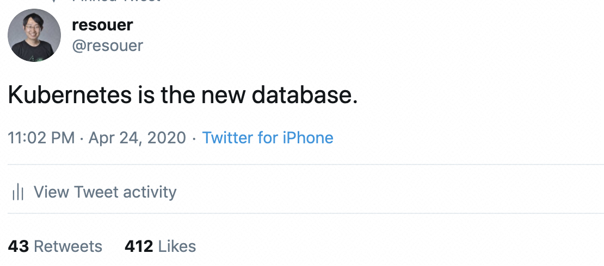
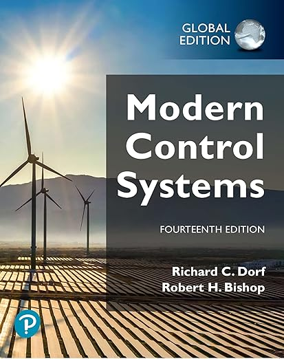

# Is Kubernetes a Database?

> This blog was originally published by Lei Zhang in 2020, but even four years later, this blog is still inspiring. The question, "Is Kubernetes a database?", is worth pondering. Using this question as a starting point, Lei's blog unveils the core concepts behind K8s, such as declarative application management and Infrastructure as Data (IaD). By drawing an analogy between K8s and databases, this blog guides us in reinterpreting K8s from a database perspective. Through this blog, you'll gain a fresh understanding of both K8s and the question, "Is Kubernetes a database?"
>
> Hope you enjoy reading!

*By Lei Zhang, CNCF TOC Member (2021-2023), Kubernetes maintainer*

Recently, a statement about "Kubernetes is the new database" has attracted a lot of attention in the Kubernetes community. To be more accurate, this idea means Kubernetes operates similarly to a database, rather than suggesting you should use Kubernetes as a database.

At first glance, comparing Kubernetes with a database is far-fetched. After all, the way Kubernetes typically works, like the controller pattern, declarative APIs, and so on, seems not to have direct connection with a database. However, behind this statement, there is a fundamental concept which can be traced back to one of the core theories adopted by Kubernetes.

## Fundamentals of declarative application management in Kubernetes

When talking about Kubernetes, the concept of declarative application management often comes up. In fact, this design is what sets Kubernetes apart from all other infrastructure projects since it's a unique capability of Kubernetes. But have you ever thought about what declarative application management is in Kubernetes?

### 1. Declarative application management is more than declarative APIs

If we examine the core principle of Kubernetes, it's clear that most features in Kubernetes – whether it's kubelet running containers, kube-proxy applying iptables rules, kube-scheduler managing Pod  scheduling, or Deployment handling ReplicaSets – follow the Controller pattern we emphasized. It means that you can define your desired and final state (be it networking, storage, etc.) using YAML files and components in Kubernetes works to bring the cluster's state in line with the desired state, ultimately achieving full alignment. This process, where the actual state gradually aligns with the desired state, is called reconciliation. This is also the fundamental way Operator and custom Controller function.

The way in which Controllers are driven to reconcile the actual and desired states by using declarative descriptions intuitively deomstrates the declarative application management. This process includes two key aspects:

- **The declared desired state**: This description must represent the final state that you want. If you declare an intermediate state or expect to dynamically adjust the desired state, it can undermine the precise execution of this declarative semantics.
- **The reconciliation-driven alignment process**: The reconciliation process ensures the system’s state aligns with the desired state in theory. Specifically, reconciliation continuously performs the "check -> diff -> execute" loop, allowing the system to detect discrepancies between its current state and the desired state, then take necessary actions. Simply having a declarative description is not enough. It’s easy to understand why: even if the system reaches the desired state when the description is first applied, that doesn’t guarantee it will stay in that state an hour later. Many people confuse "declarative application management" with "declarative APIs," largely because they fail to recognize the importance of reconciliation.

You might be wondering what benefits this declarative application management model brings to Kubernetes.

### 2. Essence of declarative application management: Infrastructure as Data

In fact, the theoretical foundation behind the declarative application management system is a concept known as Infrastructure as Data (IaD). This idea suggests that managing infrastructure should not be tied to any specific programming language or configuration method, but rather represented as pure, structured, system-readable data that fully captures the user’s desired system state.

> Note:
>
> Infrastructure as Data is sometimes also referred to as Configuration as Data, but they share the same underlying idea.

The benefit of such approach is that any operation on the infrastructure ultimately becomes an operation on data – whether creating, reading, updating, or deleting them (CRUD). More importantly, the way you manage data has nothing to do with the infrastructure itself. Therefore, interacting with the infrastructure doesn’t bind you to a specific programming language, certain Remote Procedure Call Protocol, or SDK. As long as you can generate the correctly formatted data, you are free to use any method you prefer to interact with the infrastructure.

In Kubernetes, this means that if you want to perform any operation, all you need to do is to submit a YAML file and modify it as needed. You aren’t required to use Kubernetes' RESTful API or SDK. **The content of this YAML file is, in fact, the Data in Kubernetes' IaD system.**

Therefore, Kubernetes has defined all its functionalities as APIs, which essentially are structured pieces of Data. This allows Kubernetes users to achieve their desired outcomes by managing Data rather than being tied to specific languages or SDKs. Even more crucially, compared to dedicated, imperative APIs or SDKs, declarative data represented by YAML makes it easier to abstract and integrate with existing infrastructure capabilities. This is one of the key reasons why the Kubernetes ecosystem has grown so explosively: the combination of IaD, declarative APIs, and the Controller pattern has made it much easier for the community to develop plugins and integrate various capabilities. Moreover, these plugins and capabilities are highly portable and reusable, which makes Kubernetes distinguish from projects like Mesos and OpenStack. In essence, IaD is what gives Kubernetes the power to become the "platform for platforms."

It becomes clearer that the Data in Kubernetes' IaD design manifests as declarative APIs, while Kubernetes’ control loops ensure that the system consistently adheres to the state described by this Data. **In this sense, Kubernetes is essentially a Reconciliation system that expresses its target state as Data and uses Controllers to keep the system in tune with that target state.**

Wait a minute. This idea of maintaining a system at a target state sounds familiar, doesn’t it?

That’s right. The foundational concept behind Kubernetes is something most readers with an engineering background have likely studied: it’s called Modern Control Systems.

The statement in the beginning of this blog seems to make more sense now?

With the understanding of Kubernetes’ nature, some of the more difficult-to-grasp concepts suddenly become much clearer.

For instance, the reason we write so many YAML files when working with Kubernetes is that we need a way to submit Data to the Kubernetes control system. In this process, YAML is merely a human-readable format for defining Data. YAML is like the grid paper we used as kids for handwriting practice, and the actual writing within the grids is the Data that Kubernetes truly cares about – the core around which the entire system operates.

Some readers might have realized by now: since Kubernetes needs to process Data, doesn’t Data itself need a fixed format so Kubernetes can parse it? Exactly. This format in Kubernetes is called the Schema of APIs. If you often write custom Controllers, you might be familiar with this Schema on a practical level: CRD (Custom Resource Definition) is a special API used to define Schema.

## YAML engineer? No! You're a database engineer!

We've reached the conclusion that the essence of Kubernetes is IaD and this decides its working principle is more like a database instead of the traditional distributed system. Such difference might be the fundamental reasons why the learning curve for Kubernetes can be quite steep.

From this perspective, the various APIs that Kubernetes exposes to you are essentially the pre-defined Table of Schema. The YAML files we painstakingly write are just operations on the Data within these tables – CRUD. YAML itself is akin to SQL, a tool that helps you manage data in a database. The only difference from a traditional database is that Kubernetes doesn't aim to persist the data it receives. Instead, it uses this data to drive Controllers to perform specific operations, gradually aligning the system's state with the desired state declared in the Data. This brings us back to the control systems we discussed earlier.

It’s precisely because Kubernetes revolves around Data as the primary entity that writing and managing YAML files has become almost the sole daily task of a Kubernetes engineer. However, with the understanding of IaD introduced here, you can start seeing yourself more as a database engineer – a title that’s arguably much more fitting than YAML engineer.

## View Layer of Kubernetes

As mentioned earlier, if you re-examine the design of Kubernetes from a database perspective, you’ll notice the elegant thinking behind many of its concepts. For instance,

- **Data model** – Kubernetes APIs and the CRD mechanism
- **Data interception and validation** – Kubernetes Admission Hooks
- **Data-driven mechanism** – Kubernetes Controller/Operator
- **Data change monitoring and indexing** – Kubernetes Informer mechanism
- ......

On the other hand, as Kubernetes infrastructure grows more complex and third-party plugins and capabilities increase, the community has noticed an explosion in both the scale and complexity of Kubernetes’ internal tables (API resources). This led to early discussions within the Kubernetes community about designing a View for Kubernetes, similar to database views. The goal is:

`CREATE VIEW <K8s Original Objects> AS <K8s Viewer Objects>`

Introducing a View Layer on top of Kubernetes' built-in API resources offers benefits similar to those of views in databases. For example,

1. **Simplify data format and expression**
  The Kubernetes View Layer should expose developers and operation engineers to simpler, abstracted application-layer APIs, instead of raw infrastructure-layer APIs. Users should have the freedom to define these View-Layer objects without being constrained by the Schema of the underlying Kubernetes object.
2. **Simplify complex data operations (simplified SQL)**
  View-Layer objects should not only be simpler from a UI perspective but should also define and manage the complex resource topologies underneath, reducing the operational complexity of managing Kubernetes applications.
3. **Protect underlying tables**
  Since developers and operation engineers interact with View-Layer objects, the underlying Kubernetes objects are protected. This allows Kubernetes objects to evolve or be upgraded without users noticing.
4. **Reuse data operations (reusable SQL)**
  Because the View-Layer is fully decoupled from the infrastructure, an application or operation declared via the View-Layer can move between any Kubernetes clusters without worrying about differences in supported capabilities.
5. **Views are still tables – supporting standard table operations**
  Kubernetes View-Layer objects must still be standard Kubernetes objects, so that all of Kubernetes’ API operations and primitives apply to the View-Layer objects. We should not introduce additional cognitive load to the Kubernetes API model.

Although the idea of a View Layer in Kubernetes hasn't been materialized upstream, it became a popular practice among large-scale users. For example, Pinterest designed a `PinterestService` CRD to describe and define their applications, effectively acting as a View-Layer object. However, this approach is still quite rudimentary for most enterprises. It's important to note that the View isn't just a simple abstraction or translation of data. To use the View at scale in a production environment, several key challenges need to be addressed:

- How to define and manage mappings between View-Layer objects and underlying K8s objects? Keep in mind that this isn't a simple one-to-one mapping, since one view-Layer object might map to multiple K8s objects.
- How to model and abstract operational capabilities? A real application isn't just a simple Deployment or Operator; it's a combination of the running program and the associated operational capabilities (e.g., a containerized app and its horizontal scaling strategy). How can these operational capabilities be reflected in the application definition? Is defining everything as annotations feasible?
- How to manage the binding between operational capabilities and the running program? How do we map this binding to the actual execution relationships within K8s?
- How to standardize the definition of cloud resources, e.g., an Alibaba Cloud RDS instance, using the View-Layer object?
- ……

These are the key challenges that prevented the Kubernetes upstream from realizing the View Layer, and they are also the focus of application-layer open-source projects like the [Open Application Model (OAM)](https://github.com/oam-dev/spec). It's important to note that OAM as a specification alone isn't enough to address all of these challenges. The creation of a Kubernetes View Layer requires the backing of a standardized View-Layer dependency library to ensure its implementation. Only then can we truly enjoy the benefits and convenience of a Data View within Kubernetes. One of the most robust Kubernetes View-Layer libraries in the community today comes from the Crossplane team, called [oam-kubernetes-runtime](https://github.com/crossplane/oam-kubernetes-runtime).

## Summary

The IaD-as-core and database-like design of Kubernetes has been a key theoretical foundation behind the thriving community. However, the IaD concept is a double-edged sword. On the one hand, it has fueled a booming ecosystem; on the other hand, it has led to countless independent Controllers and Operators, along with a highly complex Kubernetes cluster pieced together by these Controllers. This production-level Kubernetes cluster, with its immense complexity, is still a long way from becoming a cloud-native application management platform that is truly beloved by developers and operators.

Over the past five years, Kubernetes' monumental success has actually been a process of standardizing and unifying infrastructure capabilities (such as networking, storage, and containers) under declarative APIs. As Kubernetes application-layer technologies like OAM (Open Application Model) become more widely adopted, we are now seeing the emergence of a standardized application-layer ecosystem. More and more teams are working to expose user-friendly APIs through a more accessible Data View Layer while offering infrastructure engineers more powerful platform capabilities with horizontal connectivity and modularization.

At the same time, other missing pieces in database-like Kubernetes will continue to emerge from the community. For example, today's rapidly maturing Open Policy Agent (OPA) project can be seen as the evolving result of the data interception, validation, and modification mechanism. Similarly, the performance tuning of control planes in Alibaba's ten-thousand-node clusters shares an underlying theory and practice remarkably similar to modern database performance optimization.
