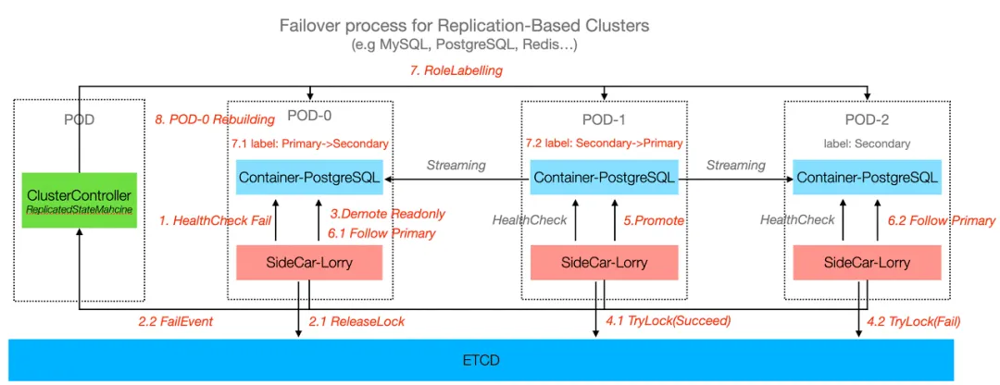

# Managing 6000+ Databases as a Single Developer: How KubeBlocks Made It Possible

> About Sealos
>
> Sealos is a cloud operating system distribution based on the Kubernetes kernel. It empowers developers to quickly build applications by offering services like application management, function computing, database services, and S3-compatible storage. The platform currently serves thousands of developers.

Let’s start with a question: Without being a professional DBA, can a single developer manage over 6,000 database clusters?

In today’s era of cloud computing and large-scale distributed systems, databases remain the cornerstone of many business systems. As their scale grows, so does the complexity of managing databases. Therefore, when faced with managing thousands of database instances alone, most would say, "That's impossible!"

However, what seems impossible has already been made a reality inside Sealos.

In this blog, I'll share how we successfully manage over 6,000 database instances across four availability zones using KubeBlocks, transforming what seemed impossible into an everyday operation.

## Challenges of managing databases at large scale

Managing such an extensive database cluster traditionally requires a large operations team and sophisticated automation tools. Any misstep can lead to performance bottlenecks, data loss, or service interruptions. Tasks such as resource allocation, scaling, backup, monitoring, alert, and access control become increasingly intricate, especially in multi-tenant environments with diverse database types.

As database instances scale from dozens to thousands, the complexity grows exponentially—not just in technical challenges but also in operational and organizational demands.

Key pain points:

- **Complexity of deploying and maintaining databases**: Version control, configuration adjustments, and scaling operations.
- **Handling exceptions**: Issues like backup failures or replication delays.
- **Ensuring high availability and disaster recovery**: The high availability of a database relies on the collaboration of replication, failover, and backup systems. With over 1,000 instances, component failures can affect the entire system.
- **Operational complexity**: The difficulty of monitoring increases and manual operations become unfeasible.
- **Balancing cost and efficiency**: Operating large-scale databases traditionally requires substantial teams, creating human resource bottlenecks.

Traditional approaches fall short when dealing with thousands of instances, necessitating new tools and platforms to redefine database management workflows.

## How Sealos simplifies database management

Sealos Database is a robust, flexible platform for visualized management and operation of various databases. Its integration with KubeBlocks provides a complete suite of tools and mechanisms for streamlining database management, scaling, monitoring, and recovery, catering to both development and production environments.

Key features:

- Supports diverse database types with unified management.
- High availability with automated recovery mechanisms.
- Integrated monitoring and alert systems.
- Dynamic resource allocation.
- Flexible backup and recovery mechanism.

The backbone of this capability lies in **KubeBlocks**, which powers Sealos’ automated database management.

KubeBlocks provides the following key functions:

- **One-click deployment**: Rapidly deploy and configure instances using CRDs and Helm Charts.
- **High-availability architecture**: Built-in support for replication and failover.
- **Backup and recovery**: Supports PITR (Point-in-Time Recovery) through built-in tools.

The following table summarizes the database distribution across Sealos availability zones. Sealos also supports self-hosted data centers.

| Availability Zone | Instance Amount |
| :---------------: | :-------------: |
| Singapore Zone    | 1137            |
| Hangzhou Zone     | 3387            |
| Guangzhou Zone    | 405             |
| Beijing Zone      | 1014            |

## How it works: core architecture and design

By now, you might be wondering: how does KubeBlocks provide stable and efficient database services on the Sealos platform? Let's explore the core design principles, focusing on high-availability architecture and comprehensive backup and recovery mechanisms.

## KubeBlocks architecture

The architecture of KubeBlocks revolves around modular components that simplify complex database operations. It provides user-friendly interfaces (e.g., kbcli, kubectl, and Argo CD) connected to a robust core API. The platform supports more than 30 database and middleware addons, making it flexible for diverse needs. Through built-in controllers such as **Cluster**, **Component**, and **InstanceSet**, users only need to manage high-level operations while the system automates backend complexities. This significantly lowers the technical barrier, making it accessible even for non-experts.

### High-availability mechanisms

KubeBlocks employs two primary high-availability algorithms: quorum-based and primary-replica databases.

1. **Quorum-based databases**:
   - KubeBlocks handles role detection, role correction, and rebuilding.
   - The database itself focuses solely on core detection and failover functions.
2. **Primary-replica databases**:
   - For MySQL and PostgreSQL primary-replica, KubeBlocks handles detection, decision-making, failover, rebuilding, and role correction.

KubeBlocks also supports general high-availability architectures, enabling various database types, including replication and sharding clusters. By increasing replica count, KubeBlocks enhances reliability and availability, minimizing data loss risks. For example,

1. **PostgreSQL**: KubeBlocks leverages the open-source Patroni framework for high availability, with Noop as the failover strategy.
2. **Redis**: KubeBlocks integrates Redis Sentinel as the high-availability solution for replication clusters, deploying Sentinel as a separate component in RedisReplication Clusters.

### Backup and recovery mechanisms

KubeBlocks provides backup and recovery capabilities by integrating **BackupRepo**, to ensure secure and reliable data backups. The platform supports on-demand and schecduled backups and stores physical files (data files and log files) by physical backups.

#### Backup options

- **On-Demand Backups**:
  - Backup tools: Database-specific tools like MySQL XtraBackup or PostgreSQL `pg_basebackup`.
  - Snapshot backup: KubeBlocks utilizes the cloud disk with snapshot capability for faster speeds.
- **Scheduled Backups**: Customizable retention periods, methods, and schedules, enabling automated tasks.

##### Physical backup

Characteristics of physical backup:

- **Fast recovery**: Restores the database to its original state efficiently.
- **Data consistency**: Ensures data integrity during backup and recovery.
- **Storage efficiency**: Optimized space usage, ideal for large-scale deployments.

The process of backup is illustrated as below:

The Sealos platform, combined with KubeBlocks, enhances data protection in production environments by enabling efficient backup and recovery. It addresses various needs, including data loss prevention, disaster recovery, and data migration.

### Migration design

KubeBlocks utilizes [Ape-DTS](https://github.com/apecloud/ape-dts), an open-source data migration tool, for seamless database migration processes. Ape-DTS supports data transfers between any source and target database, supporting data subscriptions, and data processing. It handles both real-time synchronization and offline migration.

Migration Workflow:

1. **Source database (Source DB)**: Supplies data for migration.
2. **Extractor**: Extracts full and incremental data from the source DB by using CDC (Change Data Capture).
3. **Data Pipeline**:
   - **Queue**: Temporarily stores extracted data with support for resumable transfers.
   - **Parallelizer**: Processes tasks in parallel for higher efficiency.
   - **Sinker**: Writes data to the target database.
4. **Target database (Target DB)**: Serves as the final destination for migrated data.

## Conclusion

Sealos, powered by KubeBlocks, has transformed database management into a streamlined, efficient process. It reduces time and costs while significantly simplifying operations. Whether you're a developer, data engineer, or system administrator, this robust database service enables effective management of large-scale clusters with ease.
