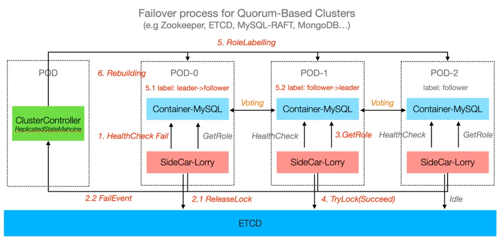

# Managing Over 6,000 Self-Hosted Databases Without a DBA: How a Single Engineer Leveraged KubeBlocks to Make It Possible

> About Sealos
>
> [Sealos](https://sealos.io/) is a startup offering Kubernetes-based PaaS (Platform-as-a-Service) solutions tailored for Chinese application developers. Sealos empowers developers to rapidly build and deploy applications by providing ready-to-use, pay-as-you-go Kubernetes services. In addition, Sealos offers a wide range of services, including function computing, gateways, DBaaS(Database-as-a-Service), MinIO storage, and an App store. 

> Author: Jinhu Xie, Sealos Engineer

Let’s start with a question: Can a single engineer, without being a professional DBA, manage over 6,000 self-hosted database clusters?

In today’s era of cloud computing and large-scale distributed systems, databases remain the cornerstone of many applications. As their scale grows, so does the complexity of managing databases. Therefore, when faced with managing thousands of database instances alone, most would say, "That's impossible!"

However, what seems impossible has already been made a reality inside Sealos. Sealos provides its developer users with Kubernetes-based PaaS services, along with essential DBaaS offerings, including **MySQL**, **PostgreSQL**, **Redis**, **MongoDB**, **Kafka**, and **Milvus**, managing **over 6,000 database instances across four regions**.

In this blog, I'll share how I, a K8s engineer without DBA background, successfully manage such a massive number of databases using KubeBlocks in Sealos, transforming what seemed impossible into an everyday operation.

## Challenges of managing databases at large scale

Managing such an extensive database cluster traditionally requires a large operations team and a wide array of  sophisticated tools. Even the smallest mistake can result in  service disruptions, performance degradation,  or, in the worst-case scenario, data loss. Tasks such as resource management, scaling, backup, monitoring, alerting, and access control become increasingly complex, especially in multi-tenant environments that host multiple database types, such as MySQL, PostgreSQL, Redis, MongoDB, and more.

As the number of database instances to manage grows from dozens to thousands, the complexity increases exponentially—not only in terms of technical challenges but also in operational and organizational demands.

Challenges of managing databases at scale include:

- **Routine deployment and maintenance**:  Tasks such as minor version upgrades, configuration adjustments, and scaling up or down can become increasingly numerous and time-consuming.
- **Timely handling of exceptions**: Issues like backup failures or replication delays require immediate attention.
- **Ensuring high availability and disaster recovery**: High availability relies on the coordination of replication, failover, and backups. However, as the number of instances scales to thousands, even a single component failure can cascade and impact the entire system.
- **Configuration drift over time**: Manual operations often lead to discrepancies between the actual configurations of hosts and instances and the desired configurations stored in the central repository.
- **Cost considerations**: Managing large-scale databases typically requires a substantial operations team, making human resource costs a significant bottleneck.

Traditional operational methods are no longer sufficient to address these challenges. New technologies and platform-based tools are essential to redesign and streamline database management processes.

## How Sealos simplifies database management?

Sealos offers a powerful and flexible DBaaS platform for user visually managing and utilizing their various databases. It supports **MySQL**, **PostgreSQL**, **Redis**, **MongoDB**, **Kafka**, and **Milvus** with unified management. The platform simplifies database operations with tools for resource management, scaling, integrated monitoring and alerting systems, ensuring high availability, automated failover, and flexible backup and recovery. Suitable for both development and production environments.

The following table summarizes the distribution of database instances provided by Sealos to customers across Sealos Regions as of December 2024.

| Availability Zone | Instance Amount |
| :---------------: | :-------------: |
| Singapore Zone    | 1137            |
| Hangzhou Zone     | 3387            |
| Guangzhou Zone    | 405             |
| Beijing Zone      | 1014            |

Sealos leverages **K8s and KubeBlocks** as its foundation to enable core features of automated database management. Engineers familiar with Kubernetes can efficiently manage databases using the **KubeBlocks operator**. Managing large-scale database instances with **KubeBlocks** addresses the challenges of routine maintenance, exception handling, high availability, configuration consistency, and cost optimization. Here’s how KubeBlocks solves these issues effectively:

### Routine deployment and maintenance

**Challenge:**

Routine tasks like version upgrades, configuration changes, and scaling become overwhelming as the number of instances grows.

**KubeBlocks solution:**

- **Declarative management**: Using Kubernetes-native CRDs (Custom Resource Definitions), users can define desired states for databases (e.g., version, replicas, configuration). KubeBlocks ensures the desired state is always reconciled with the actual state.
- **Automated workflows**: KubeBlocks provides built-in automation for common tasks such as rolling upgrades, scaling, and configuration updates. These workflows ensure minimal downtime and consistent execution across thousands of instances.

### Timely handling of exceptions

**Challenge:**

Issues like backup failures, replication delays, or unexpected crashes require immediate detection and response to prevent cascading failures.

**KubeBlocks solution:**

- **Self-healing capabilities**: KubeBlocks automates failover and recovery processes, reducing the need for manual intervention. For example, if a replica becomes unhealthy, KubeBlocks can automatically recreate it from a healthy node.
- **Real-time monitoring and alerts**: KubeBlocks integrates with monitoring tools like Prometheus and Grafana to provide real-time metrics and alerts for database status, replication health, and backup processes.
- **Centralized exception management**: All database activity logs and alerts are centralized, making it easier for operators to analyze and resolve issues quickly.

### Ensuring high availability and disaster recovery

**Challenge:**

Coordinating replication, failover, and backups at scale is complex, and a single failure can have cascading effects in a large system.

**KubeBlocks solution:**

- **Built-in High Availability**: KubeBlocks simplifies the setup of High Availability (HA) environments by automating replica management, leader election, and failover mechanisms for databases like MySQL, PostgreSQL, or MongoDB.
- **Backup and restore automation**: KubeBlocks integrates with external storage (e.g., object storage or NFS) to automate backups and ensure rapid recovery in case of failure. Scheduled backups and point-in-time recovery options improve disaster recovery workflows.

### Addressing configuration drift

**Challenge:**

Manual operations often lead to discrepancies between actual configurations and the desired configurations, which can result in unexpected behavior or downtime.

**KubeBlocks solution:**

- **Unified configuration management**: KubeBlocks uses declarative configuration files stored in a central repository. These configurations are applied consistently across all instances, eliminating manual errors.
- **Drift detection and reconciliation**: KubeBlocks continuously monitors the actual configuration of database instances and compares it to the desired state. If drift is detected, it automatically reconciles the differences, ensuring consistency.
- **Version control**: Configuration files and changes are version-controlled, allowing operators to track changes and roll back to previous configurations if necessary.

### Cost Optimization

**Challenge:**

Managing thousands of database instances typically requires a large operations team, making human resources a major cost driver.

**KubeBlocks solution:**

- **Operational efficiency**: By automating routine maintenance, exception handling, and scaling, KubeBlocks significantly reduces the need for manual intervention, allowing a small team to manage thousands of instances.

## How it works: core architecture and design

By now, you might be wondering: **how does KubeBlocks enable Sealos to offer such a wide range of DBaaS services**? Let’s explore its **core design principles** for supporting a variety of databases, with a focus on its flexible **high-availability architecture** and **comprehensive backup and recovery mechanisms**.

## KubeBlocks architecture

The architecture of KubeBlocks revolves around modular components that simplify the complexities of providing database hosting services on a PaaS platform like Sealos.  It provides user-friendly interfaces (e.g., `kbcli`, `kubectl`, and Argo CD) connected to a robust core API. The platform supports more than 30 database and middleware addons, making it flexible for diverse needs. With built-in controllers such as **Cluster**, **Component**, and **InstanceSet**, users only need to manage high-level APIs, while the operator automates and abstracts away the underlying complexities. This significantly reduces the technical barriers and makes the platform accessible even to non-database-experts.

### High-availability mechanisms

Different databases have varying levels of built-in support for High Availability. To address this, KubeBlocks supports two common HA models: **quorum-based** and **primary-secondary replication**, enabling flexible adaptation to the unique characteristics and requirements of different databases.

1. **Quorum-based high availability model**:

    For databases that support distributed consistency (such as Kafka and MongoDB), these databases ensure high availability and consistency through a quorum mechanism. In the quorum model, database nodes achieve distributed consistency through an election process, typically requiring a majority of nodes (i.e., a quorum) to reach consensus for writes or to elect a new primary node. Even if some nodes fail, as long as the quorum is maintained, the cluster can continue to operate normally.

    KubeBlocks manages role detection, role transitions, and replica rebuilding by continuously monitoring database node statuses (e.g., leader, follower, or replica) using health checks. If a node becomes unhealthy, KubeBlocks initiates role transitions or replica recovery to maintain quorum and consistency. When a failed node is restored or replaced, KubeBlocks automates replica rebuilding by synchronizing data from healthy nodes and ensuring the node is fully up-to-date before rejoining the cluster.
2. **Primary-secondary replication High Availability model**:

    The **primary-secondary High Availability model** is common in traditional databases such as **MySQL**, **PostgreSQL**, and **Redis**. These databases rely on a primary node to handle write requests, while one or more replica nodes synchronize data to provide read scalability and ensure high availability.

    KubeBlocks simplifies and enhances primary-secondary setups by automating critical processes such as role detection, high-availability decision-making, failover, replica rebuilding, and role transitions. It continuously monitors database nodes (e.g., primary and replicas) using health checks. During node failures, it automates failover by promoting the most up-to-date replica as the new primary, ensuring data consistency with mechanisms like MySQL binary logs or PostgreSQL streaming replication. It updates cluster connection endpoints (e.g., Kubernetes Services or DNS) for seamless application connectivity. KubeBlocks also automates replica rebuilding after failures.

KubeBlocks also supports third-party high-availability solutions. For example:

1. **MySQL**: KubeBlocks supports managing MySQL high availability through **Orchestrator**.
2. **PostgreSQL**: KubeBlocks supports managing PostgreSQL high availability through **Patroni**, using **Noop** as the failover strategy.
3. **Redis**: In addition to Redis Cluster, KubeBlocks integrates Redis Sentinel as the high-availability solution for replication clusters, deploying Sentinel as a separate component in Redis Replication Topology.

KubeBlocks supports a variable number of replicas. For critical business databases, increasing the replica count enhances reliability and availability, significantly reducing the risk of data loss.

### Backup and recovery mechanisms

KubeBlocks provides robust backup and recovery capabilities by storing backup files in an external BackupRepo (e.g., object storage or NFS), ensuring data security and reliability. It supports both on-demand and scheduled backups, offering options for disk snapshot backups and database-specific tools like MySQL XtraBackup and PostgreSQL pg_basebackup. With support for full and incremental backups, KubeBlocks enables Point-In-Time Recovery (PITR) from the BackupRepo, allowing data restoration to a specific point in time during disasters.

The process of backup is illustrated as below:

The Sealos platform, integrated with  KubeBlocks, strengthens data protection in production environments by providing efficient backup and recovery capabilities. It effectively supports scenarios such as data loss prevention, disaster recovery, and historical data retrieval.

### Migration design

Developers often need to migrate external databases into Sealos or transfer databases across multiple Sealos regions. The Enterprise version of KubeBlocks utilizes [Ape-DTS](https://github.com/apecloud/ape-dts), an open-source data migration tool, for seamless database migration processes. Ape-DTS supports data synchronization across multiple open-source databases and is well-suited for online, real-time data migration.

Migration Workflow:

1. **Source database (Source DB)**: Supplies data for migration.
2. **Extractor**: Extracts full and incremental data from the source DB by using CDC (Change Data Capture).
3. **Data Pipeline**:
    - **Queue**: Temporarily stores extracted data with support for resumable transfers.
    - **Parallelizer**: Processes tasks in parallel for higher efficiency.
    - **Sinker**: Writes data to the target database.
4. **Target database (Target DB)**: Serves as the final destination for migrated data.

## Conclusion

KubeBlocks has transformed database management into a streamlined, fully automatic process. It reduces time and costs while significantly simplifying operations. Whether you're a developer, platform engineer, or system administrator, it enables effective management of large-scale database clusters with ease and efficiency.
