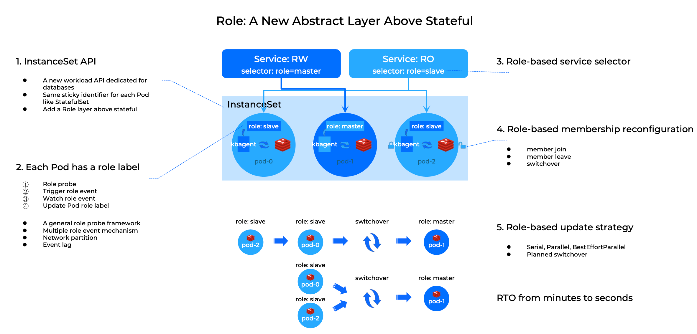
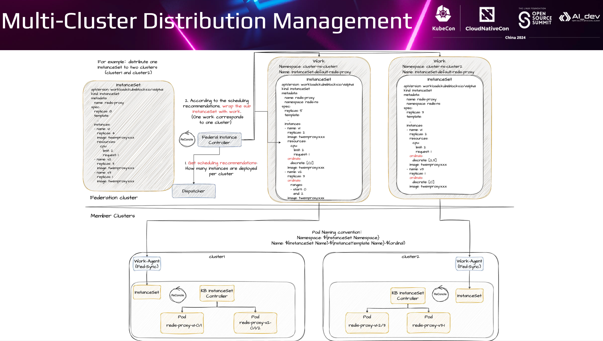

# Resource Utilization Boost: Large-Scale Redis Migration from Bare Metal to Kubernetes

I'm Xueqiang Wu, and I'm thrilled to be here at KubeCon to share some insights with you. Today, I’ll be co-presenting with Yuxing Liu from Kuaishou, and we'll discuss the migration of large-scale Redis instances from bare metal to Kubernetes, focusing on how this move can significantly improve resource utilization.

Let’s start with today’s agenda. First, I'll give you a quick introduction to the KubeBlocks project. Then, from the perspective of a single Redis cluster, I’ll highlight three key challenges KubeBlocks addresses to better run databases like Redis on Kubernetes. After that, Yuxing will share his experiences of managing multiple Redis clusters across multiple Kubernetes clusters, from a large-scale deployment perspective.

## What is KubeBlocks?

To begin, let me give you an overview of KubeBlocks. KubeBlocks was created by ApeCloud, a startup founded by a team with extensive experience in database development and operations, particularly from our time at Alibaba Cloud. About two years ago, we decided to start our own company, focusing on building products that simplify running databases like Redis on Kubernetes. Last year, we open-sourced the KubeBlocks project.

In simple terms, KubeBlocks is a Kubernetes Operator, but it stands out from other database operators because it’s designed to support a wide variety of databases. In fact, KubeBlocks already supports over 35 different databases.

To achieve this, we structured the KubeBlocks API, or Custom Resource Definitions (CRDs), into two main categories. The first category is the **"Add-on Provider API"**. These APIs allow database providers to easily integrate their databases into the KubeBlocks ecosystem. The second category is the **"Developer & DevOps API"**, which gives users and operators the ability to manage databases — whether it’s creating a new cluster, scaling, performing backups and restores, and more. Additionally, these declarative APIs make KubeBlocks easily integrable with other tools and systems in the Kubernetes ecosystem, such as kubectl, Argo CD, Terraform, and others.

## Problems solved by KubeBlocks: a single Redis cluster perspective

Now that we’ve covered the basics of KubeBlocks, let’s delve into how it tackles specific challenges associated with running a single Redis cluster on Kubernetes.

### How to handle data replication?

Running databases on Kubernetes comes with its own set of challenges, one of the most critical being data replication. Properly managing replication is crucial to maintaining high availability and data integrity, especially in large-scale deployments.

Consider a typical setup, as shown in the image below, where a single instance of Redis is running in a StatefulSet with only one replica. This configuration presents several issues:

1. This is a single point of failure - the system is highly vulnerable to outages.
2. The throughput of a single Redis instance is inherently limited. 
3. The risk of data loss is extremely high.

To address these problems, we can scale out the StatefulSet horizontally, increasing the number of replicas from one to three. But this introduces a new set of problems about managing the replication relationships between these replicas.

The first problem is that in a Redis master-slave architecture, only the master instance can handle writes, so how to ensure the service can find the master instance? The second problem is how the newly added instances during scaling can discover the master instance and properly establish the replication relationship. And the third problem is how to design an update strategy that minimizes downtime when we need to execute minor version upgrades across the Redis cluster.

StatefulSet, while useful, doesn’t fully address these challenges. This is where KubeBlocks steps in with a specialized API designed specifically for databases, called **InstanceSet**.

Like StatefulSet, **InstanceSet assigns a stable and unique network identifier to each Pod**. But one of the key differences is that **Pods in InstanceSet are not independent - they are assigned roles which represent the role they play in the replication relationships**.

Here's how it works: every time when InstanceSet creates a Pod, it injects a sidecar called kbagent, the kbagent periodically probes the main database container to detect its current role and updates a label on the Pod to reflect this role. With this role label on each Pod, we can now realize a lot of useful features.

First, we can update the Service selector to match the "Master" role label, and then the network traffic goes to the master Redis instance automatically.

Second, when scaling out the Redis cluster, the new slave instances can find the master instance through the role label and establish the replication relationship properly.

And third, **the role label allows us to better define update strategies**. For example, following best practices of database upgrades, we can first update the slave instances, and then the master instance. And we can perform a switchover operation before upgrading the master instance.

Through this role-based design, KubeBlocks not only simplifies the management of replication relationships but also significantly enhances the overall availability of the Redis cluster.

### How to achieve high availability?

Speaking of availability, let's talk about the second key topic - how to achieve high availability. Database high availability involves many dimensions, but here we'll focus on the control plane.

In addition to the role-based update strategies, the InstanceSet introduces two other features aimed at enhancing availability

The first is called "[In-place Instance Update](https://kubeblocks.io/docs/preview/api_docs/maintenance/in-place-update/overview)". The concept of in-place updates for Pods and Volume Resizing of Persistent Volume Claims (PVCs) in Kubernetes is not new, and KubeBlocks leverages these capabilities. However, KubeBlocks takes it a step further by addressing a unique challenge in database management: configuration changes. Databases often require updates to configuration parameters, and traditionally, these changes necessitate a full database restart, which can severely impact the availability of the Redis cluster. To mitigate this, KubeBlocks introduces In-place Config Updates.

We divide database parameters into three types: **Immutable**, **Static** and **Dynamic**. 

- A immutable parameter cannot be changed once set.
- A static parameter can be changed but need a database restart.
- A dynamic parameter can be hot-reloaded.

Based on this, the InstanceSet can perform configuration updates without requiring a full database restart, significantly reducing the Recovery Time Objective (RTO) and improving service uptime.

The second feature is called "**instance rebuild**". Many databases still operate on Local Persistent Volumes (LocalPVs), which poses a challenge: if a Node fails, the Pods running on it cannot be rescheduled automatically. Instance Rebuild addresses this by automatically rebuilding the PVs and Pods on other Nodes, allowing the Redis cluster to recover and return to a normal state.

### How to handle a large-scale cluster?

After discussing the high availability related topics, let's move on to the last part - the Operator P10K problem.

In our use case at Kuaishou, we encountered an extremely challenging scenario where a single Redis cluster can contain nearly 10,000 Pods. That meant a single InstanceSet Custom Resource (CR) would have over 10,000 secondary objects, which causing a huge impact on the Controller reconciliation process.

To address this, we made some parameter tunings and design changes to the InstanceSet Controller.

First, on the tuning side, **we increased the CPU and memory resources allocated to the InstanceSet Controller pod, so it can cache more objects**. We also increased the rate limiting thresholds between the Controller and API Server, that is the ClientQPS and ClientBurst. We compressed some of the larger fields in the InstanceSet CR to keep it within Kubernetes object size limits. And finally, we changed reconciliation goroutines from a single one to multiple ones.

On the design side, firstly **we split the InstanceSet reconciliation into two phases - Prepare and Commit.** In the Prepare phase, we calculate which secondary objects need to be created, updated or deleted by comparing the desired state in the InstanceSet CR with the current state of the secondary objects. Then in the Commit phase, we submit all the changes to the API Server at once. This helps merge the subsequent reconciliations into one, and reduce the total number of reconcilations.

Secondly, in the Prepare phase, **we have adopted the idea of functional programming**. We design each reconciliation step as a deterministic function, and in the Commit phase, we ensure the idempotency of all requests to the API Server. This can help us to solve some problems caused by stale cache.

Thirdly, **we asynchronized some of the heavier operations in the Prepare phase** to further improve reconciliation efficiency.

With these optimizations, we're able to handle the P10K scenario quite well.

In summary, KubeBlocks provides powerful features for managing Redis clusters on Kubernetes. **The role-based capabilities of InstanceSet enable efficient management of master-slave replication relationships of our Redis servers**. The in-place instance updates and instance rebuild features significantly enhance the availability of Redis servers. Lastly, the optimizations for the P10K problem demonstrate KubeBlocks’ ability to handle extreme scenarios involving massive numbers of Pods in a single cluster.

Now, I'd like to invite Yuxing back to the stage, to share some of his experience of running multiple Redis clusters across multiple Kubernetes clusters.

## How Kuaishou addresses the challenges of multiple Redis clusters and multiple Kubernetes clusters?

I’ll walk you through how Kuaishou leverages KubeBlocks to efficiently manage multiple Redis instances across multiple Kubernetes clusters.

### Redis at Kuaishou

Before diving into the details, let’s start with some background. At Kuaishou, Redis is deployed in a classic master-slave architecture, consisting of three key components: Server, Sentinel, and Proxy. What sets our Redis deployment apart is its massive scale—not just in the total instance count but also in the size of individual clusters, some of which exceed 10,000 nodes.

Given that we’ve already achieved stability at such a large scale, you might wonder why we pursued a cloud-native transformation. The answer lies in resource utilization. Despite our scale, we noticed that Redis wasn’t fully utilizing its resources. Even small optimizations could yield significant benefits at this scale.

So, how do you improve resource utilization? You might already have some ideas. We found that cloud-native technologies offer the best practices for this purpose. Additionally, cloud containers have become the new interface between business operations and infrastructure. While Kuaishou’s stateless services had already migrated to cloud containers, we recognized that unifying our infrastructure under a cloud-native approach was an inevitable trend. This shift not only decouples business logic from infrastructure but also enhances agility and reduces operational costs.

In summary, we embarked on a cloud-native transformation to optimize costs. To do this effectively, we involved both the Redis team and the cloud-native team.

### Why KubeBlocks?

The fact that we’re discussing this today means we chose KubeBlocks for our cloud-native transformation. But why KubeBlocks? Let’s explore the reasons behind our decision.

In one word: APIs. **The APIs provided by KubeBlocks are specifically designed for stateful services**.

What are stateful services, and how do they differ from stateless ones?

At first glance, the difference might seem as simple as whether or not the service maintains state information. However, we think **the real distinction lies in the unequal relationship between instances**. Different instances in a stateful service play different roles and store different data, making them irreplaceable. You can’t just discard any instance randomly. This unequal relationship is dynamic and can change during runtime, such as during a switchover. KubeBlocks is built to manage this complexity, offering **role-based management capabilities**.

Furthermore, KubeBlocks supports multiple databases, **eliminating the need to create a dedicated operator for each one**. It also provides **process-oriented APIs through OpsRequest**, simplifying database migration. For those interested in the specifics, you can delve deeper into [KubeBlocks APIs in the official documentation](https://kubeblocks.io/docs/preview/developer_docs/api-reference/cluster).

### Redis Cluster Orchestration Definition

We have already talked a lot about the Kubeblocks API, so let’s look at how KubeBlocks defines a Redis cluster. A Redis cluster in KubeBlocks includes all essential components: Server, Sentinel, and Proxy.

To avoid redundant definitions of components, KubeBlocks separates component definitions from component versions, allowing them to be referenced directly when creating a new cluster. Let’s take the Redis server, the most complex component, as an example.

- Firstly, the Redis Server is defined using a ShardSpec, which contains a list of shards. This approach supports larger-scale data by splitting a Redis Server cluster into multiple shards, each with master and slave instances.
- Another crucial aspect is that the master and slave instances within a shard may require different configurations. To realize this, KubeBlocks allows you to define multiple configurations within the same component using the [instance template](https://kubeblocks.io/docs/preview/api_docs/instance-template/introduction).

Here’s how the relationships between objects are structured within the Redis Server component:

- **Cluster**: Defines the entire Redis cluster as a whole.
- **ShardSpec**: Specifies the list of Redis Server shards.
- **Component**: Represents individual components like Redis Proxy, Sentinel, and a single server shard.
- **InstanceTemplate**: Specifies different configurations within the same component.
- **InstanceSet**: The final workload that’s automatically generated, providing the role-based management capabilities mentioned earlier.

### Role management

When it comes to role-based management, two key aspects stand out:

- **Building and maintaining the correct relationship**.
- **Implementing fine-grained role-based management** which Xueqiang has already introduced to us.

Let's focus on how to maintain the correct role relationships. One critical point to consider is the importance of the master node information within a shard. If this information is incorrect or inaccessible, it can lead to severe issues.To safeguard business stability, we opt to split the data plane from the control plane. This approach is also why we don't rely on KubeBlocks for master node information.

### Deployment architecture

KubeBlocks has proven effective at running stateful services within a single Kubernetes cluster. However, the number of Redis instances at Kuaishou far exceeds the capacity of a single kubernetes cluster. This necessitates the use of multiple Kubernetes clusters to support our business needs.

Managing multiple clusters presents its own set of challenges. If we were to expose this complexity directly to the Redis team, several issues would arise:

- The Redis team would need to maintain the buffer resource pool for all Kubernetes clusters, leading to wasted resources.
- The Redis team would also need to migrate the Redis cluster in advance before a single Kubernetes cluster reaches the limit.

To simplify things, we decided to hide the complexity of multi-cluster management. Fortunately, we already had the necessary capability through federated clusters, though KubeBlocks itself doesn't natively support multi-cluster environments.

How do we solve it? Here's the overall architecture.

We split the KubeBlocks operator into two parts. **The Cluster Operator and Component Operator are deployed in the federated cluster, while the InstanceSet Controller resides in the member clusters.** Between these, we introduced a component called the **Federated InstanceSet Controller**, which is responsible for distributing the InstanceSet object from the federated cluster to the member clusters. So, how does the Federated InstanceSet Controller function?

- Its primary responsibility is to **obtain scheduling recommendations to decide how many instances should be deployed for each cluster**.
- Its secondary job is to **split the InstanceSet and distribute them to the member clusters**.

Just like StatefulSets, InstanceSets have numbered names for each instance. To maintain consistency, we redesigned the 'ordinals' field in InstanceSet, allowing us to customize the numbering range.

With this architecture, we enabled KubeBlocks to operate across multiple Kubernetes clusters without requiring major changes.

### Stability guarantee

Beyond fulfilling business requirements, ensuring that our solution is production-ready is paramount, particularly in terms of stability. Let’s explore a few key aspects.

First, consider the scheduling capability. To ensure high availability for Redis, instances must be distributed as evenly as possible across the cluster. However, we must also account for the impact of a single machine failure on the size of the Redis cluster. To address this, we customized **a fine-grained dispersion scheduling capability**. This allows us to configure the maximum number of instances per node and the maximum number of nodes per Redis cluster.

Additionally, we provide load-balancing scheduling capabilities based on CPU, memory, and network bandwidth.

Next, let’s discuss runtime control. While the automation Kubernetes brings is beneficial, it also introduces risks — small changes can potentially lead to large-scale failures. To mitigate these risks, we’ve implemented several controls over running instances, including concurrency control and enforcing in-place updates only. There are many other measures we've taken, but due to time constraints, I won’t go through each one here.

## Summary

To summarize, KubeBlocks is an outstanding project, as many of you have likely realized. Compared to StatefulSet, **KubeBlocks introduces a new API tailored for stateful services and provides role-based management, making cloud-native transformation significantly easier.**

While KubeBlocks' API seems to support nearly all stateful services, there’s still more work to be done:

- How to build connections with the existing database operators and align with their capabilities.
- Promote the construction of the standard API for stateful services, a field where Kuaishou is eager to collaborate with KubeBlocks. We also hope more developers will join us in exploring this area.

To date, Kuaishou has partnered with KubeBlocks on various features, such as **managing Pods and PVCs directly through InstanceSet**, **Instance Template (formerly heterogeneous Pod)**, and **Federated cluster integration**.

