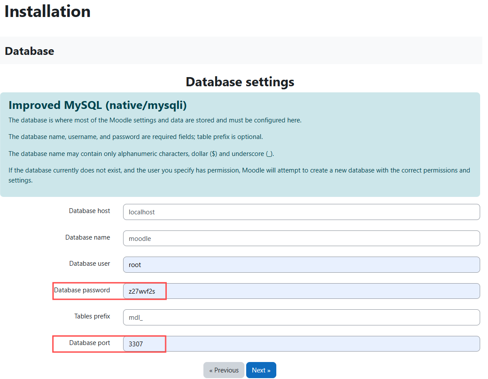
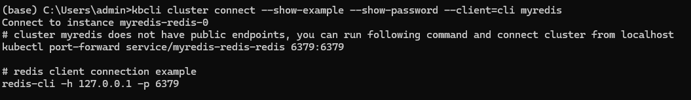
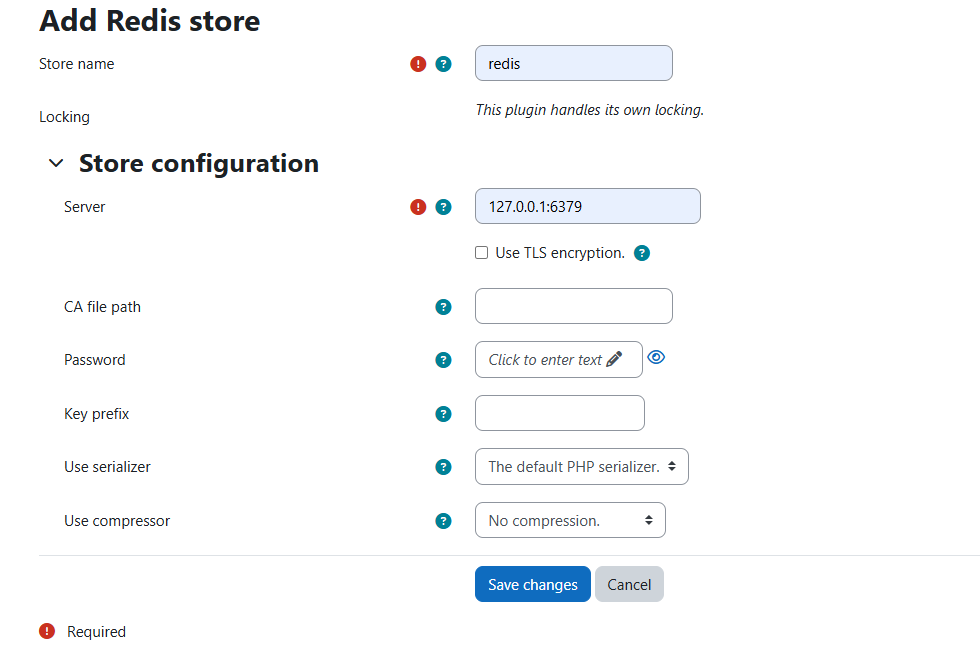

# Deploy Moddle on K8s with KubeBlocks MySQL Operator (Windows)

Moodle is a free online learning management system that allows educators to create their private websites, populate them with dynamic course content, and thereby enable people to learn anytime, anywhere.

## Introduction

This document will guide you to quickly get started with installing and using Moodle on Windows, leveraging the MySQL database provided by KubeBlocks.

## Necessary Preparations

- [Docker](https://docs.docker.com/get-docker/)：v20.10.5 (runC ≥ v1.0.0-rc93) or higher version;
- [kubectl](https://kubernetes.io/docs/tasks/tools/#kubectl): For interacting with the Kubernetes cluster;
- [kbcli](https://cn.kubeblocks.io/docs/preview/user-docs/installation/install-with-kbcli/install-kbcli): For interaction between Playground and KubeBlocks.

## Prepare a Database

### Steps

### 1. Ensure the ApeCloud MySQL addon is enabled

```shell
kbcli addon list
>
NAME                           TYPE   STATUS     EXTRAS         AUTO-INSTALL   INSTALLABLE-SELECTOR
...
apecloud-mysql                 Helm   Enabled                   true
...
```

### 2. Create a MySQL cluster

This is a Standalone demonstration. For a RaftGroup Cluster deployment, please refer to: [Create and connect to a MySQL Cluster | KubeBlocks](https://kubeblocks.io/docs/release-0.8/user_docs/kubeblocks-for-mysql/cluster-management/create-and-connect-a-mysql-cluster).

```shell
kbcli cluster create mysql <clustername>
```

### 3. Obtain cluster basic information

Execute the following commands to retrieve the network information of the target database, particularly note the password that will be needed later.

```shell
kbcli cluster connect --show-example --show-password ${cluster-name}
```


### 4. Service forwarding

Perform a `port-forward` to provide the MySQL service to the host.

:::note

Note that since you will need to start the MySQL service on the local machine later, you need to modify the local port number to avoid conflicts. Here we have changed it to 3307.

:::

```shell
kubectl port-forward service/mycluster-mysql 3307:3306
>
Forwarding from 127.0.0.1:3307 -> 3306
Forwarding from [::1]:3307 -> 3306
```

For detailed guidance on connecting to the database, please refer to: [Connect database from anywhere | KubeBlocks](https://kubeblocks.io/docs/release-0.8/user_docs/connect_database/overview-of-database-connection).

## Install Moodle

For Windows, it is recommended to use XAMPP to install Moodle.

### Steps

### 1. Download and install XAMPP

Go to the official website to download and install XAMPP. Here is the website address: [XAMPP Installers and Downloads for Apache Friends](https://www.apachefriends.org/zh_cn/index.html)

### 2. Open XAMPP and start the Apache and MySQL services


### 3. Download Moodle

Go to the Moodle official website and download the appropriate file. Here is the website address: [Latest release | Moodle downloads](https://download.moodle.org/releases/latest/)


After the download is complete, extract the compressed package to the download directory under the `htdocs` folder of your XAMPP installation. If the configuration is all default, it will be in `C:/xampp/htdocs`

### 4. Install Moodle

Open a browser and enter the address localhost/moodle, then follow the steps below to install Moodle.

#### 1. Choose a language


#### 2. Confirm paths

The default configuration is fine, just click <kbd>Next</kbd>.


#### 3. Choose a database driver

Select `mysqli` here.


#### 4. Database settings

Use the previous KubeBlocks settings.



#### 5. Server Check

**When downloading PHP extensions, some server component check errors may occur in this step.**

The steps to fix this are as follows:

1. Use a text editor to open the `php.ini` file, which is located in the `xampp/` directory, and search for and uncomment the following extension lines:

   `extension=zip`

   `extension=gd`

   `extension=intl`

   `extension=sodium`

   `max_input_vars`

2. After uncovering `max_input_vars`, modify it to `max_input_vars=5000`

3. Copy the `xampp/php/libsodium.dll` library to the `xampp/apache/bin/` directory.


#### 6. Wait for Download

After that, there will be some downloads, just wait.


#### 7. Basic Settings of Moodle

Set the name and email, and the installation will soon be complete.


#### 8. Mission Accomplished

In this step, the entire installation is complete, and you can now freely use Moodle!!


For more detailed installation steps, please visit [Install Moodle - MoodleDocs](https://docs.moodle.org/404/en/Installing_Moodle).

## Prepare the Redis Database

### Steps

### 1. Ensure the Redis addon is enabled

```shell
kbcli addon list
NAME                      TYPE   STATUS     EXTRAS         AUTO-INSTALL   INSTALLABLE-SELECTOR
...
redis                     Helm   Enabled                   true
...
```

### 2. Create a Redis Cluster

This example only demonstrates the Standalone version of Redis. For more information, please refer to the documentation [Create and connect to a Redis Cluster | KubeBlocks](https://kubeblocks.io/docs/release-0.8/user_docs/kubeblocks-for-redis/cluster-management/create-and-connect-a-redis-cluster).

```shell
kbcli cluster create redis --mode standalone <clustername>
```

### 3. Obtain the basic connection information

Execute the following commands to obtain the basic information of the target database.

```shell
kbcli cluster connect --show-example --show-password --client=cli <clustername>
```



### 4. Service forwarding

Execute `port-forward` to provide the Redis service to the host. Note that I have named my Redis instance as 'myredis', you will need to change it to the name you have chosen.

```shell
kubectl port-forward service/myredis-redis-redis 6379:6379
>
Forwarding from 127.0.0.1:3306 -> 3306
Forwarding from [::1]:3306 -> 3306
```

## Install the Redis PHP Driver

### Steps

### 1. Check the driver adapter version

Check your PHP version, CPU (64-bit or x86), and thread safety value (refer to Site Admin > Server > PHP Info) to get the correct version.


### 2. Download the compatible PHP extension file and enable it

- Download the corresponding version of the PHP-redis extension file from [PECL :: Package :: redis (php.net)](https://pecl.php.net/package/redis)
- Add the DLL file `php_redis.dll` to the `xampp/php/ext` directory
- Add `extension=php_redis.dll` to the php.ini and restart the web server.

## Connect to the Redis Server

### Steps

### 1. Service Check

Check Site admin > Plugins > Caching > Configuration. If the service is successful, you should see a green checkmark next to "Redis" under "Installed cache stores", as well as a link to add an instance.


### 2. Add Instance

After clicking `Add instance`, fill in the basic settings. In this example, the name is 'redis' and the server is 127.0.0.1:6379.



After clicking `Save changes`, you will see `Handling connection` when you return to KubeBlocks. At this point, you can use Moodle more smoothly!


