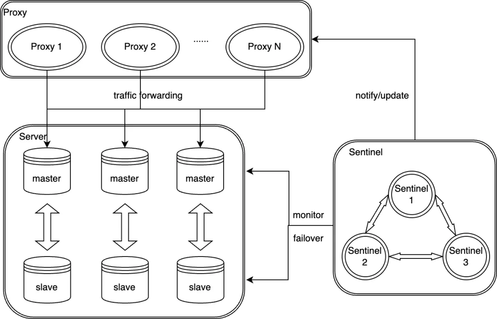
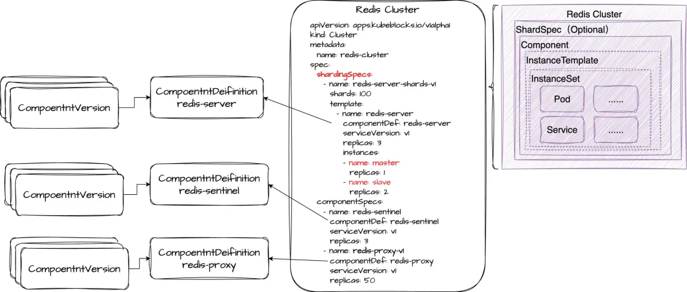
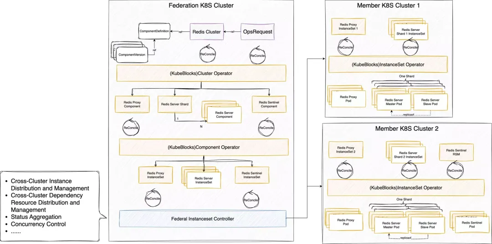
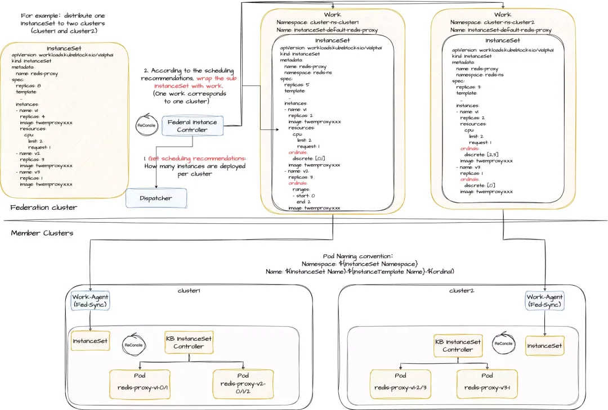
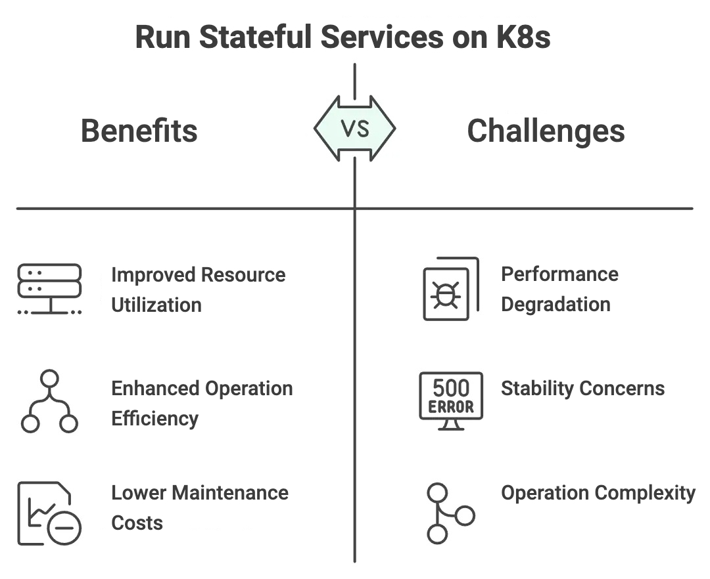
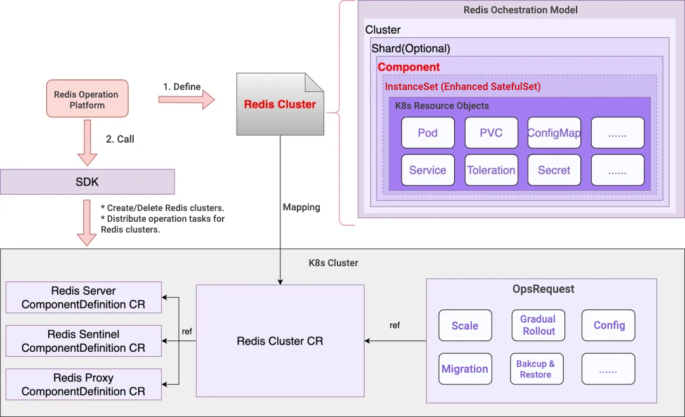

# Managing Large-Scale Redis Clusters on Kubernetes with an Operator: Kuaishou's Approach

> **About Kuaishou**
>
> Kuaishou is a leading content community and social platform in China and globally, committed to becoming the most customer-obsessed company in the world. Kuaishou uses its technological backbone, powered by cutting-edge AI technology, to continuously drive innovation and product enhancements that enrich its service offerings and application scenarios, creating exceptional customer value. Through short videos and live streams on Kuaishou's platform, users can share their lives, discover goods and services they need and showcase their talent. By partnering closely with content creators and businesses, Kuaishou provides technologies, products, and services that cater to diverse user needs across a broad spectrum of entertainment, online marketing services, e-commerce, local services, gaming, and much more.

> **About Author**
>
> Yuxing Liu is the senior software engineer from Kuaishou. Yuxing has worked in the cloud-native teams of Alibaba Cloud and Kuaishou, focusing on the cloud-native field and gaining experience in open source, commercialization, and scaling of cloud-native technologies. Yuxing is also one of the maintainers of the CNCF/Dragonfly project and also one of the maintainers of the CNCF/Sealer project. Currently, he focuses on driving the cloud-native transformation of stateful business in Kuaishou.

As a popular short-form video application, Kuaishou relies heavily on Redis to deliver low-latency responses to its users. Operating on private cloud infrastructure, automating the management of large-scale Redis clusters with minimal human intervention presents a significant challenge. A promising solution emerged: running Redis on Kubernetes using an Operator.

While containerizing stateless services like applications and Nginx is now standard, running stateful services like databases and Redis on Kubernetes remains debated. Based on Kuaishou's experience transforming Redis from physical machines to a cloud-native solution, this blog explores solutions and key considerations for managing stateful services on Kubernetes with the KubeBlocks Operator.

## Background

As technology evolves, Kuaishou's infrastructure is transitioning toward cloud-native technology stack. The infrastructure team delivers containers and Kubernetes to Application and PaaS systems. While stateless services at Kuaishou have almost fully adopted Kubernetes, the path toward cloud-native stateful services presents several challenges.

Taking Redis as an example, it is one of the most widely used stateful services at Kuaishou, characterized by its massive scale. Even small cost savings at this scale can deliver substantial financial benefits to the company. In its long-term planning,  Kuaishou recognizes the significant potential of running Redis on Kubernetes, particularly in terms of cost optimization through improved resource utilization. This article shares insights from Kuaishou's experience migrating Redis to Kubernetes, covering solutions, challenges encountered, and the corresponding strategies to address them.

## How Did Kuaishou Run Redis on Kubernetes?

### Redis Deployment Architecture

To meet the need for flexible shard management and support for hotspot migration and isolation, Kuaishou adopts a horizontally sharded, master-slave high-availability Redis architecture consisting of three components: Server, Sentinel, and Proxy.

### Analysis: What Does Kuaishou Require from a Redis Operator?

**First, Redis Pod Management Requires a Layered Approach**

Redis Pod management needs to be handled in two layers: the first layer manages multiple shards, while the second layer manages multiple replicas within a single shard. It must support the dynamic scaling of the number of shards and the number of replicas per shard to adapt to varying workloads and usage scenarios.

This means that, in Operator's implementation, a workload (such as a StatefulSet) is used to manage multiple replicas within each shard. On top of this, an additional layer (some CRD object) should be constructed to enable management of multiple shards within the entire Redis cluster.

**Second, Ensuring Data Consistency and Reliability During Failures and Day-2 Operations**

During shard or replica lifecycle changes, data consistency and reliability must be ensured. For example, shard scaling requires data rebalancing, while instance scaling within a shard may require data backup and restoration.

Thus, the Operator must support lifecycle hooks at both the shard and replica levels, enabling custom data management operations at different lifecycle stages.

**Third, Topology Awareness for Service Discovery and Canary Releases**

The topology among multiple Redis Pods within a shard may dynamically change due to events like high-availability failovers, upgrades, or scaling operations. Service discovery and features like canary releases rely on the real-time topology.

To achieve this, the Operator must support dynamic topology awareness by introducing role detection and role labeling capabilities. This enables service discovery and canary releases based on the dynamic topology.

These requirements go beyond the capabilities of any existing open-source Redis Operator and would typically require developing a highly complex Kubernetes Operator to fulfill them. However, building a stable Operator with well-designed APIs from scratch is daunting for most platform teams, as it demands expertise in both Kubernetes and databases, along with extensive real-world testing.

### The KubeBlocks Solution Came into Our View

After evaluating several solutions, **KubeBlocks** caught our attention as an open-source Kubernetes database Operator. What makes KubeBlocks unique is its extensibility, offering an **Addon mechanism** that allows you to use its API to describe the Day-1 and Day-2 characteristics and behaviors of a database, enabling its full lifecycle management on Kubernetes. As stated on its website, KubeBlocks' vision is to "Run any database on Kubernetes." This flexibility enables us to customize the KubeBlocks Redis Addon to fit our in-house Redis cluster deployment architecture.

KubeBlocks' API design also aligns well with our requirements for managing Redis clusters:

**1. InstanceSet: A More Powerful Workload Than StatefulSet**

**InstanceSet** is a workload used within KubeBlocks to replace StatefulSet, designed specifically for managing database Pods. Like StatefulSet, InstanceSet supports managing multiple Pods (referred to as Instances). The key difference is that InstanceSet can track the **Role** of each database Pod (e.g., primary, secondary). For different databases (as KubeBlocks supports multiple types), KubeBlocks allows customization of Pod roles, role detection methods, and the upgrade order based on roles during canary upgrades. The InstanceSet controller dynamically detects role changes during runtime and updates the role information as labels in the Pod metadata, enabling role-based Service selector.

StatefulSet assigns each instance a globally ordered, incrementing identifier. This mechanism provides stable network and storage identities, with the topology within the cluster relying on these identifiers. However, as the topology dynamically changes during runtime, the fixed identifiers provided by StatefulSet may fall short of meeting requirements. For example, StatefulSet identifiers cannot have gaps, and deleting an intermediate identifier is not allowed.

Kuaishou's platform team has contributed several PRs to the KubeBlocks community, including enhancements such as allowing Pods within the same InstanceSet to have different configurations, decommissioning Pods with specific ordinals (without first decommissioning Pods with higher ordinals), and controlling upgrade concurrency. These improvements make InstanceSet more adaptable to Kuaishou's requirements for managing large-scale Redis clusters in production environments.

**2. Layered CRD & Controller Design: Component, Cluster Objects**

KubeBlocks leverages a multi-layered CRD structure—**Component**, **Cluster**—to manage the complex topology of database clusters. This design aligns seamlessly with Kuaishou's Redis cluster deployment architecture:

- **Component**: Represents a group of Pods within the Redis cluster. For example, Proxy Pods form one Component, Sentinel Pods form another, and Redis-Server Pods are organized into one or more Components, each corresponding to a Shard. The number of Components dynamically changes based on the number of Shards.

> ⛱️ **Shard**: A specialized Component that defines the sharding behavior of horizontally scalable databases. Each Shard shares the same configuration. In Kuaishou's Redis Cluster, for example, each Shard (Component) consists of a primary Pod and a replica Pod. Scaling out adds a new Shard (Component), while scaling in removes one, enabling shard-level scaling and lifecycle management.

- **Cluster**: Represents the entire Redis cluster, integrating Proxy, Server, and Sentinel Components, while managing their startup topology and relationships.

This hierarchical design simplifies scaling, enhances lifecycle management, and provides the flexibility needed to support complex Redis deployment architecture in production.

Through close collaboration with the KubeBlocks community, we implemented the orchestration of a Redis cluster in the following ways:

There are three Components in a Redis Cluster: `redis-server`, `redis-sentinel`, and `redis-proxy`. Within each Component, Pods are managed using **InstanceSet** instead of **StatefulSet**.

### Using Kubernetes Federation to Manage Ultra-Large-Scale Redis Clusters

At Kuaishou, multiple applications operate in a multi-tenant manner within a single ultra-large-scale Redis cluster. For example, a single cluster may contain over 10,000 Pods, exceeding the capacity of a single Kubernetes cluster. As a result, we had to deploy a Redis cluster across multiple Kubernetes clusters. An important aspect is that we need to hide the complexity of managing multiple clusters from Redis application users.

#### Federated K8s Cluster Architecture

Fortunately, Kuaishou's Kubernetes infrastructure team provides a mature Kubernetes federation service, offering unified scheduling and a unified view:

- **Unified Scheduling**: Federation serves as a centralized resource dispatch entry, enabling resource scheduling across multiple member clusters.
- **Unified View**: Federation acts as a unified resource access point, allowing seamless retrieval of resources across both the federation and member clusters.

So, the question becomes how can the Redis cluster management solution based on KubeBlocks be integrated into Kuaishou's internal federation cluster architecture? Below is the overall architecture:

The Federation Kubernetes Cluster serves as the central control plane for managing multiple member clusters. It is responsible for cross-cluster orchestration, resource distribution, and lifecycle management of the Redis cluster. Its responsibilities include:

- Cross-Cluster Instance Distribution and Management: Ensures that Redis components (Proxy, Sentinel, Server) are distributed across member clusters based on resource requirements.
- **Concurrency Control**: Coordinates operations across clusters to ensure consistency and avoid conflicts.
- **Status Aggregation**: Collects and aggregates the status of all components from member clusters to provide a unified view.

Member K8s Clusters are the individual Kubernetes clusters where Redis Pods (instances) are deployed and managed. Each member cluster is responsible for running a subset of the overall Redis cluster. Its responsibilities include:

- **Instance Management**: Localized management of Redis Pods (Proxy, Sentinel, Server) via InstanceSet.

So, we divided the KubeBlocks Operator into two parts and deployed them in different Kubernetes clusters:

- The **InstanceSet Controller** is deployed in member clusters to manage Pods locally.
- The **Cluster Controller** and **Component Controller** are deployed in the federation cluster to handle global resource orchestration and coordination.

Once again, the layered CRD and Controller design of KubeBlocks is the key to enabling this deployment. If KubeBlocks had a monolithic CRD and Controller managing everything, splitting and deploying it separately in the Federation Kubernetes Cluster and Member Kubernetes Clusters would not have been possible.

#### Fed-InstanceSet Controller

There may be multiple Member Kubernetes Clusters, requiring the InstanceSet in the Federation Kubernetes Cluster to be partitioned into multiple InstanceSets, with one InstanceSet assigned to each Member Cluster. Additionally, the Instances (Pods) managed by the original InstanceSet need to be distributed across the new InstanceSets in the Member Clusters.

To handle this, **Kuaishou developed the Fed-InstanceSet Controller** to manage interactions between the Federation Cluster and its Member Clusters. Its key responsibilities include:

- **Scheduling Decisions**: Determining how many Instances each Member Cluster should deploy, based on predefined scheduling policies.
- **InstanceSet Partitioning and Distribution**: Splitting the InstanceSet from the Federation Cluster and distributing the resulting InstanceSets to the appropriate Member Clusters.

To manage instance partitioning and ensure global uniqueness and proper ordering of Redis Instances in member Clusters, Kuaishou contributed a PR to the KubeBlocks community, adding an **Ordinals** field to InstanceSet. This allows precise index assignment to instances.

The **Fed-InstanceSet Controller** uses this field to assign unique index ranges to each Member Cluster, ensuring instance uniqueness and correct ordering across clusters.

## Discussion: Are Stateful Services Fit for Kubernetes?

### Benefits and Risks of Running Stateful Services on Kubernetes

In our view, running stateful services on Kubernetes comes with notable benefits:

- **Improved resource utilization**: By merging multiple small resource pools for unified scheduling and enabling colocation of applications with Redis or Redis with other stateful services, resource usage is optimized, significantly reducing costs.
- **Enhanced operation efficiency**: With Kubernetes's declarative APIs and the Operator pattern, it manages Redis services in an Infrastructure-as-Code (IaC) manner, reducing the need for manual intervention.
- **Lower maintenance costs**: Previously, Redis ran on physical machines, requiring dedicated personnel to manage the hardware infrastructure. By unifying the infrastructure onto containers and Kubernetes, infrastructure-related maintenance costs are reduced, and overall management efficiency is improved.

Although running stateful services on Kubernetes offers significant benefits, the potential risks must be carefully evaluated, especially for stateful services like databases and Redis, which demand high levels of importance and stability. The challenges include:

1. **Performance degradation risk**: Running processes in containers, as opposed to directly on physical machines, introduces an additional layer, particularly due to the latency introduced by the overlay network. This raises concerns about potential service performance degradation.
2. **Stability concerns**: Building the database platform (DBaaS) on the Kubernetes infrastructure raises concerns about whether the stability (availability and reliability) of databases or Redis might be affected.
3. **Increased Operational Complexity**: In the event of an issue, would it require experts with both database and K8s technology expertise to effectively identify and resolve the problem?

The following sections explore these risks in more detail.

### Mitigate Risks of Running Redis on Kubernetes

#### Performance

Containerizing Redis within a cloud-native architecture introduces an additional abstraction layer compared to traditional host-based deployments. However, industry benchmarks and Kuaishou’s internal testing show that performance differences are generally within 10%, which is often negligible in most use cases. While this variance is typically acceptable, organizations are advised to conduct their own performance testing to ensure the solution meets the specific needs of their workloads.

#### Stability

Migrating stateful services to Kubernetes has greatly improved operational efficiency through automation. However, this also made the execution processes more opaque, with even small configuration changes potentially impacting many instances. To mitigate the stability risks from unexpected scenarios — such as pod evictions, human error, or Operator bugs— Kuaishou utilizes the **Admission Webhook** mechanism within the Kubernetes API server to intercept and validate change requests. This approach allows Kuaishou to directly reject any unauthorized operations. Given the multi-cluster Kubernetes setup across multiple availability zones (AZs), it's critical to ensure change control across clusters. To achieve this, Kuaishou developed an internal risk mitigation system called **kube-shield**.

Additionally, it’s worth mentioning that Kuaishou has further enhanced availability and stability by improving support for fine-grained scheduling distribution and introducing load balancing features based on resource utilization.

#### Operation Complexity

Migrating from a host-based system to a Kubernetes-based environment, while ensuring ongoing maintenance, requires deep expertise in both Redis and K8s technologies. Relying solely on the Redis team or the K8s team for independent support would be challenging. Proper division of responsibilities not only enhances productivity but also allows each team to fully leverage their expertise in their respective domains.

For example, in Kuaishou's cloud-native Redis solution:

- **Redis Team**: Focused on defining Redis cluster objects and encapsulating their operational expertise into declarative configurations.
- **Container Cloud Team**: Managed the Kubernetes side, including developing and maintaining the Operator, handling scheduling, and ensuring the cluster's lifecycle.

## Conclusion

Cloud-native transformation for stateful services is a complex journey requiring careful evaluation of its pros and cons, and one filled with challenges. However, for Kuaishou, its value is self-evident. Starting with Redis, Kuaishou has worked closely with the KubeBlocks community to implement a cost-effective, cloud-native solution.

Looking forward, Kuaishou aims to build upon this experience to drive the cloud-native transformation of more stateful services, such as databases and middleware, thus reaping dual benefits in technology and cost efficiency.

At KubeCon Hong Kong in August, Kuaishou and the KubeBlocks team delivered a joint presentation. If you're interested, you can revisit [the talk](https://kubeblocks.io/blog/migrate-redis-at-kuaishou-from-bare-metal-to-k8s) for further insights.
