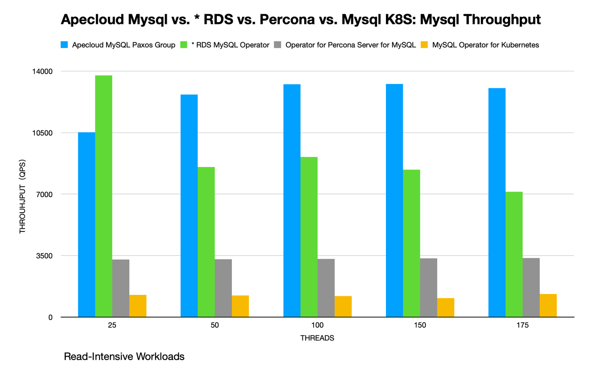

# Sysbench Performance Test Report - ApeCloud MySQL Raft Group

## Purpose

This test aims at comparing the Sysbench performance of Apecloud MySQL Paxos Group and * RDS MySQL, Percona Server for MySQL and MySQL Operator for Kubernetes in the Online Transactional Processing (OLTP) scenario.

## Environment (EKS/EC2)

### Hardware configuration

<table align="center">
    <tr>
        <th> Product </th>
        <th> Deployment </th>
        <th> EC2 Type </th>
        <th> Instance Count </th>
        <th> Region </th>
    </tr>
    <tr>
        <td> ApeCloud Raft Group </td>
        <td> EKS + KB </td>
        <td> m5a.2xlarge (node 8c32g, pod 4c16g) </td>
        <td> 3 </td>
        <td rowspan="3"> cn-northwest-1 </td>
    </tr>
    <tr>
        <td> * RDS MySQL Operator </td>
        <td> EKS + RDS </td>
        <td> db.m5.xlarg (4c16g) </td>
        <td> 3 </td>
    </tr>
    <tr>
        <td> Operator for Percona Server for MySQL </td>
        <td> EKS + Percona </td>
        <td> m5a.2xlarge (node 8c32g, pod 4c16g) </td>
        <td> 3 </td>
    </tr>
    <tr>
        <td> MySQL Operator for Kubernetes </td>
        <td> EKS + MySQL </td>
        <td> m5a.2xlarge (node 8c32g, pod 4c16g) </td>
        <td> 3 </td>
    </tr>   
    <tr>
        <td> Sysbench </td>
        <td> EKS + Sysbench </td>
        <td> m5a.2xlarge (node 8c32g) </td>
        <td> 1 </td>
    </tr>    
</table>

### Software version

<table align="center">
    <tr>
        <th> Product </th>
        <th> Version </th>
    </tr>
    <tr>
        <td> Apecloud MySQL Paxos Group </td>
        <td> 8.0.30 </td>
    </tr>
    <tr>
        <td> * RDS MySQL Operator </td>
        <td> 8.0.32 </td>
    </tr>
    <tr>
        <td> Operator for Percona Server for MySQL </td>
        <td> 8.0.29-21.1 </td>
    </tr>
    <tr>
        <td> MySQL Operator for Kubernetes </td>
        <td> 8.0.32 </td>
    </tr>
    <tr>
        <td> Sysbench </td>
        <td> 1.0.20 </td>
    </tr>
</table>

### Parameter configuration

| Configuration           | Apecloud MySQL Paxos Group | * RDS MySQL Operator | Operator for Percona Server for MySQL | MySQL Operator for Kubernetes |
|-------------------------|----------------------------|----------------------|---------------------------------------|-------------------------------|
| innodb_buffer_pool_size | 9G                         | 11G                  | 9G                                    | 9G                            |
| innodb_log_file_size    | 48M                        | 128M                 | 48M                                   | 48M                           |
| innodb_io_capacity      | 200                        | 200                  | 200                                   | 200                           |
| innodb_io_capacity_max  | 2000                       | 2000                 | 2000                                  | 2000                          |

## Test plan

1. Deploy Apecloud MySQL Paxos Group , * RDS MySQL, Percona Server for MySQL and MySQL Operator for Kubernetes.
2. Use Sysbench to import 300 tables, each table with 2000000 rows of data.
3. Start the Sysbench client on Pod to perform the point_selectandupdate_index tests. Perform stress tests on Apecloud MySQL Paxos Group, Percona Server for MySQL, MySQL Operator for Kubernetes via Pod IP and * RDS MySQL via DNS.
4. The test takes 10 minutes.


### Prepare the test data

```yaml
kubectl create -f - <<EOF
apiVersion: v1
kind: Pod                  
metadata:
  namespace: default          
  generateName: test-sysbench-prepare-
spec:
  containers: 
    - name: test-sysbench
      image: registry.cn-hangzhou.aliyuncs.com/apecloud/datatestsuites:latest
      env:   
        - name: TYPE
          value: "2"    
        - name: FLAG
          value: "0"                 
        - name: CONFIGS 
          value: "mode:prepare,driver:mysql,host:<db_host>,user:root,password:<db_password>,port:3306,db:sbtest1,size:2000000,tables:300,times:600,type:oltp_read_write_pct"
  restartPolicy: Never
EOF
```

### Perform the test

- Read-Intensive Workload: 80% reads and 20% writes: `--read-percent=80 --write-percent=20`
- Balanced Workload: 50% reads and 50% writes:`--read-percent=50 --write-percent=50`
- Write-Intensive Workload: 20% reads and 80% writes:`--read-percent=20 --write-percent=80`

```yaml
kubectl create -f - <<EOF
apiVersion: v1
kind: Pod                  
metadata:
  namespace: default          
  generateName: test-sysbench-run-
spec:
  containers: 
    - name: test-sysbench
      image: registry.cn-hangzhou.aliyuncs.com/apecloud/datatestsuites:latest
      env:   
        - name: TYPE
          value: "2"    
        - name: FLAG
          value: "0"                 
        - name: CONFIGS 
          value: "mode:run,driver:mysql,host:<db_host>,user:root,password:<db_password>,port:3306,db:sbtest1,size:2000000,tables:300,times:600,type:oltp_read_write_pct,threads:25 50 100 150 175,others:--read-percent=80 --write-percent=20"
  restartPolicy: Never
EOF
```

### Results

#### Read-intensive performance

point_select:update_index 4:1
**QPS**

| Threads | Apecloud MySQL Paxos Group | * RDS MySQL Operator | Operator for Percona Server for MySQL | MySQL Operator for Kubernetes |
|---------|----------------------------|----------------------|---------------------------------------|-------------------------------|
| 25      | 10516.35                   | 13761.06             | 3280.96                               | 1270.15                       |
| 50      | 12663.15                   | 8537.31              | 3285.41                               | 1222.22                       |
| 100     | 13253.86                   | 9113.26              | 3302.07                               | 1193.26                       |
| 150     | 13272.37                   | 8390.76              | 3341.11                               | 1071.97                       |
| 175     | 13028.97                   | 7135.27              | 3353.90                               | 1318.18                       |

**Latency (ms)**

| Threads | Apecloud MySQL Paxos Group | * RDS MySQL Operator | Operator for Percona Server for MySQL | MySQL Operator for Kubernetes |
|---------|----------------------------|----------------------|---------------------------------------|-------------------------------|
| 25      | 303.33                     | 248.83               | 1191.92                               | 2778.39                       |
| 50      | 502.20                     | 861.95               | 2362.72                               | 5607.61                       |
| 100     | 995.51                     | 1479.41              | 4437.27                               | 12609.11                      |
| 150     | 1506.29                    | 2493.86              | 6713.97                               | 20137.61                      |
| 175     | 1803.47                    | 3841.98              | 7895.16                               | 18738.17                      |

The Read-Intensive performance of Apecloud PostgreSQL is about 46.78% more than * RDS PostgreSQL on Pod.

**QPS improvement**

| Threads | * RDS MySQL Operator | Operator for Percona Server for MySQL | MySQL Operator for Kubernetes |
|---------|----------------------|---------------------------------------|-------------------------------|
| 25      | -30.85%              | 68.80%                                | 87.922%                       |
| 50      | 32.58%               | 74.06%                                | 90.35%                        |
| 100     | 31.24%               | 75.09%                                | 91.00%                        |
| 150     | 36.78%               | 74.83%                                | 91.92%                        |
| 175     | 45.24%               | 74.26%                                | 89.88%                        |
| Average | 23.00%               | 73.41%                                | 90.21%                        |

- The Read-Intensive performance of Apecloud MySQL Paxos Group is about 23% more than * RDS MySQL
- The Read-Intensive performance of Apecloud MySQL Paxos Group is about 73.41% more than Percona Server for MySQL
- The Read-Intensive performance of Apecloud MySQL Paxos Group is about 90.21% more than MySQL Operator for Kubernetes




#### Balanced performance 
point_select:update_index 1:1

**QPS**

| Threads | Apecloud MySQL Paxos Group | * RDS MySQL Operator | Operator for Percona Server for MySQL | MySQL Operator for Kubernetes |
|---------|----------------------------|----------------------|---------------------------------------|-------------------------------|
| 25      | 6082.62                    | 3695.66              | 1372.49                               | 724.58                        |
| 50      | 7851.10                    | 4551.22              | 1379.01                               | 912.29                        |
| 100     | 8718.86                    | 4647.50              | 1377.36                               | 1058.92                       |
| 150     | 8775.23                    | 3477.48              | 1373.29                               | 1202.32                       |
| 175     | 8430.28                    | 3378.92              | 1376.00                               | 1305.82                       |

**Latency**

| Threads | Apecloud MySQL Paxos Group | * RDS MySQL Operator | Operator for Percona Server for MySQL | MySQL Operator for Kubernetes |
|---------|----------------------------|----------------------|---------------------------------------|-------------------------------|
| 25      | 467.30                     | 977.74               | 2493.86                               | 4203.93                       |
| 50      | 759.88                     | 1836.24              | 4855.31                               | 6360.91                       |
| 100     | 1327.91                    | 2728.81              | 9452.83                               | 11317.84                      |
| 150     | 1938.16                    | 6247.39              | 14302.94                              | 14827.42                      |
| 175     | 2362.72                    | 7346.49              | 16519.10                              | 15934.78                      |

**QPS improvement**

| Threads | * RDS MySQL Operator | Operator for Percona Server for MySQL | MySQL Operator for Kubernetes |
|---------|----------------------|---------------------------------------|-------------------------------|
| 25      | 39.24%               | 77.43%                                | 88.09%                        |
| 50      | 42.03%               | 82.44%                                | 88.38%                        |
| 100     | 46.70%               | 84.20%                                | 87.85%                        |
| 150     | 60.37%               | 84.351%                               | 86.30%                        |
| 175     | 59.92%               | 83.68%                                | 84.51%                        |
| Average | 49.65%               | 82.42%                                | 87.03%                        |

- The Balanced performance of Apecloud MySQL Paxos Group is about 49.65% more than * RDS MySQL
- The Balanced performance of Apecloud MySQL Paxos Group is about 82.42% more than Percona Server for MySQL
- The Balanced performance of Apecloud MySQL Paxos Group is about 87.03% more than MySQL Operator for Kubernetes


#### Write-Intensive performance

point_select:update_index 1:4
**QPS**

| Threads | Apecloud MySQL Paxos Group | * RDS MySQL Operator | Operator for Percona Server for MySQL | MySQL Operator for Kubernetes |
|---------|----------------------------|----------------------|---------------------------------------|-------------------------------|
| 25      | 3865.72                    | 2449.72              | 900.21                                | 336.18                        |
| 50      | 5039.79                    | 2975.20              | 886.95                                | 450.07                        |
| 100     | 5707.98                    | 2903.84              | 882.68                                | 559.40                        |
| 150     | 5812.02                    | 2432.94              | 878.27                                | 660.04                        |
| 175     | 5777.16                    | 2213.65              | 880.19                                | 730.54                        |


**Latency(ms)**

| Threads | Apecloud MySQL Paxos Group | * RDS MySQL Operator | Operator for Percona Server for MySQL | MySQL Operator for Kubernetes |
|---------|----------------------------|----------------------|---------------------------------------|-------------------------------|
| 25      | 746.32                     | 1836.24              | 3511.19                               | 8638.96                       |
| 50      | 1129.24                    | 2045.74              | 7086.63                               | 12609.11                      |
| 100     | 1938.16                    | 4855.31              | 13797.01                              | 20137.61                      |
| 150     | 2828.87                    | 8038.61              | 21255.35                              | 25448.93                      |
| 175     | 3267.19                    | 9452.83              | 24548.75                              | 26861.48                      |

**QPS improvement**

| Threads | * RDS MySQL Operator | Operator for Percona Server for MySQL | MySQL Operator for Kubernetes |
|---------|----------------------|---------------------------------------|-------------------------------|
| 25      | 36.63%               | 76.71%                                | 91.30%                        |
| 50      | 40.97%               | 82.40%                                | 91.07%                        |
| 100     | 49.13%               | 84.54%                                | 90.20%                        |
| 150     | 58.14%               | 84.89%                                | 88.64%                        |
| 175     | 61.68%               | 84.76%                                | 87.35%                        |
| Average | 49.31%               | 82.66%                                | 89.71%                        |

- The Read-Intensive performance of Apecloud MySQL Paxos Group is about 49.31% more than * RDS MySQL
- The Read-Intensive performance of Apecloud MySQL Paxos Group is about  82.66% more than Percona Server for MySQL
- The Read-Intensive performance of Apecloud MySQL Paxos Group is about 89.71% more than MySQL Operator for Kubernetes

[!img](./assets/img/write-intensive.png)
