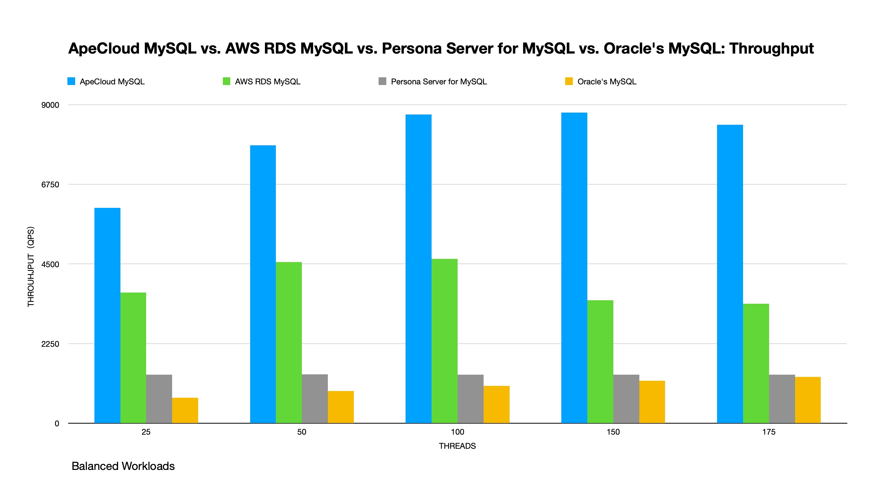

# Sysbench Performance Test Report - MySQL

## Purpose

This test aims to compare the transactional processing performance of popular MySQL distributions provided by Percona, Oracle, and other companies. To truly simulate the runtime environment of cloud-native applications, sysbench was run within a Kubernetes cluster throughout all tests.

## Environment (EKS/EC2)

### MySQL versions and resources

<table align="center">
    <tr>
        <th> MySQL distribution </th>
        <th> Version </th>
        <th> Deployment </th>
        <th> EC2 Class </th>
        <th> EC2 Instances </th>
    </tr>
    <tr>
        <td align="center"> ApeCloud MySQL </td>
        <td align="center"> 8.0.30 </td>
        <td align="center"> EKS + KubeBlocks </td>
        <td align="center"> m5a.2xlarge (node 8c32g, pod 4c16g) </td>
        <td align="center"> 3 </td>
    </tr>
    <tr>
        <td align="center"> AWS RDS MySQL </td>
        <td align="center"> 8.0.32 </td>
        <td align="center"> EKS + RDS </td>
        <td align="center"> db.m5.xlarg (4c16g) </td>
        <td align="center"> 3 </td>
    </tr>
    <tr>
        <td align="center"> Percona Server for MySQL </td>
        <td align="center"> 8.0.29-21.1 </td>
        <td align="center"> EKS + Percona Operator </td>
        <td align="center"> m5a.2xlarge (node 8c32g, pod 4c16g) </td>
        <td align="center"> 3 </td>
    </tr>
    <tr>
        <td align="center"> Oracle's MySQL </td>
        <td align="center"> 8.0.32 </td>
        <td align="center"> EKS + MySQL Operator </td>
        <td align="center"> m5a.2xlarge (node 8c32g, pod 4c16g) </td>
        <td align="center"> 3 </td>
    </tr>   
    <tr>
        <td align="center"> Sysbench </td>
        <td align="center"> 1.0.20 </td>
        <td align="center"> EKS </td>
        <td align="center"> m5a.2xlarge (node 8c32g) </td>
        <td align="center"> 1 </td>
    </tr>    
</table>

### MySQL parameters

| Configuration             | ApeCloud MySQL | AWS RDS MySQL | Percona Server for MySQL | Oracle's MySQL   |
|:-------------------------:|:---------------------------:|:----------------------:|:---------------------------------------:|:-------------------------------:|
| innodb_buffer_pool_size   | 9G                          | 11G                    | 9G                                      | 9G                              |
| innodb_log_file_size      | 48M                         | 128M                   | 48M                                     | 48M                             |
| innodb_io_capacity        | 200                         | 200                    | 200                                     | 200                             |
| innodb_io_capacity_max    | 2000                        | 2000                   | 2000                                    | 2000                            |

## Test plan

1. Deploy MySQL and Sysbench in Kubernetes using operators.
2. Use Sysbench to import 300 tables, each table with 2000000 rows of data.
3. Start the Sysbench client on Pod to perform the `point_select` and `update_index` tests. Perform stress tests on ApeCloud MySQL, Percona Server for MySQL, Oracle's MySQL via Pod IP and AWS RDS MySQL via DNS.
4. The test takes 10 minutes.

### Prepare the test data

```yaml
kubectl create -f - <<EOF
apiVersion: v1
kind: Pod                  
metadata:
  namespace: default          
  generateName: test-sysbench-prepare-
spec:
  containers: 
    - name: test-sysbench
      image: registry.cn-hangzhou.aliyuncs.com/apecloud/datatestsuites:latest
      env:   
        - name: TYPE
          value: "2"    
        - name: FLAG
          value: "0"                 
        - name: CONFIGS 
          value: "mode:prepare,driver:mysql,host:<db_host>,user:root,password:<db_password>,port:3306,db:sbtest1,size:2000000,tables:300,times:600,type:oltp_read_write_pct"
  restartPolicy: Never
EOF
```

### Perform the test

- Read-intensive Workload: 80% reads and 20% writes by setting `--read-percent=80 --write-percent=20`.
- Balanced Workload: 50% reads and 50% writes by setting `--read-percent=50 --write-percent=50`.
- Write-intensive Workload: 20% reads and 80% writes by setting `--read-percent=20 --write-percent=80`.

```yaml
kubectl create -f - <<EOF
apiVersion: v1
kind: Pod                  
metadata:
  namespace: default          
  generateName: test-sysbench-run-
spec:
  containers: 
    - name: test-sysbench
      image: registry.cn-hangzhou.aliyuncs.com/apecloud/datatestsuites:latest
      env:   
        - name: TYPE
          value: "2"    
        - name: FLAG
          value: "0"                 
        - name: CONFIGS 
          value: "mode:run,driver:mysql,host:<db_host>,user:root,password:<db_password>,port:3306,db:sbtest1,size:2000000,tables:300,times:600,type:oltp_read_write_pct,threads:25 50 100 150 175,others:--read-percent=80 --write-percent=20"
  restartPolicy: Never
EOF
```

### Results

#### Read-intensive performance

Point Select : Update Index = 4 : 1

**QPS**

| Threads   | ApeCloud MySQL    | AWS RDS MySQL   | Percona Server for MySQL   | Oracle's MySQL   |
|:---------:|:---------------------------:|:----------------------:|:---------------------------------------:|:-------------------------------:|
| 25        | 10516.35                    | 13761.06               | 3280.96                                 | 1270.15                         |
| 50        | 12663.15                    | 8537.31                | 3285.41                                 | 1222.22                         |
| 100       | 13253.86                    | 9113.26                | 3302.07                                 | 1193.26                         |
| 150       | 13272.37                    | 8390.76                | 3341.11                                 | 1071.97                         |
| 175       | 13028.97                    | 7135.27                | 3353.90                                 | 1318.18                         |

**Latency (ms)**

| Threads   | ApeCloud MySQL   | AWS RDS MySQL   | Percona Server for MySQL   | Oracle's MySQL   |
|:---------:|:---------------------------:|:----------------------:|:---------------------------------------:|:-------------------------------:|
| 25        | 303.33                      | 248.83                 | 1191.92                                 | 2778.39                         |
| 50        | 502.20                      | 861.95                 | 2362.72                                 | 5607.61                         |
| 100       | 995.51                      | 1479.41                | 4437.27                                 | 12609.11                        |
| 150       | 1506.29                     | 2493.86                | 6713.97                                 | 20137.61                        |
| 175       | 1803.47                     | 3841.98                | 7895.16                                 | 18738.17                        |

**QPS improvement**

| Threads     | AWS RDS MySQL   | Percona Server for MySQL   | Oracle's MySQL   |
|:-----------:|:----------------------:|:---------------------------------------:|:-------------------------------:|
| 25          | -30.85%                | 68.80%                                  | 87.922%                         |
| 50          | 32.58%                 | 74.06%                                  | 90.35%                          |
| 100         | 31.24%                 | 75.09%                                  | 91.00%                          |
| 150         | 36.78%                 | 74.83%                                  | 91.92%                          |
| 175         | 45.24%                 | 74.26%                                  | 89.88%                          |
| **Average** | 23.00%                 | 73.41%                                  | 90.21%                          |

- The Read-intensive performance of ApeCloud MySQL is about 23% more than AWS RDS MySQL.
- The Read-intensive performance of ApeCloud MySQL is about 73.41% more than Percona Server for MySQL.
- The Read-intensive performance of ApeCloud MySQL is about 90.21% more than Oracle's MySQL.


#### Balanced performance

Point Select : Update Index = 1 : 1

**QPS**

| Threads   | ApeCloud MySQL    | AWS RDS MySQL   | Percona Server for MySQL   |  Oracle's MySQL   |
|:---------:|:----------------------------:|:----------------------:|:---------------------------------------:|:-------------------------------:|
| 25        | 6082.62                      | 3695.66                | 1372.49                                 | 724.58                          |
| 50        | 7851.10                      | 4551.22                | 1379.01                                 | 912.29                          |
| 100       | 8718.86                      | 4647.50                | 1377.36                                 | 1058.92                         |
| 150       | 8775.23                      | 3477.48                | 1373.29                                 | 1202.32                         |
| 175       | 8430.28                      | 3378.92                | 1376.00                                 | 1305.82                         |

**Latency (ms)**

| Threads   | ApeCloud MySQL    | AWS RDS MySQL  | Percona Server for MySQL   |  Oracle's MySQL   |
|:---------:|:----------------------------:|:----------------------:|:---------------------------------------:|:-------------------------------:|
| 25        | 467.30                       | 977.74                 | 2493.86                                 | 4203.93                         |
| 50        | 759.88                       | 1836.24                | 4855.31                                 | 6360.91                         |
| 100       | 1327.91                      | 2728.81                | 9452.83                                 | 11317.84                        |
| 150       | 1938.16                      | 6247.39                | 14302.94                                | 14827.42                        |
| 175       | 2362.72                      | 7346.49                | 16519.10                                | 15934.78                        |

**QPS improvement**

| Threads     | AWS RDS MySQL   | Percona Server for MySQL   | Oracle's MySQL   |
|:-----------:|:----------------------:|:---------------------------------------:|:-------------------------------:|
| 25          | 39.24%                 | 77.43%                                  | 88.09%                          |
| 50          | 42.03%                 | 82.44%                                  | 88.38%                          |
| 100         | 46.70%                 | 84.20%                                  | 87.85%                          |
| 150         | 60.37%                 | 84.351%                                 | 86.30%                          |
| 175         | 59.92%                 | 83.68%                                  | 84.51%                          |
| **Average** | 49.65%                 | 82.42%                                  | 87.03%                          |

- The Balanced performance of ApeCloud MySQL is about 49.65% more than AWS RDS MySQL.
- The Balanced performance of ApeCloud MySQL is about 82.42% more than Percona Server for MySQL.
- The Balanced performance of ApeCloud MySQL is about 87.03% more than Oracle's MySQL.



#### Write-intensive performance

Point Select : Update Index = 1 : 4

**QPS**

| Threads   | ApeCloud MySQL    | AWS RDS MySQL   | Percona Server for MySQL   | Oracle's MySQL   |
|:---------:|:----------------------------:|:----------------------:|:---------------------------------------:|:-------------------------------:|
| 25        | 3865.72                      | 2449.72                | 900.21                                  | 336.18                          |
| 50        | 5039.79                      | 2975.20                | 886.95                                  | 450.07                          |
| 100       | 5707.98                      | 2903.84                | 882.68                                  | 559.40                          |
| 150       | 5812.02                      | 2432.94                | 878.27                                  | 660.04                          |
| 175       | 5777.16                      | 2213.65                | 880.19                                  | 730.54                          |

**Latency (ms)**

| Threads   | ApeCloud MySQL    | AWS RDS MySQL    | Percona Server for MySQL   | Oracle's MySQL   |
|:---------:|:----------------------------:|:----------------------:|:---------------------------------------:|:-------------------------------:|
| 25        | 746.32                       | 1836.24                | 3511.19                                 | 8638.96                         |
| 50        | 1129.24                      | 2045.74                | 7086.63                                 | 12609.11                        |
| 100       | 1938.16                      | 4855.31                | 13797.01                                | 20137.61                        |
| 150       | 2828.87                      | 8038.61                | 21255.35                                | 25448.93                        |
| 175       | 3267.19                      | 9452.83                | 24548.75                                | 26861.48                        |

**QPS improvement**

| Threads     | AWS RDS MySQL    | Percona Server for MySQL   | Oracle's MySQL   |
|:---------:  |:----------------------:|:---------------------------------------:|:-------------------------------:|
| 25          | 36.63%                 | 76.71%                                  | 91.30%                          |
| 50          | 40.97%                 | 82.40%                                  | 91.07%                          |
| 100         | 49.13%                 | 84.54%                                  | 90.20%                          |
| 150         | 58.14%                 | 84.89%                                  | 88.64%                          |
| 175         | 61.68%                 | 84.76%                                  | 87.35%                          |
| **Average** | 49.31%                 | 82.66%                                  | 89.71%                          |

- The Read-intensive performance of ApeCloud MySQL is about 49.31% more than AWS RDS MySQL.
- The Read-intensive performance of ApeCloud MySQL is about  82.66% more than Percona Server for MySQL.
- The Read-intensive performance of ApeCloud MySQL is about 89.71% more than Oracle's MySQL.


