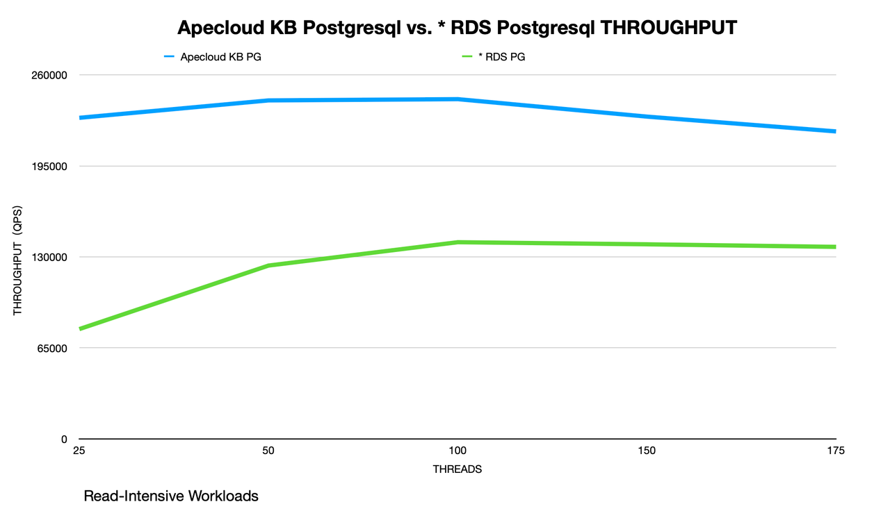
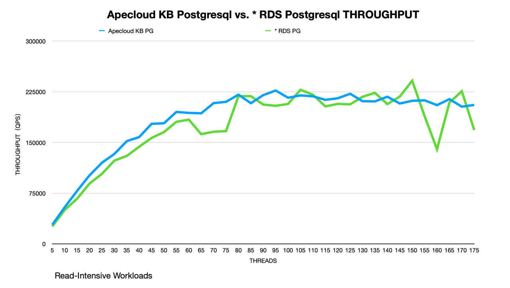

# Sysbench Performance Test Report -- ApeCloud PostgreSQL vs. RDS PostgreSQL

## Purpose

This test aims at comparing the Sysbench performance between Apecloud PostgreSQL and * RDS PostgreSQL in the Online Transactional Processing (OLTP) scenario.

## Environment (ACK/ECS)

### Hardware configuration

<table align="center">
    <tr>
        <th> Product </th>
        <th> Deployment </th>
        <th> ECS Type </th>
        <th> Instance Count </th>
        <th> Region </th>
    </tr>
    <tr>
        <td> ApeCloud PostgreSQL </td>
        <td> ACK + KubeBlocks PostgreSQL </td>
        <td> ecs.g8i.4xlarge(16c64g) </td>
        <td> 2 </td>
        <td rowspan="3"> cn-hangzhou </td>
    </tr>
    <tr>
        <td> * RDS PostgreSQL </td>
        <td> RDS PostgreSQL </td>
        <td> pg.x4.2xlarge.2c(16c64g) </td>
        <td> 2 </td>
    </tr>
    <tr>
        <td> Sysbench </td>
        <td> ACK + Sysbench </td>
        <td> ecs.g8i.4xlarge </td>
        <td> 1 </td>
    </tr>
</table>

<table align="center">
    <tr>
        <th> Test Plan </th>
        <th> Volume </th>
    </tr>
    <tr>
        <td> Sysbench on Pod </td>
        <td> ESSD 300GB，PL1(16800IOPS) </td>
    </tr>
    <tr>
        <td> Sysbench on ECS </td>
        <td> ESSD 500GB，PL1(26800IOPS) </td>
    </tr>
</table>

### Software version

<table align="center">
    <tr>
        <th> Product </th>
        <th> Product Version </th>
    </tr>
    <tr>
        <td> ApeCloud PostgreSQL </td>
        <td> 12.14 </td>
    </tr>
    <tr>
        <td> * RDS PostgreSQL </td>
        <td> 12.13 </td>
    </tr>
    <tr>
        <td> Sysbench </td>
        <td> 1.0.20 </td>
    </tr>
</table>

## Test on Pod

***Steps:***

1. Deploy Apecloud PostgreSQL and * RDS PostgreSQL.
2. Use Sysbench to import 60 tables and each table includes 2,000,000 rows of data.
3. Start the Sysbench client on Pod to perform the `point_select` and `update_index` tests. Perform stress tests on ApeCloud PostgreSQL via Pod IP and * RDS PostgreSQL via VPC IP.
4. The test takes about 10 minutes.

### Perform the test

1. Prepare the test data.

    ```yaml
    kubectl create -f - <<EOF
    apiVersion: v1
    kind: Pod                  
    metadata:
      namespace: default          
      generateName: test-sysbench-prepare-
    spec:
      containers: 
        - name: test-sysbench
          image: registry.cn-hangzhou.aliyuncs.com/apecloud/datatestsuites:latest
          env:   
            - name: TYPE
              value: "2"    
            - name: FLAG
              value: "0"                 
            - name: CONFIGS 
              value: "mode:prepare,driver:pgsql,host:<db_host>,user:postgres,password:<db_password>,port:5432,db:pgbenchtest,size:2000000,tables:60,times:600,type:oltp_read_write_pct"
      restartPolicy: Never
    EOF
    ```

2. Perform the test.

    Configure a read-intensive workload: 80% reads and 20% writes by setting `--read-percent=80` and `--write-percent=20`.

    ```yaml
    kubectl create -f - <<EOF
    apiVersion: v1
    kind: Pod                  
    metadata:
      namespace: default          
      generateName: test-sysbench-run-
    spec:
      containers: 
        - name: test-sysbench
          image: registry.cn-hangzhou.aliyuncs.com/apecloud/datatestsuites:latest
          env:   
            - name: TYPE
              value: "2"    
            - name: FLAG
              value: "0"                 
        - name: CONFIGS 
          value: "mode:run,driver:pgsql,host:<db_host>,user:postgres,password:<db_password>,port:5432,db:pgbenchtest,size:2000000,tables:60,times:600,type:oltp_read_write_pct,threads:25 50 100 150 175,others:--read-percent=80 --write-percent=20"
      restartPolicy: Never
    EOF
    ```

### Results

#### Read-Intensive performance

point_select:update_index=4:1

**QPS**

<table align="center">
    <tr>
        <th> Threads </th>
        <th> ApeCloud PostgreSQL </th>
        <th> * RDS PostgreSQL </th>
        <th> QPS Improvement </th>
    </tr>
    <tr>
        <td> 25 </td>
        <td> 229339.51 </td>
        <td> 78410.42 </td>
        <td> 65.81% </td>
    </tr>
    <tr>
        <td> 50 </td>
        <td> 241774.12 </td>
        <td> 123801.16 </td>
        <td> 48.79% </td>
    </tr>
    <tr>
        <td> 100 </td>
        <td> 242690.36 </td>
        <td> 140488.15 </td>
        <td> 42.11% </td>
    </tr>
    <tr>
        <td> 150 </td>
        <td> 230210.45 </td>
        <td> 138984.83 </td>
        <td> 39.63% </td>
    </tr>
    <tr>
        <td> 175 </td>
        <td> 219621.06 </td>
        <td> 137161.37 </td>
        <td> 37.55% </td>
    </tr>
    <tr>
        <th colspan="3"> Average </th>
        <td> 46.78% </td>
    </tr>
</table>

**Latency (ms)**

<table align="center">
    <tr>
        <th> Threads </th>
        <th> ApeCloud PostgreSQL </th>
        <th> * RDS PostgreSQL </th>
    </tr>
    <tr>
        <td> 25 </td>
        <td> 14.21 </td>
        <td> 38.25 </td>
    </tr>
    <tr>
        <td> 50 </td>
        <td> 38.94 </td>
        <td> 51.02 </td>
    </tr>
    <tr>
        <td> 100 </td>
        <td> 66.84 </td>
        <td> 99.33 </td>
    </tr>
    <tr>
        <td> 150 </td>
        <td> 92.42 </td>
        <td> 176.73 </td>
    </tr>
    <tr>
        <td> 175 </td>
        <td> 112.67 </td>
        <td> 240.02 </td>
    </tr>
</table>

The Read-Intensive performance of Apecloud PostgreSQL is about 46.78% more than * RDS PostgreSQL on Pod.



## Test on ECS

***Steps:***

1. Use the clusters and table data in [Test on Pod](#test-on-pod).
2. Start the Sysbench client on ECS to perform the `point_select` and `update_index` tests. Perform stress tests on ApeCloud PostgreSQL via load balancer IP and * RDS PostgreSQL via VPC IP.
3. The test takes about 2 minutes.

### Perform the test

```bash
sysbench --db-driver=pgsql --pgsql-host=<db_host> --pgsql-port=5432 --pgsql-user=postgres --pgsql-password=<db_password> --pgsql-db=pgbenchtest --table_size=2000000 --tables=60 --time=120 --threads=$i --events=0 --percentile=95 --read-percent=80 --write-percent=20 --report-interval=1 oltp_read_write_pct run
```

### Test results

#### Read-Intensive performance

point_select:update_index 4:1

**QPS**

<table align="center">
    <tr>
        <th> Threads </th>
        <th> ApeCloud PostgreSQL </th>
        <th> * RDS PostgreSQL </th>
        <th> QPS Improvement </th>
    </tr>
    <tr>
        <td> 5 </td>
        <td> 28469.88 </td>
        <td> 25961.68 </td>
        <td> 8.81% </td>
    </tr>
    <tr>
        <td> 10 </td>
        <td> 54265.35 </td>
        <td> 50255.61 </td>
        <td> 7.39% </td>
    </tr>
    <tr>
        <td> 15 </td>
        <td> 78510.87 </td>
        <td> 66962.79 </td>
        <td> 14.71% </td>
    </tr>
    <tr>
        <td> 20 </td>
        <td> 101476.84 </td>
        <td> 89347.94 </td>
        <td> 11.95% </td>
    </tr>
    <tr>
        <td> 25 </td>
        <td> 120091.33 </td>
        <td> 103619.99 </td>
        <td> 13.72% </td>
    </tr>
    <tr>
        <td> 30 </td>
        <td> 133052.48 </td>
        <td> 123224.29 </td>
        <td> 7.39% </td>
    </tr>
    <tr>
        <td> 35 </td>
        <td> 152021.10 </td>
        <td> 130158.46 </td>
        <td> 14.38% </td>
    </tr>
    <tr>
        <td> 40 </td>
        <td> 158016.47 </td>
        <td> 143767.52 </td>
        <td> 9.02% </td>
    </tr>
    <tr>
        <td> 45 </td>
        <td> 177604.38 </td>
        <td> 156763.22 </td>
        <td> 11.73% </td>
    </tr>
    <tr>
        <td> 50 </td>
        <td> 178483.52 </td>
        <td> 165425.93 </td>
        <td> 7.32% </td>
    </tr>
    <tr>
        <td> 55 </td>
        <td> 195249.49 </td>
        <td> 180639.14 </td>
        <td>7.48% </td>
    </tr>
    <tr>
        <td> 60 </td>
        <td> 193799.68 </td>
        <td> 183847.01 </td>
        <td> 5.14% </td>
    </tr>
    <tr>
        <td> 65 </td>
        <td> 193204.90 </td>
        <td> 162369.05 </td>
        <td> 15.96% </td>
    </tr>
    <tr>
        <td> 70 </td>
        <td> 208259.71 </td>
        <td> 165921.35 </td>
        <td> 20.33% </td>
    </tr>
    <tr>
        <td> 75 </td>
        <td> 210178.66 </td>
        <td> 166909.30 </td>
        <td> 20.59% </td>
    </tr>
    <tr>
        <td> 80 </td>
        <td> 220713.51 </td>
        <td> 218543.67 </td>
        <td> 0.98% </td>
    </tr>
    <tr>
        <td> 85 </td>
        <td> 208122.39 </td>
        <td> 218545.45 </td>
        <td> -5.01% </td>
    </tr>
    <tr>
        <td> 90 </td>
        <td> 220093.44 </td>
        <td> 206094.36 </td>
        <td> 6.36% </td>
    </tr>
    <tr>
        <td> 95 </td>
        <td> 226834.32 </td>
        <td> 204306.05 </td>
        <td> 9.93% </td>
    </tr>
    <tr>
        <td> 100 </td>
        <td> 216220.89 </td>
        <td> 207046.17 </td>
        <td> 4.24% </td>
    </tr>
    <tr>
        <td> 105 </td>
        <td> 219669.30 </td>
        <td> 227993.06 </td>
        <td> -3.79% </td>
    </tr>
    <tr>
        <td> 110 </td>
        <td> 218310.26 </td>
        <td> 220682.03 </td>
        <td> -1.07% </td>
    </tr>
    <tr>
        <td> 115 </td>
        <td> 213125.91 </td>
        <td> 203407.40 </td>
        <td> 4.56% </td>
    </tr>
    <tr>
        <td> 120 </td>
        <td> 215400.65 </td>
        <td> 207132.81 </td>
        <td> 3.84% </td>
    </tr>
    <tr>
        <td> 125 </td>
        <td> 222068.97 </td>
        <td> 206375.50 </td>
        <td> 7.07% </td>
    </tr>
    <tr>
        <td> 130 </td>
        <td> 211131.50 </td>
        <td> 217626.62 </td>
        <td> -3.08% </td>
    </tr>
    <tr>
        <td> 135 </td>
        <td> 210781.85 </td>
        <td> 223438.52 </td>
        <td> -6.00% </td>
    </tr>
    <tr>
        <td> 140 </td>
        <td> 217716.04 </td>
        <td> 206780.18 </td>
        <td> 5.02% </td>
    </tr>
    <tr>
        <td> 145 </td>
        <td> 207703.18 </td>
        <td> 217898.10 </td>
        <td> -4.91% </td>
    </tr>
    <tr>
        <td> 150 </td>
        <td> 211692.59 </td>
        <td> 241363.73 </td>
        <td> -14.02% </td>
    </tr>
    <tr>
        <td> 155 </td>
        <td> 212380.80 </td>
        <td> 189030.26 </td>
        <td> 10.99% </td>
    </tr>
    <tr>
        <td> 160 </td>
        <td> 205243.36 </td>
        <td> 140081.35 </td>
        <td> 31.75% </td>
    </tr>
    <tr>
        <td> 165 </td>
        <td> 214130.12 </td>
        <td> 208969.23 </td>
        <td> 2.41% </td>
    </tr>
    <tr>
        <td> 170 </td>
        <td> 203012.70 </td>
        <td> 225853.73 </td>
        <td> -11.25% </td>
    </tr>
    <tr>
        <td> 175 </td>
        <td> 205558.92 </td>
        <td> 168474.08 </td>
        <td> 18.04% </td>
    </tr>
    <tr>
        <th  colspan="3"> Average </th>
        <td> 6.63% </td>
    </tr>
</table>

The Read-Intensive performance of Apecloud PostgreSQL is about 6.63% more than * RDS PostgreSQL on ECS.


