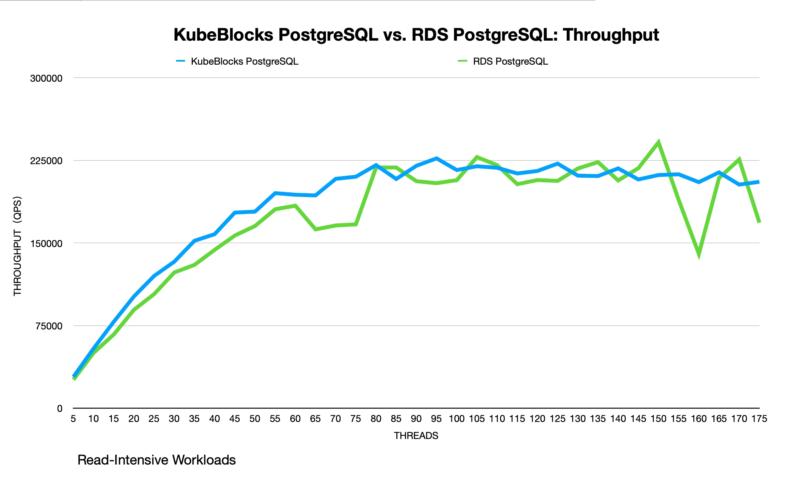

# Sysbench Performance Test Report - PostgreSQL
## Purpose

This test aims at comparing the transactional processing performance between KubeBlocks PostgreSQL and RDS PostgreSQL.

## Environment (ACK/ECS)

### Hardware configuration

<table align="center">
    <tr>
        <th> Product </th>
        <th> Deployment </th>
        <th> ECS Type </th>
        <th> Instance Count </th>
    </tr>
    <tr>
        <td align="center"> ApeCloud PostgreSQL </td>
        <td align="center"> ACK + KubeBlocks PostgreSQL </td>
        <td align="center"> ecs.g8i.4xlarge(16c64g) </td>
        <td align="center"> 2 </td>
    </tr>
    <tr>
        <td align="center"> RDS PostgreSQL </td>
        <td align="center"> RDS PostgreSQL </td>
        <td align="center"> pg.x4.2xlarge.2c(16c64g) </td>
        <td align="center"> 2 </td>
    </tr>
    <tr>
        <td align="center"> Sysbench </td>
        <td align="center"> ACK + Sysbench </td>
        <td align="center"> ecs.g8i.4xlarge </td>
        <td align="center"> 1 </td>
    </tr>
</table>

<table align="center">
    <tr>
        <th> Test Environment </th>
        <th> Volume </th>
    </tr>
    <tr>
        <td align="center"> Sysbench on Pod </td>
        <td align="center"> ESSD 300GB，PL1(16800IOPS) </td>
    </tr>
    <tr>
        <td align="center"> Sysbench on ECS </td>
        <td align="center"> ESSD 500GB，PL1(26800IOPS) </td>
    </tr>
</table>

### Software version

<table align="center">
    <tr>
        <th> Product </th>
        <th> Product Version </th>
    </tr>
    <tr>
        <td align="center"> ApeCloud PostgreSQL </td>
        <td align="center"> 12.14 </td>
    </tr>
    <tr>
        <td align="center"> * RDS PostgreSQL </td>
        <td align="center"> 12.13 </td>
    </tr>
    <tr>
        <td align="center"> Sysbench </td>
        <td align="center"> 1.0.20 </td>
    </tr>
</table>

## Test on Pod

### Plan

1. Deploy ApeCloud PostgreSQL and * RDS PostgreSQL.
2. Use Sysbench to import 60 tables and each table includes 2,000,000 rows of data.
3. Start the Sysbench client on Pod to perform the `point_select` and `update_index` tests. Perform stress tests on ApeCloud PostgreSQL via Pod IP and * RDS PostgreSQL via VPC IP.
4. The test takes about 10 minutes.

### Prepare the test data

```yaml
kubectl create -f - <<EOF
apiVersion: v1
kind: Pod                  
metadata:
  namespace: default          
  generateName: test-sysbench-prepare-
spec:
  containers: 
    - name: test-sysbench
      image: registry.cn-hangzhou.aliyuncs.com/apecloud/datatestsuites:latest
      env:   
        - name: TYPE
          value: "2"    
        - name: FLAG
          value: "0"                 
        - name: CONFIGS 
          value: "mode:prepare,driver:pgsql,host:<db_host>,user:postgres,password:<db_password>,port:5432,db:pgbenchtest,size:2000000,tables:60,times:600,type:oltp_read_write_pct"
  restartPolicy: Never
EOF
```

### Perform the test

Configure a read-intensive workload: 80% reads and 20% writes by setting `--read-percent=80` and `--write-percent=20`.

```yaml
kubectl create -f - <<EOF
apiVersion: v1
kind: Pod                  
metadata:
  namespace: default          
  generateName: test-sysbench-run-
spec:
  containers: 
    - name: test-sysbench
      image: registry.cn-hangzhou.aliyuncs.com/apecloud/datatestsuites:latest
      env:   
        - name: TYPE
          value: "2"    
        - name: FLAG
          value: "0"                 
        - name: CONFIGS 
          value: "mode:run,driver:pgsql,host:<db_host>,user:postgres,password:<db_password>,port:5432,db:pgbenchtest,size:2000000,tables:60,times:600,type:oltp_read_write_pct,threads:25 50 100 150 175,others:--read-percent=80 --write-percent=20"
  restartPolicy: Never
EOF
```

### Results

#### Read-intensive performance

Point Select : Update Index = 4 : 1

**QPS**

<table align="center">
    <tr>
        <th> Threads </th>
        <th> ApeCloud PostgreSQL </th>
        <th> * RDS PostgreSQL </th>
        <th> QPS Improvement </th>
    </tr>
    <tr>
        <td align="center"> 25 </td>
        <td align="center"> 229339.51 </td>
        <td align="center"> 78410.42 </td>
        <td align="center"> 65.81% </td>
    </tr>
    <tr>
        <td align="center"> 50 </td>
        <td align="center"> 241774.12 </td>
        <td align="center"> 123801.16 </td>
        <td align="center"> 48.79% </td>
    </tr>
    <tr>
        <td align="center"> 100 </td>
        <td align="center"> 242690.36 </td>
        <td align="center"> 140488.15 </td>
        <td align="center"> 42.11% </td>
    </tr>
    <tr>
        <td align="center"> 150 </td>
        <td align="center"> 230210.45 </td>
        <td align="center"> 138984.83 </td>
        <td align="center"> 39.63% </td>
    </tr>
    <tr>
        <td align="center"> 175 </td>
        <td align="center"> 219621.06 </td>
        <td align="center"> 137161.37 </td>
        <td align="center"> 37.55% </td>
    </tr>
    <tr>
        <th colspan="3"> Average </th>
        <td align="center"> 46.78% </td>
    </tr>
</table>

**Latency (ms)**

<table align="center">
    <tr>
        <th> Threads </th>
        <th> ApeCloud PostgreSQL </th>
        <th> * RDS PostgreSQL </th>
    </tr>
    <tr>
        <td align="center"> 25 </td>
        <td align="center"> 14.21 </td>
        <td align="center"> 38.25 </td>
    </tr>
    <tr>
        <td align="center"> 50 </td>
        <td align="center"> 38.94 </td>
        <td align="center"> 51.02 </td>
    </tr>
    <tr>
        <td align="center"> 100 </td>
        <td align="center"> 66.84 </td>
        <td align="center"> 99.33 </td>
    </tr>
    <tr>
        <td align="center"> 150 </td>
        <td align="center"> 92.42 </td>
        <td align="center"> 176.73 </td>
    </tr>
    <tr>
        <td align="center"> 175 </td>
        <td align="center"> 112.67 </td>
        <td align="center"> 240.02 </td>
    </tr>
</table>

The Read-intensive performance of ApeCloud PostgreSQL is about 46.78% more than * RDS PostgreSQL on Pod.


## Test on ECS

### Plan

1. Use the clusters and table data in [Test on Pod](#test-on-pod).
2. Start the Sysbench client on ECS to perform the `point_select` and `update_index` tests. Perform stress tests on ApeCloud PostgreSQL via load balancer IP and * RDS PostgreSQL via VPC IP.
3. The test takes about 2 minutes.

### Perform the test

```bash
sysbench --db-driver=pgsql --pgsql-host=<db_host> --pgsql-port=5432 --pgsql-user=postgres --pgsql-password=<db_password> --pgsql-db=pgbenchtest --table_size=2000000 --tables=60 --time=120 --threads=$i --events=0 --percentile=95 --read-percent=80 --write-percent=20 --report-interval=1 oltp_read_write_pct run
```

### Results

#### Read-intensive performance

Point Select : Update Index = 4 : 1

**QPS**

<table align="center">
    <tr>
        <th> Threads </th>
        <th> ApeCloud PostgreSQL </th>
        <th> * RDS PostgreSQL </th>
        <th> QPS Improvement </th>
    </tr>
    <tr>
        <td align="center"> 5 </td>
        <td align="center"> 28469.88 </td>
        <td align="center"> 25961.68 </td>
        <td align="center"> 8.81% </td>
    </tr>
    <tr>
        <td align="center"> 10 </td>
        <td align="center"> 54265.35 </td>
        <td align="center"> 50255.61 </td>
        <td align="center"> 7.39% </td>
    </tr>
    <tr>
        <td align="center"> 15 </td>
        <td align="center"> 78510.87 </td>
        <td align="center"> 66962.79 </td>
        <td align="center"> 14.71% </td>
    </tr>
    <tr>
        <td align="center"> 20 </td>
        <td align="center"> 101476.84 </td>
        <td align="center"> 89347.94 </td>
        <td align="center"> 11.95% </td>
    </tr>
    <tr>
        <td align="center"> 25 </td>
        <td align="center"> 120091.33 </td>
        <td align="center"> 103619.99 </td>
        <td align="center"> 13.72% </td>
    </tr>
    <tr>
        <td align="center"> 30 </td>
        <td align="center"> 133052.48 </td>
        <td align="center"> 123224.29 </td>
        <td align="center"> 7.39% </td>
    </tr>
    <tr>
        <td align="center"> 35 </td>
        <td align="center"> 152021.10 </td>
        <td align="center"> 130158.46 </td>
        <td align="center"> 14.38% </td>
    </tr>
    <tr>
        <td align="center"> 40 </td>
        <td align="center"> 158016.47 </td>
        <td align="center"> 143767.52 </td>
        <td align="center"> 9.02% </td>
    </tr>
    <tr>
        <td align="center"> 45 </td>
        <td align="center"> 177604.38 </td>
        <td align="center"> 156763.22 </td>
        <td align="center"> 11.73% </td>
    </tr>
    <tr>
        <td align="center"> 50 </td>
        <td align="center"> 178483.52 </td>
        <td align="center"> 165425.93 </td>
        <td align="center"> 7.32% </td>
    </tr>
    <tr>
        <td align="center"> 55 </td>
        <td align="center"> 195249.49 </td>
        <td align="center"> 180639.14 </td>
        <td align="center">7.48% </td>
    </tr>
    <tr>
        <td align="center"> 60 </td>
        <td align="center"> 193799.68 </td>
        <td align="center"> 183847.01 </td>
        <td align="center"> 5.14% </td>
    </tr>
    <tr>
        <td align="center"> 65 </td>
        <td align="center"> 193204.90 </td>
        <td align="center"> 162369.05 </td>
        <td align="center"> 15.96% </td>
    </tr>
    <tr>
        <td align="center"> 70 </td>
        <td align="center"> 208259.71 </td>
        <td align="center"> 165921.35 </td>
        <td align="center"> 20.33% </td>
    </tr>
    <tr>
        <td align="center"> 75 </td>
        <td align="center"> 210178.66 </td>
        <td align="center"> 166909.30 </td>
        <td align="center"> 20.59% </td>
    </tr>
    <tr>
        <td align="center"> 80 </td>
        <td align="center"> 220713.51 </td>
        <td align="center"> 218543.67 </td>
        <td align="center"> 0.98% </td>
    </tr>
    <tr>
        <td align="center"> 85 </td>
        <td align="center"> 208122.39 </td>
        <td align="center"> 218545.45 </td>
        <td align="center"> -5.01% </td>
    </tr>
    <tr>
        <td align="center"> 90 </td>
        <td align="center"> 220093.44 </td>
        <td align="center"> 206094.36 </td>
        <td align="center"> 6.36% </td>
    </tr>
    <tr>
        <td align="center"> 95 </td>
        <td align="center"> 226834.32 </td>
        <td align="center"> 204306.05 </td>
        <td align="center"> 9.93% </td>
    </tr>
    <tr>
        <td align="center"> 100 </td>
        <td align="center"> 216220.89 </td>
        <td align="center"> 207046.17 </td>
        <td align="center"> 4.24% </td>
    </tr>
    <tr>
        <td align="center"> 105 </td>
        <td align="center"> 219669.30 </td>
        <td align="center"> 227993.06 </td>
        <td align="center"> -3.79% </td>
    </tr>
    <tr>
        <td align="center"> 110 </td>
        <td align="center"> 218310.26 </td>
        <td align="center"> 220682.03 </td>
        <td align="center"> -1.07% </td>
    </tr>
    <tr>
        <td align="center"> 115 </td>
        <td align="center"> 213125.91 </td>
        <td align="center"> 203407.40 </td>
        <td align="center"> 4.56% </td>
    </tr>
    <tr>
        <td align="center"> 120 </td>
        <td align="center"> 215400.65 </td>
        <td align="center"> 207132.81 </td>
        <td align="center"> 3.84% </td>
    </tr>
    <tr>
        <td align="center"> 125 </td>
        <td align="center"> 222068.97 </td>
        <td align="center"> 206375.50 </td>
        <td align="center"> 7.07% </td>
    </tr>
    <tr>
        <td align="center"> 130 </td>
        <td align="center"> 211131.50 </td>
        <td align="center"> 217626.62 </td>
        <td align="center"> -3.08% </td>
    </tr>
    <tr>
        <td align="center"> 135 </td>
        <td align="center"> 210781.85 </td>
        <td align="center"> 223438.52 </td>
        <td align="center"> -6.00% </td>
    </tr>
    <tr>
        <td align="center"> 140 </td>
        <td align="center"> 217716.04 </td>
        <td align="center"> 206780.18 </td>
        <td align="center"> 5.02% </td>
    </tr>
    <tr>
        <td align="center"> 145 </td>
        <td align="center"> 207703.18 </td>
        <td align="center"> 217898.10 </td>
        <td align="center"> -4.91% </td>
    </tr>
    <tr>
        <td align="center"> 150 </td>
        <td align="center"> 211692.59 </td>
        <td align="center"> 241363.73 </td>
        <td align="center"> -14.02% </td>
    </tr>
    <tr>
        <td align="center"> 155 </td>
        <td align="center"> 212380.80 </td>
        <td align="center"> 189030.26 </td>
        <td align="center"> 10.99% </td>
    </tr>
    <tr>
        <td align="center"> 160 </td>
        <td align="center"> 205243.36 </td>
        <td align="center"> 140081.35 </td>
        <td align="center"> 31.75% </td>
    </tr>
    <tr>
        <td align="center"> 165 </td>
        <td align="center"> 214130.12 </td>
        <td align="center"> 208969.23 </td>
        <td align="center"> 2.41% </td>
    </tr>
    <tr>
        <td align="center"> 170 </td>
        <td align="center"> 203012.70 </td>
        <td align="center"> 225853.73 </td>
        <td align="center"> -11.25% </td>
    </tr>
    <tr>
        <td align="center"> 175 </td>
        <td align="center"> 205558.92 </td>
        <td align="center"> 168474.08 </td>
        <td align="center"> 18.04% </td>
    </tr>
    <tr>
        <th  colspan="3"> Average </th>
        <td align="center"> 6.63% </td>
    </tr>
</table>

The Read-intensive performance of ApeCloud PostgreSQL is about 6.63% more than * RDS PostgreSQL on ECS.


