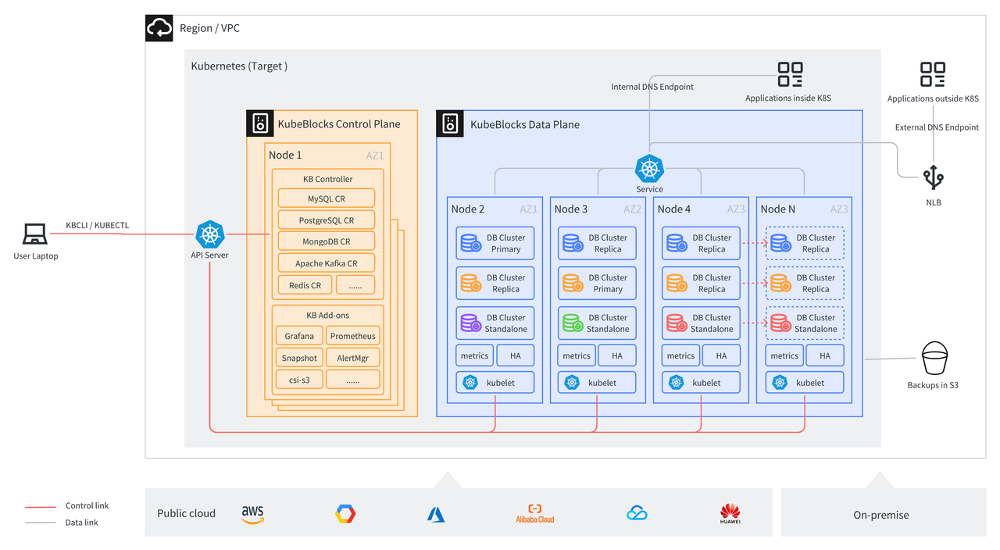
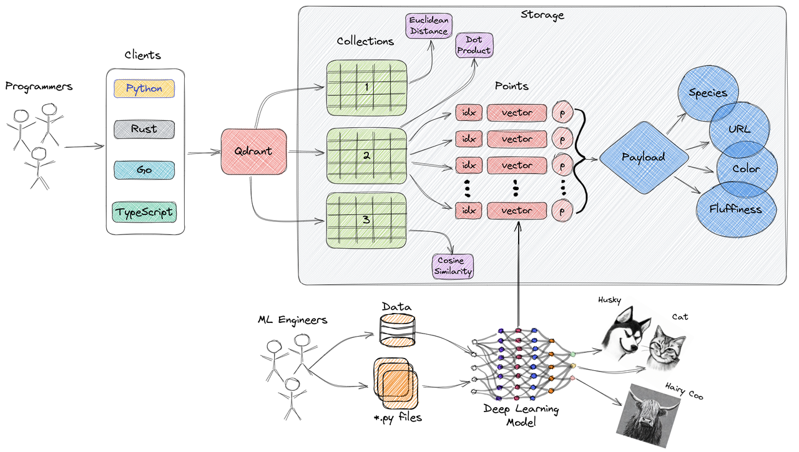

# Use KubeBlocks to build your AIGC infrastructure on Amazon EKS
## Foreword
Generative AI has sparked a widespread interest and catapulted the vector database market into the spotlight. Numerous vector databases have begun to emerge and catch the public's attention.

According to IDC's prediction, by 2025, more than 80% of business data will be unstructured, stored in text, images, audio, video or other formats. However, handling large-scale unstructured data storage and querying still faces great challenges.

In Generative AI and Deep Learning, the common practice is to convert unstructured data into vectors for storage, and use vector similarity search technology to perform semantic correlation retrieval. The fast storage, indexing and search of embedding are the core functions of vector databases.

So, what is embedding? Put simply, embedding is a vector representation composed of floating point numbers. The distance between two vectors represents their correlation. The closer the distance, the higher the correlation; the farther the distance, the lower the correlation. If two embedding vectors are similar, it means that the original data they represent is also similar, which is different from traditional keyword searches.

However, a vector database is complex to manage because in nature it is a stateful workload. When used in the production environment, it faces the same problems as those of traditional OLTP and OLAP databases, such as data security, high availability, vertical/horizontal scalability, monitoring and alerts, backup and restore, etc. As vector databases are relatively new, most users lack necessary knowledge, which brings great challenges to implementing LLMs + vector databases stack. **Users pay more attention to the value that LLMs and vector databases bring to the business, rather than investing excessive effort into their management.**

To address these problems, KubeBlocks, leveraging the declarative API of K8s, abstracts various databases in a unified manner and uses an operator and a set of APIs to manage databases, greatly alleviating the management burden. Moreover, **built on K8s, KubeBlocks supports multi-cloud to avoid the risk of cloud vendors lock-in.**

EKS, a managed K8s service provided by AWS, offers an easy way to run, scale, and manage K8s clusters on AWS without worrying about node deployment, upgrade and maintenance. EKS itself also supports multi-AZ deployment to offer high-availability, ensuring that the cluster remains available when node failure or Availability Zone disruption occurs. In addition, with the help of AWS robust resource pool, you can add or remove nodes on demand during business peaks and off-peaks, guaranteeing elasticity and scalability.

This blog mainly discusses how to easily deploy and manage vector databases through KubeBlocks based on Amazon EKS.

## Architecture
Kubernetes has become the de facto standard for container orchestration. It leverages the scalability and availability provided by ReplicaSet and the rollout and rollback capabilities provided by Deployment to manage an increasing number of stateless workloads. However, managing stateful workloads poses significant challenges to Kubernetes. Although StatefulSet provides stable persistent storage and unique network identifiers, these capabilities are not enough for complex stateful workloads. To tackle these challenges and simplify the complexity, KubeBlocks introduces ReplicationSet and ConsensusSet, which have the following functions:

- Role-based update sequencing reduces downtime caused by upgrading, scaling, and restarting.
- Maintain the state of data replication and automatically fix replication errors or delays.

With the powerful container orchestration capabilities of Kubernetes and the unified abstraction of the database engines, KubeBlocks has the following advantages:

- Be compatible with AWS, GCP, Azure, and more.
- Provides production-level performance, resilience, scalability, and observability.
- Simplifies day-2 operations, such as upgrading, scaling, monitoring, backup, and restore.
- Contains a powerful and intuitive command line tool. It helps you set up a full-stack, production-ready data infrastructure in minutes.

The above capabilities allow us to build AIGC infrastructure, such as LLMs and vector databases, on KubeBlocks in a convenient and quick way. New databases can also be accessed very quickly. You only need to define a few CRs such as ClusterDefinition and ClusterVersion, and configure the operations scripts, parameters and monitoring panels to create a database cluster on KubeBlocks, which also supports capabilities such as parameter configuration, vertical/horizontal scaling, upgrade and downgrade, backup and restore.


The following instructions take Qdrant as an example to introduce how to set up a vector database on AWS EKS by KubeBlocks.

Qdrant is an open-source vector database designed to efficiently store and query high-dimensional vector data. The architecture of Qdrant can be described as follows:


**Key features of Qdrant:**

1. Storage Engine: Qdrant uses RocksDB as its storage engine. RocksDB is a high-performance key-value storage engine based on the LSM (Log-Structured Merge) tree structure, offering exceptional write and query performance.

2. Index Structure: Qdrant employs an index structure known as HNSW (Hierarchical Navigable Small World), which is based on the MVP (Most Valuable Point) concept. The HNSW index structure organizes vector data by building a multi-layer graph structure for fast approximate nearest neighbor search.

3. Vector Encoding: Qdrant supports multiple vector encoding methods, including L2, IP, Cosine, etc. These encoding techniques are used to map high-dimensional vectors to low-dimensional space for efficient similarity calculation and search within index structures.

4. Query Processing: Qdrant uses multithreading and parallel computing to process query requests. It works by comparing the query vector with the index structure and using the approximate nearest neighbor algorithm to find the most similar vector.

5. Distributed Deployment: Qdrant supports horizontal scaling and distributed deployment. It can perform data sharding and load balancing across multiple nodes to increase storage capacity and query throughput.

Overall, the architecture of Qdrant is designed to deliver efficient vector storage and query capabilities. By leveraging storage engines, index structures, vector encoding, and query processing techniques, Qdrant achieves fast and accurate approximate nearest neighbor search. It is well-suited for a range of application scenarios that involve the processing of high-dimensional vector data.

### ClusterDefinition

This CR defines the ClusterDefinition of Qdrant, including parameters closely related to the engine, such as how Qdrant's services are accessed, how monitoring metrics are collected, how availability is probed.

```yaml
---
apiVersion: apps.kubeblocks.io/v1alpha1
kind: ClusterDefinition
metadata:
  name: qdrant
  labels:
    {{- include "qdrant.labels" . | nindent 4 }}
spec:
  type: qdrant
  connectionCredential:
    username: root
    password: "$(RANDOM_PASSWD)"
    endpoint: "$(SVC_FQDN):$(SVC_PORT_tcp-qdrant)"
    host: "$(SVC_FQDN)"
    port: "$(SVC_PORT_tcp-qdrant)"
  componentDefs:
    - name: qdrant
      workloadType: Stateful
      characterType: qdrant
      probes:
      monitor:
        builtIn: false
        exporterConfig:
          scrapePath: /metrics
          scrapePort: 6333
      logConfigs:
      scriptSpecs:
      - name: qdrant-scripts
        templateRef: qdrant-scripts
        namespace: {{ .Release.Namespace }}
        volumeName: scripts
        defaultMode: 0555
      configSpecs:
        - name: qdrant-config-template
          templateRef: qdrant-config-template
          volumeName: qdrant-config
          namespace: {{ .Release.Namespace }}
      service:
        ports:
          - name: tcp-qdrant
            port: 6333
            targetPort: tcp-qdrant
          - name: grpc-qdrant
            port: 6334
            targetPort: grpc-qdrant
      volumeTypes:
        - name: data
          type: data
      podSpec:
        securityContext:
          fsGroup: 1001
        initContainers:
        - name: qdrant-tools
          command:
          - /bin/sh
          - -c
          - |
            cp /bin/jq /qdrant/tools/jq
            cp /bin/curl /qdrant/tools/curl
          imagePullPolicy: {{default .Values.images.pullPolicy "IfNotPresent"}}
          terminationMessagePath: /dev/termination-log
          terminationMessagePolicy: File
          volumeMounts:
          - mountPath: /qdrant/tools
            name: tools
        containers:
          - name: qdrant
            imagePullPolicy: {{default .Values.images.pullPolicy "IfNotPresent"}}
            securityContext:
              runAsUser: 0
            livenessProbe:
              failureThreshold: 3
              httpGet:
                path: /
                port: tcp-qdrant
                scheme: HTTP
              periodSeconds: 15
              successThreshold: 1
              timeoutSeconds: 10
            readinessProbe:
              exec:
                command:
                - /bin/sh
                - -c
                - |
                  consensus_status=`/qdrant/tools/curl -s http://localhost:6333/cluster | /qdrant/tools/jq -r .result.consensus_thread_status.consensus_thread_status`
                  if [ "$consensus_status" != "working" ]; then
                    echo "consensus stopped"
                    exit 1
                  fi
              failureThreshold: 2
              initialDelaySeconds: 5
              periodSeconds: 15
              successThreshold: 1
              timeoutSeconds: 3
            startupProbe:
              failureThreshold: 18
              httpGet:
                path: /
                port: tcp-qdrant
                scheme: HTTP
              periodSeconds: 10
              successThreshold: 1
              timeoutSeconds: 3
            lifecycle:
              preStop:
                exec:
                  command: ["/qdrant/scripts/pre-stop.sh"]
            terminationMessagePath: /dev/termination-log
            terminationMessagePolicy: File
            volumeMounts:
              - mountPath: /qdrant/config/
                name: qdrant-config
              - mountPath: /qdrant/storage
                name: data
              - mountPath: /qdrant/scripts
                name: scripts
              - mountPath: /etc/annotations
                name: annotations
              - mountPath: /qdrant/tools
                name: tools
            dnsPolicy: ClusterFirst
            enableServiceLinks: true
            ports:
              - name: tcp-qdrant
                containerPort: 6333
              - name: grpc-qdrant
                containerPort: 6334
              - name: tcp-metrics
                containerPort: 9091
              - name: p2p
                containerPort: 6335
            command: ["/bin/sh", "-c"]
            args: ["/qdrant/scripts/setup.sh"]
            env:
            - name: QDRANT__TELEMETRY_DISABLED
              value: "true"
        volumes:
        - name: annotations
          downwardAPI:
            items:
            - path: "component-replicas"
              fieldRef:
                fieldPath: metadata.annotations['apps.kubeblocks.io/component-replicas']
        - emptyDir: {}
          name: tools
```


### ClusterVersion
This CR defines a specific version of Qdrant. If there are multiple versions, make sure each version corresponds to a ClusterVersion.

```yaml
apiVersion: apps.kubeblocks.io/v1alpha1
kind: ClusterVersion
metadata:
  name: qdrant-{{ default .Chart.AppVersion .Values.clusterVersionOverride }}
  labels:
    {{- include "qdrant.labels" . | nindent 4 }}
spec:
  clusterDefinitionRef: qdrant
  componentVersions:
    - componentDefRef: qdrant
      versionsContext:
        initContainers:
        - name: qdrant-tools
          image: {{ .Values.images.registry | default "docker.io" }}/{{ .Values.images.tools.repository }}:{{ default .Chart.AppVersion .Values.images.tools.tag }}
        containers:
          - name: qdrant
            image:  {{ .Values.images.registry | default "docker.io" }}/{{ .Values.images.repository}}:{{ default .Chart.AppVersion .Values.images.tag }}
```

## Demo

### Before you start
- Prepare an EKS cluster.
- Install kubectl and Helm clients.

### Install kbcli and KubeBlocks

1. Install kbcli.
  
   ```bash
   curl -fsSL https://kubeblocks.io/installer/install_cli.sh | bash
   ```

2. Install KubeBlocks.
   
   ```bash
   kbcli kubeblocks install
   ```

3. Enable Qdrant addon.
    
   ```bash
   kbcli addon enable qdrant
   ```

## Create a cluster

1. Create a Standalone Qdrant cluster.

   ```bash
   kbcli cluster create qdrant --cluster-definition=qdrant
   ```

   If there is a large amount of data, you can set the `replicas` parameter to create a RaftGroup Qdrant cluster.
   ```bash
   kbcli cluster create qdrant --cluster-definition=qdrant --set replicas=3
   ```


2. View the cluster status and when the status is running, the cluster is created successfully.

   ```bash
   # View the cluster list
   kbcli cluster list
   >
   NAME     NAMESPACE   CLUSTER-DEFINITION   VERSION        TERMINATION-POLICY   STATUS    CREATED-TIME
   qdrant   default     qdrant               qdrant-1.1.0   Delete               Running   Aug 15,2023 23:03 UTC+0800
   ```

    You can also view the cluster details.

    ```bash
    # View the cluster information
    kblci cluster describe qdrant
    >
    Name: qdrant         Created Time: Aug 15,2023 23:03 UTC+0800
    NAMESPACE   CLUSTER-DEFINITION   VERSION        STATUS    TERMINATION-POLICY
    default     qdrant               qdrant-1.1.0   Running   Delete

    Endpoints:
    COMPONENT   MODE        INTERNAL                                       EXTERNAL
    qdrant      ReadWrite   qdrant-qdrant.default.svc.cluster.local:6333   <none>
                        qdrant-qdrant.default.svc.cluster.local:6334

    Topology:
    COMPONENT   INSTANCE          ROLE     STATUS    AZ       NODE                   CREATED-TIME
    qdrant      qdrant-qdrant-0   <none>   Running   <none>   x-worker3/172.20.0.3   Aug 15,2023 23:03 UTC+0800
    qdrant      qdrant-qdrant-1   <none>   Running   <none>   x-worker2/172.20.0.5   Aug 15,2023 23:03 UTC+0800
    qdrant      qdrant-qdrant-2   <none>   Running   <none>   x-worker/172.20.0.2    Aug 15,2023 23:04 UTC+0800

    Resources Allocation:
    COMPONENT   DEDICATED   CPU(REQUEST/LIMIT)   MEMORY(REQUEST/LIMIT)   STORAGE-SIZE   STORAGE-CLASS
    qdrant      false       1 / 1                1Gi / 1Gi               data:20Gi      standard

    Images:
    COMPONENT   TYPE     IMAGE
    qdrant      qdrant   docker.io/qdrant/qdrant:latest

    Data Protection:
    AUTO-BACKUP   BACKUP-SCHEDULE   TYPE     BACKUP-TTL   LAST-SCHEDULE   RECOVERABLE-TIME
    Disabled      <none>            <none>   7d           <none>          <none>

    Show cluster events: kbcli cluster list-events -n default qdrant
    ```

### Connect to the cluster
Qdrant provides both HTTP and gRPC protocols for client access on ports 6333 and 6334 respectively. Depending on where the client is, different connection options are offered to connect to the Qdrant cluster. 


:::note

If your cluster is on AWS, install the AWS Load Balancer Controller first.

:::

- If your client is inside a K8s cluster, run `kbcli cluster describe qdrant` to get the ClusterIP address of the cluster or the corresponding K8s cluster domain name.
-  If your client is outside the K8s cluster but in the same VPC as the server, run `kbcli cluster expose qdant --enable=true --type=vpc` to get a VPC load balancer address for the database cluster.
- If your client is outside the VPC, run `kbcli cluster expose qdant --enable=true --type=internet` to open a public network reachable address for the database cluster.

### Test
1. To insert data into the Qdrant cluster, first create a Collection, named `test_collection`, with a vector dimension of 4, and use Cosine distance to calculate the similarity.
   
   ```bash 
    curl -X PUT 'http://localhost:6333/collections/test_collection' \
        -H 'Content-Type: application/json' \
        --data-raw '{
            "vectors": {
                "size": 4,
                "distance": "Cosine"
            }
        }'
   ```
   **Result**
   ```json
   {"result":true,"status":"ok","time":0.173516958}
   ```

2. View the information of the created Collection.
   ```bash
   curl 'http://localhost:6333/collections/test_collection'
   ```
   **Result**
   ```sql
   {
     "result": {
       "status": "green",
       "optimizer_status": "ok",
       "vectors_count": 0,
       "indexed_vectors_count": 0,
       "points_count": 0,
       "segments_count": 2,
       "config": {
         "params": {
           "vectors": {
             "size": 4,
             "distance": "Cosine"
           },
           "shard_number": 1,
           "replication_factor": 1,
           "write_consistency_factor": 1,
           "on_disk_payload": true
         },
         "hnsw_config": {
           "m": 16,
           "ef_construct": 100,
           "full_scan_threshold": 10000,
           "max_indexing_threads": 0,
           "on_disk": false
         },
         "optimizer_config": {
           "deleted_threshold": 0.2,
           "vacuum_min_vector_number": 1000,
           "default_segment_number": 0,
           "max_segment_size": null,
           "memmap_threshold": null,
           "indexing_threshold": 20000,
           "flush_interval_sec": 5,
           "max_optimization_threads": 1
         },
         "wal_config": {
           "wal_capacity_mb": 32,
           "wal_segments_ahead": 0
         },
         "quantization_config": null
       },
       "payload_schema": {}
     },
     "status": "ok",
     "time": 1.9708e-05
   }
   ```


3. Insert data into the Collection.
    ```bash
    curl -L -X PUT 'http://localhost:6333/collections/test_collection/points?wait=true' \
        -H 'Content-Type: application/json' \
        --data-raw '{
            "points": [
              {"id": 1, "vector": [0.05, 0.61, 0.76, 0.74], "payload": {"city": "Berlin" }},
              {"id": 2, "vector": [0.19, 0.81, 0.75, 0.11], "payload": {"city": ["Berlin", "London"] }},
              {"id": 3, "vector": [0.36, 0.55, 0.47, 0.94], "payload": {"city": ["Berlin", "Moscow"] }},
              {"id": 4, "vector": [0.18, 0.01, 0.85, 0.80], "payload": {"city": ["London", "Moscow"] }},
              {"id": 5, "vector": [0.24, 0.18, 0.22, 0.44], "payload": {"count": [0] }},
              {"id": 6, "vector": [0.35, 0.08, 0.11, 0.44]}
            ]
        }'
    ```

   **Result**
    ```json
    {
      "result": {
        "operation_id": 0,
        "status": "completed"
      },
      "status": "ok",
      "time": 0.040477833
    }
    ```

4. Search for the data inserted before, for example, data similar to vector [0.2,0.1,0.9,0.7].
    ```bash
    curl -L -X POST 'http://localhost:6333/collections/test_collection/points/search' \
        -H 'Content-Type: application/json' \
        --data-raw '{
            "vector": [0.2,0.1,0.9,0.7],
            "limit": 3
        }'
   ```

   **Result**
     ```json
     {
       "result": [
         {
           "id": 4,
           "version": 0,
           "score": 0.99248314,
           "payload": null,
           "vector": null
         },
         {
           "id": 1,
           "version": 0,
           "score": 0.89463294,
           "payload": null,
           "vector": null
         },
         {
           "id": 5,
           "version": 0,
           "score": 0.8543979,
           "payload": null,
           "vector": null
         }
       ],
       "status": "ok",
       "time": 0.003061
     }
     ```

     You can also add additional metadata filtering conditions, such as finding data similar to the vector [0.2,0.1,0.9,0.7] in points where city is equal to London.

     ```bash
     curl -L -X POST 'http://localhost:6333/collections/test_collection/points/search' \
         -H 'Content-Type: application/json' \
         --data-raw '{
           "filter": {
               "should": [
                   {
                       "key": "city",
                       "match": {
                           "value": "London"
                       }
                   }
               ]
           },
           "vector": [0.2, 0.1, 0.9, 0.7],
           "limit": 3
       }'
      ```

   **Result**

    ```json
    {
      "result": [
        {
          "id": 4,
          "version": 0,
          "score": 0.99248314,
          "payload": null,
          "vector": null
        },
        {
          "id": 2,
          "version": 0,
          "score": 0.66603535,
          "payload": null,
          "vector": null
        }
      ],
      "status": "ok",
      "time": 0.012462584
    }
    ```

## Scale the cluster

KubeBlocks supports both vertical and horizontal scaling. If you create a Standalone cluster first, but later find that the capacity is not enough and needs to be scaled, you can vertically or horizontally scale your cluster.

Vertical scaling adds CPU and memory resources.

```bash
kbcli cluster vscale qdrant --components qdrant --cpu 8 --memory 32Gi
```

If the vertical scaling has reached the upper limit of the machine, you can vertically scale a cluster to add nodes, for example, scale from a Standalone to a RaftGroup.

```bash
kbcli cluster hscale qdrant --replicas 3
```
